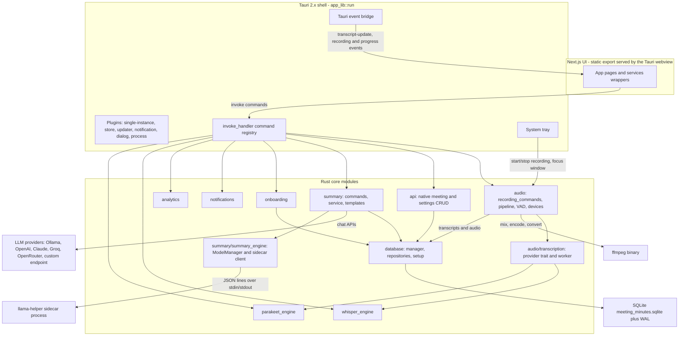

# Architecture Overview

Meetily is a privacy-first meeting assistant shipped as a single self-contained [Tauri 2.x](https://tauri.app/) desktop app. A Next.js UI runs inside the Tauri webview; everything else happens in a Rust core (`app_lib`) that captures and transcribes audio, generates summaries with local or cloud LLMs, and persists data in SQLite. Two auxiliary executables complete the picture: a bundled `ffmpeg` binary for audio encoding/conversion and a `llama-helper` sidecar process for on-device GGUF inference.

## Crate workspace

The repository root `Cargo.toml` defines a Cargo workspace with exactly two members:

- `frontend/src-tauri` — the Tauri application. Its library crate is named `app_lib` (`crate-type = ["staticlib", "cdylib", "rlib"]`); the thin binary in `main.rs` only initializes `env_logger` and calls `app_lib::run()`, which owns the entire Tauri builder pipeline.
- `llama-helper` — a standalone binary crate wrapping `llama-cpp-2`. It is never linked into the app; the app spawns it as a sidecar process (see below).

GPU acceleration is a compile-time choice made through cargo features on the app crate: `metal` (auto-enabled on macOS), `cuda`, `vulkan`, `hipblas`, `openblas`, and `coreml` toggle the matching `whisper-rs` backends; `WhisperCompiledBackend::current()` resolves the compiled backend at runtime. The `pnpm` scripts (`tauri:dev:cuda`, `tauri:build:vulkan`, …) are thin wrappers that pass these features to `tauri build/dev`.

## Component map

*Figure: the runtime component graph. The Next.js UI only reaches the Rust core through `invoke` commands and Tauri events; Rust modules own the audio pipeline, both transcription engines, the summary engine, and SQLite. `llama-helper` and `ffmpeg` are external executables resolved and supervised by the core.*

## Next.js UI

The UI is a Next.js 14 app exported as static files (`output: 'export'` in `next.config.js`, `frontendDist: "../out"`, dev server on port 3118 via `devUrl`). It holds no business logic of its own: every capability is reached through `invoke` from `@tauri-apps/api/core` and background updates through `listen` on `@tauri-apps/api/event`. Thin service wrappers (`frontend/src/services/*.ts`) wrap the invoke/listen pairs for recording, transcripts, and storage. Pages are `home` (`/`), `meeting-details`, `notes`, and `settings`.

## Rust core module layout

`lib.rs` declares these top-level modules (this is also the authoritative list of what is compiled in):

| Module | Responsibility |
| --- | --- |
| `audio` | Device discovery, capture streams, the 48 kHz processing pipeline (mixing, resampling, EBU R128 normalization, optional RNNoise), Silero VAD, recording commands/state, incremental audio checkpoints, audio import and retranscription. Contains the `transcription` subtree. |
| `audio/transcription` | `TranscriptionProvider` trait, the `TranscriptionEngine` wrapper over Whisper/Parakeet, and the worker task that feeds VAD speech segments to the loaded engine and emits `transcript-update` events. |
| `whisper_engine` | `whisper-rs` engine: model catalog/discovery/downloads, transcription commands, parallel chunk processor + system monitor. |
| `parakeet_engine` | NVIDIA Parakeet ONNX engine (`ort` runtime) mirroring the Whisper command API. |
| `summary` | Summary generation: `llm_client` for cloud/local providers, `processor`/`service` orchestration, JSON templates, commands. `api_process_transcript` persists the transcript chunk record, spawns `SummaryService::process_transcript_background`, and returns a process id immediately; progress and results are read back from `summary_processes` via `api_get_summary`. The `summary_engine` subtree is the built-in AI stack (ModelManager + sidecar client). |
| `database` | `manager` (pool, migrations, WAL recovery), typed repositories, `setup`/`commands` for init and legacy import. |
| `api` | Native meeting/transcript/settings CRUD and custom-OpenAI endpoint config, all served from `AppState`. |
| `notifications` | `NotificationManager`, consent/settings, DND handling, commands. |
| `analytics` | PostHog client and tracking commands (opt-out, sanitized properties). |
| `tray` | Tray menu, recording state transitions, window focus/quit handlers. |
| `onboarding` | Onboarding status persisted in the Tauri store; completion writes default model config to SQLite. |
| `ollama`, `openai`, `anthropic`, `groq`, `openrouter` | Model listing/management per provider. |
| `state` | `AppState { db_manager }` — the shared SQLite handle. |
| `config` | Default model constants (`large-v3-turbo`, `parakeet-tdt-0.6b-v3-int8`) and the Whisper model catalog. |
| `console_utils`, `utils` | Windows console toggle; macOS System Settings deep link; timestamp helper. |

## Managed state

Four pieces of state are registered with `.manage()` before `.setup()` runs:

- `whisper_engine::parallel_commands::ParallelProcessorState` — an optional `ParallelProcessor` plus a shared `SystemMonitor`; `initialize_parallel_processor` caps requested workers at 4 and at the resource-safe count.
- `NotificationManagerState<Wry>` (`Arc<RwLock<Option<NotificationManager<Wry>>>>`) — populated asynchronously during setup, which grants default consent, requests permission, and stores the manager.
- `audio::init_system_audio_state()` — the optional `SystemAudioDetector` used by system-audio monitoring commands.
- `summary::summary_engine::ModelManagerState` (`Arc<Mutex<Option<Arc<ModelManager>>>>`) — built-in AI model manager; if startup init fails, commands lazily initialize it on first use.

A fifth, `AppState { db_manager: DatabaseManager }`, is added during setup or by the onboarding database commands. It is the app-wide SQLite handle: `DatabaseManager` wraps a `sqlx` `SqlitePool`, and commands across `api`, `summary`, `audio` import/retranscription, and `onboarding` obtain it via `state.db_manager.pool()`.

## SQLite storage

- Location: `app_data_dir/meeting_minutes.sqlite`. If only the legacy backend file `meeting_minutes.db` exists, it is copied over and migrated; `sqlx::migrate!("./migrations")` runs the embedded migrations at every open. If opening fails with a malformed/corrupt error, orphaned `-wal`/`-shm` files are deleted and the connection is retried once.
- The initial schema creates `meetings`, `transcripts`, `summary_processes`, `transcript_chunks`, `settings`, and `transcript_settings` (all referencing `meetings` with `ON DELETE CASCADE`); later migrations add openrouter/gemini keys, licensing, speakers, and notes fields. See `/openwiki/concepts/data-model.md`.
- On startup, `database::setup::initialize_database_on_startup` is the only **blocking** init step (`tauri::async_runtime::block_on` inside `.setup()`). On a normal launch it constructs the manager and manages `AppState`. On first launch (no `.sqlite` file) it only emits a delayed `first-launch-detected` event; `AppState` is then created by the onboarding flow — `import_and_initialize_database` or `initialize_fresh_database` — which also emits `database-initialized` so the UI can proceed.
- On exit, `DatabaseManager::cleanup()` runs `PRAGMA wal_checkpoint(TRUNCATE)` (flushing WAL pages into the main file) and closes the pool gracefully.

## llama-helper sidecar (built-in AI)

`llama-helper` is a separate workspace binary built against `llama-cpp-2`. It reads JSON lines from stdin and writes JSON lines to stdout: requests are `generate` (prompt, sampling parameters, optional model path), `ping`, or `shutdown`; responses are `response`, `pong`, `goodbye`, or `error`. It exits on stdin EOF or after an idle timeout — `LLAMA_IDLE_TIMEOUT`, default 300 s, passed to the process by the app and honored by both sides.

The Rust side (`summary/summary_engine`) owns the lifecycle:

- `ModelManager` downloads GGUF models (Qwen 3.5 / Gemma 3 catalog) into `app_data_dir/models/summary` and reports status/progress through the `builtin_ai_*` commands.
- `SidecarManager` resolves the binary from the `MEETILY_LLAMA_HELPER` env var, then next to the app executable with a target-triple suffix (with a fuzzy `llama-helper*` match), then `RESOURCE_DIR`, then dev workspace paths; `tauri.conf.json` bundles it as `externalBin: binaries/llama-helper`. It spawns the process with piped stdio, lowered priority (`nice -n 10` on Unix, `BELOW_NORMAL_PRIORITY_CLASS` + no window on Windows), and restarts it whenever the requested model path changes (`ensure_running`).
- `generate_with_builtin` formats the prompt with the model's chat template, applies sanitized per-model sampling presets, and races generation against a `CancellationToken` — cancelling shuts the sidecar down. Cancellation aside, `shutdown_sidecar_gracefully` drains active requests, and `force_shutdown_sidecar` is reserved for app exit.

Details: `/openwiki/integrations/llama-helper-sidecar.md`.

## Bundled ffmpeg

- **Build time:** `build.rs` calls `ensure_ffmpeg_binary()` (`build/ffmpeg.rs`), which verifies a cached per-target binary in `frontend/src-tauri/binaries/` or downloads one from the `Zackriya-Solutions/ffmpeg-binaries` GitHub release, verifies it by execution, and fails the build otherwise.
- **Bundling:** `tauri.conf.json` lists `binaries/ffmpeg` (and `binaries/llama-helper`) as `externalBin`.
- **Runtime:** `audio::ffmpeg::find_ffmpeg_path()` (a `Lazy` static) resolves, in order: a binary next to the executable, `PATH`, `~/.local/bin` (macOS), the working directory, then Tauri resource/lib folders — falling back to an `ffmpeg-sidecar` auto-install. Consumers: `encode.rs` (single-file WAV encoding), `incremental_saver.rs` (checkpoint merge/recovery), and `decoder.rs` (converting formats Symphonia cannot demux, e.g. `.mkv`/`.webm`/`.wma`, to WAV).

## Startup and exit sequence in `run()`

`app_lib::run()` wires everything in a single builder chain:

1. **Plugins** — `tauri_plugin_single_instance` (desktop-only; a second launch just focuses the main window), `notification`, `store`, `dialog`, `updater`, and `process`.
2. **Managed state** — the four states listed above.
3. **`.setup()`** — creates the system tray; spawns notification-manager initialization; sets Whisper and Parakeet model directories (`app_data_dir/models`) and spawns `whisper_init` and `parakeet_init` in the background; spawns built-in AI `ModelManager` initialization (lazy fallback on failure); blocks on `database::setup::initialize_database_on_startup`; and sets the bundled templates directory to `resource_dir()/templates` for `summary::templates`.
4. **`.on_window_event()`** — a close request on the `main` window is prevented and the window is hidden instead (close-to-tray; the app keeps running in the tray).
5. **`.invoke_handler()`** — registers the full command surface spanning recording/audio devices, Whisper and Parakeet engines, parallel processing, analytics, notifications, native API CRUD, summary and templates, built-in AI, database import, onboarding, permissions, and import/retranscription. See `/openwiki/architecture/tauri-command-surface.md`.
6. **`.run()` callback** — on macOS, `RunEvent::Reopen` focuses the main window; `RunEvent::Exit` performs cleanup.

On `RunEvent::Exit` the app blocks on two cleanup steps: `AppState.db_manager.cleanup()` (WAL checkpoint + pool close, skipped with a warning if `AppState` is absent on first launch) and `summary::summary_engine::force_shutdown_sidecar()` (kills the sidecar, waiting at most 3 s after a shutdown command).

## Audio-to-transcript flow (live recording)

Tauri `start_recording*` commands validate the configured transcription model (defaulting to Parakeet with `parakeet-tdt-0.6b-v3-int8` when no config exists), then delegate to `audio::recording_commands`, which owns a global `RecordingManager`. The manager starts the `AudioStreamManager` (raw mic + optional system streams), the `AudioPipelineManager` (mixes both inputs at 48 kHz with adaptive buffering, then runs Silero VAD — which internally resamples to 16 kHz — and emits speech segments), and the `RecordingSaver` (incremental audio checkpoints). A single serial worker consumes the segments so transcripts are emitted in chronological order as `transcript-update` events; the Rust side also listens to its own `transcript-update` events to persist history for reload sync. On stop, the pipeline is force-flushed and the app waits for all queued chunks (10-minute cap) before unloading the loaded model.

## Code that is not compiled

`src/audio_v2/` (an unfinished "modern audio system" rewrite) and `src/lib_old_complex.rs` (the previous ~2,400-line `lib.rs`) exist under `frontend/src-tauri/src/` but are never declared with `mod` in `lib.rs`, so they are not compiled into the application binary. The same applies to stray `.backup`/`_old` files inside `audio/`. Read them for history only — see `/openwiki/architecture/legacy-and-dead-code.md`.

## Operational notes

- Analytics are PostHog-based (`posthog-rs`); `AnalyticsConfig` defaults to `enabled: false`, and `sanitize_analytics_properties` strips sensitive keys (meeting titles, file/folder paths, device names, user agent) before any event is sent.
- All app data lives under the platform `app_data_dir`: the SQLite database, `models/` (whisper, parakeet, summary), recordings, and meeting folders.
- The updater plugin polls the GitHub releases endpoint configured in `tauri.conf.json`; templates ship as bundled resources (`templates/*.json`) with user overrides from the OS data directory.

## Related pages

- `/openwiki/architecture/tauri-command-surface.md` — every registered command in detail.
- `/openwiki/architecture/legacy-and-dead-code.md` — the audio_v2/lib_old_complex story.
- `/openwiki/concepts/data-model.md` — SQLite schema and repositories.
- `/openwiki/integrations/llama-helper-sidecar.md` — sidecar protocol, resolution, and lifecycle.
