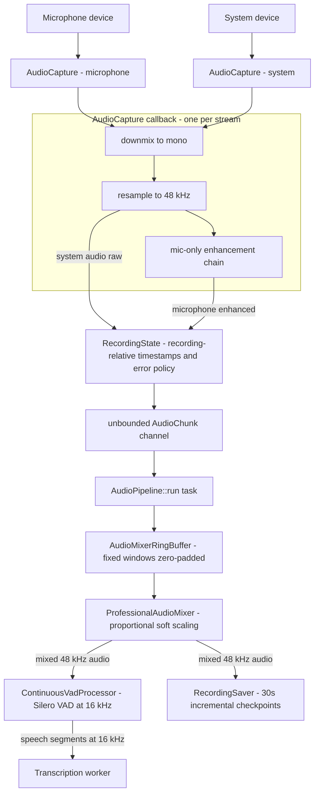

# Audio Pipeline

Meetily records a meeting by capturing two independent streams — the **microphone** and the **system** playback — and running both through a single 48 kHz processing pipeline (`frontend/src-tauri/src/audio/pipeline.rs`). Every mixed window fans out to two consumers: the **recording path** receives the pre-mixed 48 kHz audio and accumulates it into incremental checkpoint files, and the **transcription path** receives only VAD-filtered speech segments at 16 kHz. Everything else in the `audio` module exists to feed or protect these two paths: device discovery and platform capture backends (`devices/`, `capture/`), sample-rate normalization, adaptive buffering for Bluetooth jitter, device monitoring for disconnect/reconnect, permissions, and hot-path-optimized logging.

The key modules and their roles:

| Module | Role |
| --- | --- |
| `audio/devices/` | Device discovery, identity (`AudioDevice`), platform enumeration, Bluetooth fallback |
| `audio/capture/` | System-audio capture backends (Core Audio tap, ScreenCaptureKit, WASAPI loopback) and backend selection |
| `audio/pipeline.rs` | `AudioCapture` (per-stream preprocessing), `AudioPipeline` (mixing + VAD + fan-out), `AudioPipelineManager` |
| `audio/vad.rs` | `ContinuousVadProcessor` around `silero_rs` |
| `audio/recording_state.rs` | Shared `RecordingState`, `AudioChunk`, `DeviceType`, error policy |
| `audio/stream.rs` | `AudioStream`/`AudioStreamManager` — backend selection and CPAL stream construction |
| `audio/recording_manager.rs` | Orchestrates state, streams, pipeline, saver, and device monitor |
| `audio/recording_saver.rs` + `incremental_saver.rs` | Mixed-audio accumulation and 30-second checkpoint encoding |
| `audio/device_detection.rs` | `InputDeviceKind` (Wired/Bluetooth/Unknown) and adaptive buffer timeouts |
| `audio/device_monitor.rs`, `playback_monitor.rs` | Disconnect/reconnect events; active-output Bluetooth detection |
| `audio/permissions.rs` | macOS microphone and Audio Capture permission triggers |

## Naming and vocabulary

Two device vocabularies coexist and must not be confused:

- `devices::DeviceType::{Input, Output}` describes *physical* cpal devices. An `AudioDevice` is parsed from strings like `"MacBook Pro Microphone (input)"` (`AudioDevice::from_name` strips the suffix).
- `recording_state::DeviceType::{Microphone, System}` tags each `AudioChunk` by *role in the pipeline*. A system device (an output) produces `DeviceType::System` chunks.

Throughout this page, "microphone" and "system" refer to the pipeline roles; "input"/"output" appear only when discussing cpal enumeration. The pipeline's sample-rate contract is a consistent **48 kHz mono f32**: every capture is converted at capture time (see below), and downstream components (mixing, saving, VAD input) assume 48 kHz.

## End-to-end flow

*Figure: dual-path flow. Both captures preprocess independently (mono → 48 kHz → optional mic enhancement), converge on `RecordingState`'s channel, and are mixed in `AudioPipeline::run`; each mixed window goes to the recording saver and to VAD, and only VAD speech reaches transcription.*

## Capture layer

### devices/ — discovery, identity, and fallback

`devices::list_audio_devices()` delegates to a per-platform enumerator and then merges any additional default-host devices (`devices/discovery.rs`). The platform modules are:

- **Windows** — enumerates the explicit WASAPI host (`cpal::HostId::Wasapi`) input and output devices, falling back to the default host and finally to just the default devices if WASAPI fails.
- **macOS** — lists cpal input devices plus output devices, filtering out the built-in "speakers" (they do not capture system audio properly); Bluetooth output devices are deliberately allowed because disconnect handling exists. System capture itself does not go through cpal — the Core Audio backend uses the `cidre` API directly.
- **Linux** — lists cpal input devices plus ALSA/PulseAudio `monitor` sources, which are relabeled `"<name> (System Audio)"` and typed as outputs so they can be selected as the system source.

`get_device_and_config` resolves a selected `AudioDevice` back to a cpal device + config, with the Windows branch preferring F32 stereo configs and falling back through supported configs. On macOS the default-microphone/default-speaker pair can be replaced wholesale by `get_safe_recording_devices_macos` (see [macOS Bluetooth override](#macos-bluetooth-override)).

### capture/ — platform backends and selection

`AudioStream::create_with_backend` picks the capture route: **microphones always use CPAL**; **system audio on macOS** may use the Core Audio backend when the global `BACKEND_CONFIG` says so (`capture/backend_config.rs` holds a process-wide `AudioCaptureBackend`, defaulting to `CoreAudio` on macOS and `ScreenCaptureKit` elsewhere; the persisted `recording_preferences.system_audio_backend` overrides it at startup). Non-macOS system capture via `capture::system` explicitly bails with "System audio capture not yet implemented for this platform" — on Windows, loopback is instead achieved by opening the WASAPI **output** device and building an *input* stream on it. Failing to create the system stream is non-fatal; recording continues microphone-only.

The Core Audio backend (`capture/core_audio.rs`) creates a **mono global process tap** (`with_mono_global_tap_excluding_processes`) and an aggregate device that contains **only the tap** — an earlier configuration that also listed the output device as a sub-device captured every sample twice and caused audible echo, so the sub-device list was removed. The IO proc pushes samples into a 128 KB lock-free `ringbuf` heap ring consumed by a waker-driven async `Stream`; 10 consecutive ring-buffer push failures set a `should_terminate` flag that ends the stream under backpressure, and the device's nominal sample rate is tracked in an atomic so rate changes are visible to consumers.

### Permissions

- **Microphone (all platforms):** `devices::trigger_audio_permission` builds and plays a throwaway cpal input stream; failure at any step is interpreted as "permission likely denied".
- **macOS Audio Capture (macOS 14.4+):** required for Core Audio taps and declared via `NSAudioCaptureUsageDescription`. The dialog is triggered automatically when the tap is created, so `permissions::check_screen_recording_permission` always returns `true` and merely logs; `trigger_system_audio_permission` constructs a `CoreAudioCapture` to force the prompt. If permission is denied, the tap still succeeds but **delivers silence** — a silent system track is a permission symptom, not a capture bug.

## Pipeline internals

### AudioCapture — per-stream preprocessing

Each CPAL/Core Audio stream owns an `AudioCapture`. Its `process_audio_data` callback performs, in order:

1. **Mono downmix** (`audio_to_mono`). For mic arrays with more than two channels, only the first two channels are averaged — averaging all channels can destructively cancel anti-phase beam-forming aux channels down to near-silence.
2. **Resampling to 48 kHz.** If the device reports any rate other than 48 kHz (Bluetooth headsets commonly report 8/16/44.1 kHz), a **persistent** `rubato::SincFixedIn` resampler is used with fixed 512-sample input buffering. Samples accumulate in `resampler_input_buffer` until a full 512-sample chunk exists; a partial remainder is *held, not dropped* (`process_audio_data` returns early), and the fallback one-shot `resample_audio` is used only if the persistent resampler could not be created. Creating a fresh resampler per chunk previously amplified energy (~173% RMS) and produced wrong output sizes — hence the persistent design. Resampler quality parameters (sinc length, interpolation) adapt to the conversion ratio.
3. **Mic-only enhancement**, in a fixed order that matters: high-pass filter at 80 Hz → optional RNNoise noise suppression → EBU R128 loudness normalization to **−23 LUFS** with a 10 ms true-peak limiter. Noise is removed *before* normalization so it is not amplified. System audio is captured raw — no enhancement. RNNoise is gated by `ffmpeg_mixer::RNNOISE_APPLY_ENABLED`, which defaults to `false` ("Whisper handles noise well internally"); the `nnnoiseless`-based processor works in 480-sample (10 ms) frames when enabled.

Each processed buffer becomes an `AudioChunk` whose `timestamp` is `RecordingState::get_recording_duration()` — seconds since recording start — and whose `sample_rate` is 48 kHz after resampling. Chunks are sent through `RecordingState::send_audio_chunk` into the pipeline channel; the "Audio pipeline not ready" error during startup is logged at debug level and the chunk is dropped.

### AudioPipeline — mixing and fan-out

`AudioPipelineManager::start` creates the unbounded channel, installs the sender into `RecordingState` (captures use it via `send_audio_chunk`), attaches the recording-saver sender as `recording_sender_for_mixed`, and spawns `AudioPipeline::run`. The `target_chunk_duration_ms` argument is ignored — VAD, not timers, controls segmentation.

The `run` loop deliberately loops **until the channel closes**, not while `state.is_recording()`; checking the recording flag previously caused early exits that lost flush signals and buffered chunks during shutdown. Each iteration receives with a 50 ms timeout, watches for flush signals (`chunk_id >= u64::MAX - 10`), feeds raw chunks into the `AudioMixerRingBuffer`, and then, while a window can be mixed, extracts, mixes, and fans out:

- **To VAD → transcription:** mixed 48 kHz audio goes through `ContinuousVadProcessor`; completed speech segments are wrapped as `AudioChunk { sample_rate: 16000, timestamp: start_timestamp_ms / 1000.0 }` — recording-relative seconds — and sent to the transcription channel. Segments shorter than **800 samples (50 ms at 16 kHz)** are dropped, matching the smallest useful Parakeet/Whisper input.
- **To the recording saver:** the same mixed 48 kHz window is cloned into a recording chunk and sent to `recording_sender_for_mixed`.

Raw per-device audio is **never** sent to the recording saver — only the mixed stream is saved, so mic + system are recorded exactly once and echo-free.

### Ring-buffer mixing semantics

`AudioMixerRingBuffer` accumulates `VecDeque<f32>` per side and mixes in fixed windows. Note that the code sets `window_ms = 600.0` (the adjacent "50ms" comment is stale), so at 48 kHz a window is 28,800 samples, and `max_buffer_size` is 8× the window — about **4.8 s of tolerated skew per side** before dropping. `can_mix` fires when *either* side has a full window; `extract_window` drains a full window from each side and, when one side is short or empty, **zero-pads** it instead of holding the last sample. Zero-padding (silence) is inaudible at 48 kHz, whereas last-sample-hold produces audible repetition artifacts.

Overflow is handled by dropping the **oldest** samples once the cap is exceeded, after logging — a `warn` for microphone and an `error` for system ("THIS CAUSES DISTORTION!"). System audio is the fragile side because its journey (sample-by-sample IO proc → batching → channel transmission → pipeline) introduces jitter that can outrun the consumer; the enlarged cap exists specifically to absorb that jitter, and residual overflow manifests as audible distortion in the saved recording rather than a crash.

`ProfessionalAudioMixer::mix_window` sums the two windows and applies **proportional soft scaling**: a summed sample whose magnitude exceeds 1.0 is divided by its own magnitude (landing exactly at ±1.0 with polarity preserved) rather than hard-clamped, which avoided the "radio break" clipping artifacts of the previous limiter. No post-mix gain is applied: the microphone is already at −23 LUFS from the capture stage, and an earlier 2× post-gain caused excessive limiting.

### Adaptive buffering and InputDeviceKind

`device_detection.rs` classifies each input as `InputDeviceKind::{Wired, Bluetooth, Unknown}` using three layered strategies, first match wins:

1. **Platform-native APIs** — macOS queries the Core Audio transport type via `cidre` (BLUETOOTH/BLUETOOTH_LE vs USB/BUILT_IN); Windows matches WASAPI naming ("Bluetooth Audio…", "Realtek"); Linux matches BlueZ/A2DP/HFP/HSP/HDA patterns.
2. **Cross-platform name heuristics** in three confidence tiers (AirPods; "bluetooth"/WH-1000XM/QuietComfort/…; "bt"/"wireless"), with virtual devices (BlackHole, VB-Audio, loopback, monitor) treated as wired.
3. **Buffer-size analysis** — reported buffer duration >50 ms ⇒ Bluetooth, <20 ms ⇒ wired, in between ⇒ undetermined.

Each kind maps to an adaptive buffer-timeout range: **Wired 20–50 ms, Bluetooth 80–200 ms, Unknown 80–180 ms** (conservative, Bluetooth-like). `calculate_buffer_timeout` doubles the reported buffer duration as jitter headroom and clamps to the kind's range. `RecordingManager::start_recording` detects the kind for both the microphone and system devices and passes names + kinds into the pipeline; today they are logged for monitoring and diagnostics (`diagnostics::log_device_capabilities`), and `AudioPipeline` still mixes via its own ring buffer. The consumer of the adaptive timeouts is `FFmpegAudioMixer` (`ffmpeg_mixer.rs`), a Cap-style design kept as the alternate mixer: per-source `SourceBuffer`s hold timestamped chunks, become "ready" when the oldest chunk ages past the device-aware timeout, count gaps (inter-arrival > 2× chunk duration) and insert silence on underrun, and mix 50 ms windows with **RMS-based ducking** — system audio drops to 0.60 gain while mic RMS exceeds 0.01 and runs at full gain when the mic is silent. It is exported (`audio::FFmpegAudioMixer`) and unit-tested but not wired into the live path; wiring it in is the intended extension point for Bluetooth-heavy deployments.

### Metrics, buffer pooling, and hot-path logging

Per-chunk logging in the audio hot path caused measurable degradation, so:

- `perf_debug!`/`perf_trace!` macros (defined in `lib.rs`) compile to real log calls in debug builds and to **nothing** in release builds; the pipeline uses `perf_debug!` for its periodic summary.
- The pipeline logs a summary only every 200 chunks or 60 seconds, and per-chunk statistics flow through `AudioMetricsBatcher` (`batch_processor.rs`), which batches `AudioMetric`s (via the `batch_audio_metric!` macro) every 50 chunks or 5 seconds into an `AudioMetricsSummary`.
- `RecordingState` owns an `AudioBufferPool` (16 pooled buffers of 48,000-sample capacity, exposed via `get_buffer_pool()` with an RAII `PooledBuffer` wrapper) as the allocation-reuse mechanism for chunk processing.

## VAD speech path

`ContinuousVadProcessor` wraps a `silero_rs::VadSession`, which **only runs at 16 kHz** (`VAD_SAMPLE_RATE = 16000`, hardcoded). The processor resamples its 48 kHz input internally — a moving-average low-pass followed by linear-interpolation downsampling — buffers the result, and feeds the model in 30 ms (480-sample) chunks. Its config trades fragmentation against coverage: positive speech threshold 0.50, negative 0.35, `pre_speech_pad` 300 ms, `post_speech_pad` 400 ms, and `min_speech_time` 250 ms so Whisper never sees tiny fragments.

**Redemption time** (how long silence must persist before a speech segment is closed) is the critical knob. The live pipeline passes **400 ms on all platforms** (the surrounding comment muses about 900 ms on macOS, but both branches are 400) so natural pauses do not fragment long utterances into 40 ms slivers — an earlier 400 ms cap combined with tighter thresholds was exactly the bug. Batch callers — audio **import** and **retranscription** — use `VAD_REDEMPTION_TIME_MS = 2000` because whole-file processing would otherwise split speech at every sentence gap; a dedicated test asserts 2000 ms yields no more segments than 400 ms and that segments stay ≥250 ms. `get_speech_chunks_with_progress` additionally processes files larger than ~60 s of 16 kHz audio in 10-second chunks, reports monotonic percentage progress, and honors a cancellation callback that returns an error.

`flush` pads any partial buffered chunk with zeros and force-ends an open speech segment, so the tail of a meeting is never lost. `SpeechSegment`s carry `start_timestamp_ms`/`end_timestamp_ms` relative to the VAD stream (i.e., recording start) and become 16 kHz `AudioChunk`s with `timestamp = start_ms / 1000.0` — the recording-relative times that later appear in transcript segments.

## Recording path

`RecordingSaver::start_accumulation(auto_save)` returns the sender the pipeline writes mixed audio to. When `auto_save` is enabled, a spawned task feeds chunks to an `IncrementalAudioSaver`, which encodes a checkpoint **every 30 seconds** (1,440,000 samples at 48 kHz) as `audio_chunk_NNN.mp4` via `encode_single_audio` (bundled ffmpeg, mono AAC). This bounds memory and gives crash recovery for free. When `auto_save` is disabled, audio chunks are discarded and only transcripts and metadata are written. `stop_and_save` finalizes: the last partial checkpoint is written, all checkpoints are merged into a single 48 kHz mono `audio.mp4`, `transcripts.json` and `metadata.json` are written atomically (temp file + rename), the metadata is marked `completed` with the actual recording duration, and a `recording-saved` event carries the paths to the UI. The meeting folder layout is `<save_folder>/<Meeting>_<timestamp>/` with an optional `.checkpoints/` subdirectory.

Transcript persistence rides the same session: the transcription worker emits `transcript-update` events with `audio_start_time`/`audio_end_time` derived from the chunk timestamp plus duration; a listener in `recording_commands.rs` converts each into a `TranscriptSegment` and adds it to the saver, which rewrites `transcripts.json` incrementally.

## Lifecycle: start, pause, stop, force flush

`RecordingManager::start_recording` orders the boot sequence deliberately: start `RecordingState`, detect device kinds, seed saver metadata, **start the pipeline first**, sleep 50 ms so the channel is ready, then start the streams (raw chunks flow immediately), then start device monitoring. The transcription channel receiver is returned to the caller (`recording_commands.rs`), which spawns the transcription task.

Pausing is enforced at the state boundary: `send_audio_chunk` silently discards chunks while `is_paused`, so capture callbacks keep running without polluting the recording.

Stopping uses **force flush** to eliminate 30+ second shutdown delays: `stop_recording` (command) → `RecordingManager::stop_streams_and_force_flush`, which stops the **device monitor first** (continuous WASAPI polling on Windows otherwise prolongs shutdown by 90+ seconds), stops recording state and streams, calls `pipeline_manager.force_flush_and_stop()`, and finally `state.cleanup()`. Force flush sends a burst of flush chunks (`chunk_id = u64::MAX`, then `u64::MAX-1..MAX-3` after 20 ms and 10 ms sleeps); the pipeline detects any `chunk_id >= u64::MAX - 10` and calls `flush_remaining_audio`, which drains VAD state and emits final segments. The pipeline then stops normally: dropping the senders closes the channel, `recv` returns `None`, and the loop exits after a final flush. The transcription task is awaited **without timeout** and verifies with atomic counters that every queued chunk was completed — otherwise it emits `transcript-chunk-loss-detected` after retries. Because the pipeline loop keys on channel closure rather than the recording flag, no accumulated speech is dropped during this handoff.

## Failure semantics and invariants

- `RecordingState` is the single source of truth for recording/pause/reconnecting flags, device references, the pipeline sender, the buffer pool, and error counts. `report_error` stops recording after **10 recoverable** errors, **immediately** for non-recoverable ones (permission, channel closed, init/config errors), and after **15 total** errors as a backstop.
- `handle_stream_error` classifies cpal stream errors by message: "device is no longer available"/"disconnected"/"removed" ⇒ `DeviceDisconnected`; "permission"/"access denied" ⇒ `PermissionDenied`; otherwise channel/stream failures — enabling the reconnect path to react only to genuine disconnects.
- `stop_recording` clears the audio sender (closing the pipeline channel) and the device `Arc`s — without that, captured device references keep the microphone hardware active after stop. `cleanup()` resets everything, including the buffer pool and stats.
- Stream teardown pauses CPAL streams before dropping them so callbacks release their captured `Arc`s, and aborts Core Audio processing tasks explicitly.
- Invariant summary: the pipeline consumes 48 kHz mono; mixing windows are zero-padded; only mixed audio is saved; only VAD speech (≥50 ms) is transcribed; timestamps are recording-relative seconds throughout.

## Device monitoring and reconnection

`AudioDeviceMonitor` polls `list_audio_devices` on a 2-second cadence. A monitored device missing for the threshold number of consecutive polls emits `DeviceDisconnected` **once** — the threshold is 3 polls for Bluetooth devices (they can blip during roaming/sleep) and 2 for wired; a device reappearing emits `DeviceReconnected`, and any change in list length emits `DeviceListChanged`. Events flow through `RecordingManager::poll_device_events` to the `poll_audio_device_events` Tauri command, which the frontend polls every 1–2 seconds during recording; `attempt_device_reconnect` (also exposed as a command for a UI "Retry" button) restarts the matching stream while preserving the other one, and `RecordingState` tracks `is_reconnecting` plus the disconnected device for status queries.

### macOS Bluetooth override

`get_safe_recording_devices_macos` evaluates the default microphone and default speaker **independently**: each Bluetooth device is overridden to the corresponding built-in device (`find_builtin_input_device`/`find_builtin_output_device` pattern matching) when available. Rationale: Core Audio and the Bluetooth stack resample dynamically, and ScreenCaptureKit captures the *processed* stream, so Bluetooth sources deliver inconsistent sample rates that break mic+system mixing; built-in devices are fixed-rate. The user still hears playback through their Bluetooth headset — only the recording path is rerouted. If no built-in replacement exists, the Bluetooth device is used with a warning.

## Bluetooth playback caveat

Distorted or "sped-up" playback of recordings through Bluetooth headphones is a **playback-side** problem, documented in `BLUETOOTH_PLAYBACK_NOTICE.md`: recordings are correct 48 kHz mono AAC files, but macOS resampling to a headset's negotiated rate (8–44.1 kHz depending on profile/codec) can shift pitch and speed. `playback_monitor::get_active_audio_output` reports the active output device with an `is_bluetooth` flag derived from per-platform name heuristics (cpal default output on all three OSes, with BlueZ/A2DP keywords on Linux); the `get_active_audio_output` command feeds the `BluetoothPlaybackWarning` component, which polls every 5 seconds on playback screens and recommends speakers or wired headphones for review.

## Focused tests

- `device_detection.rs` — AirPods → Bluetooth, built-in names → Unknown, buffer-size classification (3840 frames @ 48 kHz ⇒ Bluetooth, 512 ⇒ Wired), timeout ranges (20–50/80–200 ms), headroom clamping (80 ms base × 2 ⇒ 160 ms), and virtual devices ⇒ Wired.
- `ffmpeg_mixer.rs` — 50 ms window is 2400 samples at 48 kHz, RMS calculation, and clipping prevention under extreme inputs.
- `vad.rs` — chunked vs single-pass segmentation equivalence (±1 segment), large-file progress reaching 100% monotonically, cancellation at 50%, VAD state persistence across 10-second chunk boundaries, and the 400 ms vs 2000 ms redemption comparison.
- `backend_config.rs` — backend string round-tripping (`"coreaudio"`, `"core_audio"`, `"screencapturekit"`).
- `device_monitor.rs` — Bluetooth vs wired disconnect thresholds.
- `buffer_pool.rs` — pool reuse and capacity limits.
- `capture/core_audio.rs` — a `#[ignore]`d manual test that collects one second of tap audio on real hardware.
- `playback_monitor.rs` — active output detection smoke test.
