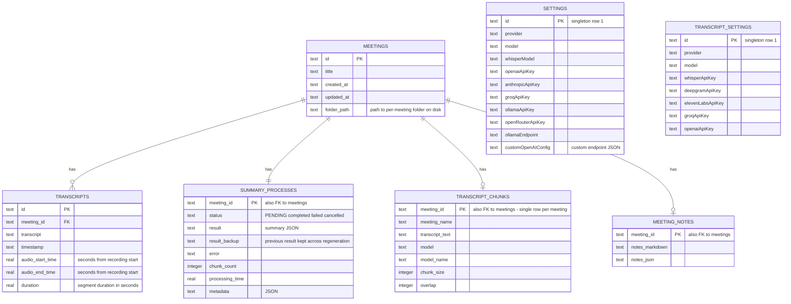
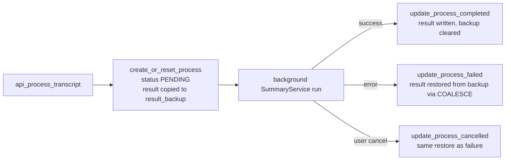

# Data Model & On-Disk Layout

Meetily persists state in three distinct layers, each owned by different code:

1. **SQLite** (`app_data_dir/meeting_minutes.sqlite`) — the relational source of truth for meetings, transcripts, summary pipeline state, and provider configuration. Owned by `database::manager::DatabaseManager` and the typed repositories in `database/repositories/`.
2. **The per-meeting folder** — a directory per recording on the user's media/document storage, containing the audio file, a versioned `transcripts.json`, a `metadata.json`, and (during a live recording) a `.checkpoints/` directory. Created by `audio::recording_saver::RecordingSaver` and shared by audio import and retranscription.
3. **Tauri store JSON files** — small UI/preference documents (`onboarding-status.json`, `recording_preferences.json`, `store.json`) managed by the `tauri-plugin-store` plugin, plus one non-store JSON file for notification settings under the OS config directory.

| Layer | Location | Format | Primary owner |
| --- | --- | --- | --- |
| Relational data | `app_data_dir/meeting_minutes.sqlite` (+ `-wal`/`-shm`) | SQLite via `sqlx` | `database::manager` |
| Models | `app_data_dir/models/`, `app_data_dir/models/summary/` | onnx / GGUF files | `whisper_engine`, `parakeet_engine`, `summary_engine` |
| Recordings | `Music/Movies/Documents/meetily-recordings/<Meeting>_YYYY-MM-DD_HH-MM/` | mp4 + JSON | `audio::recording_saver`, `audio::import`, `audio::retranscription` |
| UI preferences | Tauri stores: `onboarding-status.json`, `recording_preferences.json`, `store.json` | JSON via `tauri-plugin-store` | `onboarding.rs`, `audio::recording_preferences`, `api::api` |
| Notification settings | `<config_dir>/meetily/notifications.json` | JSON (plain file) | `notifications::settings::ConsentManager` |

## SQLite database lifecycle

`DatabaseManager` (`frontend/src-tauri/src/database/manager.rs`) wraps a `sqlx::SqlitePool` and is the only way the app touches SQLite. It is held in managed state as `AppState { db_manager }` and cloned freely; queries run through `state.db_manager.pool()` or the `with_transaction` helper (begin → commit on success, rollback on error).

**Open sequence** (`DatabaseManager::new_from_app_handle` → `new`):

1. Resolve `app_data_dir` via Tauri's path API and create it if missing.
2. Target file is `app_data_dir/meeting_minutes.sqlite`; legacy backend file is `app_data_dir/meeting_minutes.db`.
3. If the `.sqlite` file does not exist: copy the legacy `.db` over it when present (auto-migration of old Python-backend installs), otherwise create a new database.
4. Connect and run `sqlx::migrate!("./migrations")` — the migrations directory is compiled into the binary and replayed (idempotently) at **every** open.

**Defensive WAL recovery:** if opening fails with an error message containing `malformed` or `corrupt`, the manager assumes an orphaned `meeting_minutes.sqlite-wal` / `-shm` pair, deletes both files, and retries `new` exactly once. Any other error, or a second failure, propagates.

**Exit:** on `RunEvent::Exit`, `lib.rs` calls `AppState.db_manager.cleanup()`, which runs `PRAGMA wal_checkpoint(TRUNCATE)` (flushing all WAL pages into the main file and removing the WAL) and then closes the pool. Checkpoint failures are logged but non-fatal.

**First launch vs. normal launch** (`database/setup.rs`): `is_first_launch` is simply "the `.sqlite` file does not exist yet". On first launch, startup does **not** construct the manager; it emits a delayed `first-launch-detected` event so the UI can offer legacy import. `AppState` is then created by one of two onboarding commands, both of which emit `database-initialized` afterwards:

- `import_and_initialize_database` — imports a user-selected legacy DB (below) and manages `AppState`.
- `initialize_fresh_database` — creates the manager and seeds the default configuration rows: summary provider `builtin-ai` with the recommended local model, transcription provider `parakeet` with `DEFAULT_PARAKEET_MODEL`.

**Legacy database import** (`database/commands.rs`): `detect_legacy_database` accepts either a `.db` file directly, a directory containing `meeting_minutes.db`, or a repository root containing `backend/meeting_minutes.db`. `DatabaseManager::import_legacy_database` copies the chosen file to `app_data_dir/meeting_minutes.db` and then re-runs the standard open sequence, so the copy-from-legacy branch picks it up. The old file remains untouched after the copy.

## Schema

The initial migration (`20250916100000_initial_schema.sql`) creates six tables. All content tables reference `meetings(id)` with `ON DELETE CASCADE`:

| Table | Purpose | Key columns |
| --- | --- | --- |
| `meetings` | One row per meeting | `id` (PK, `meeting-{uuid}`), `title`, `created_at`, `updated_at`, `folder_path` (added later) |
| `transcripts` | Per-segment transcript rows for playback and search | `transcript` (text), `timestamp`, `audio_start_time`/`audio_end_time`/`duration` (added later), legacy `summary`/`action_items`/`key_points`, `speaker` (added later) |
| `summary_processes` | Summary pipeline state, one row per meeting (`meeting_id` is the PK) | `status`, `result` (JSON string), `result_backup` + `result_backup_timestamp` (added later), `error`, `start_time`/`end_time`, `chunk_count`, `processing_time`, `metadata` |
| `transcript_chunks` | Full-transcript snapshot with chunking parameters | `meeting_id` (PK), `meeting_name`, `transcript_text`, `model`, `model_name`, `chunk_size`, `overlap` |
| `settings` | Summary/LLM provider config, singleton row `id='1'` | `provider`, `model`, `whisperModel`, per-provider API key columns, `ollamaEndpoint`, `customOpenAIConfig` |
| `transcript_settings` | Transcription provider config, singleton row `id='1'` | `provider`, `model`, `whisperApiKey`, `deepgramApiKey`, `elevenLabsApiKey`, `groqApiKey`, `openaiApiKey` |



*Figure: the SQLite entities. `SETTINGS` and `TRANSCRIPT_SETTINGS` are single-row configuration tables, not related to `meetings`. Despite its name, `transcript_chunks` holds at most one row per meeting (`meeting_id` is its primary key).*

### Migration history

Later migrations are purely additive and shape the columns above:

| Migration | Effect |
| --- | --- |
| `20250920155811_add_openrouter_api_key` | Rebuilds `settings` with `openRouterApiKey` (temporary table, copy, drop, rename) |
| `20251006000000_add_audio_sync_fields` | `meetings.folder_path`; `transcripts.audio_start_time` / `audio_end_time` / `duration` (REAL, recording-relative seconds) |
| `20251010153942_add_ollama_endpoint` | `settings.ollamaEndpoint` |
| `20251101000000_add_summary_backup` | `summary_processes.result_backup` and `result_backup_timestamp` |
| `20251105120000_add_pro_license_custom_openai` | `settings.customOpenAIConfig` (JSON: endpoint, apiKey, model, maxTokens, temperature, topP); recreates the `licensing` table with RSA fields (`license_key`, `encrypted_key`, `signature_hash`, `activation_date`, `expiry_date`, `soft_expiry_date`, `is_soft_expired`) |
| `20251110000000_add_grace_period_to_licensing` | `licensing.grace_period` (seconds, default 604800 = 7 days) |
| `20251110000001_add_speaker_field` | `transcripts.speaker` (intended `mic` / `system`) |
| `20251223000000_add_meeting_notes` | `meeting_notes` table (`meeting_id` PK/FK, `notes_markdown`, `notes_json`) plus lookup index |
| `20251229000000_add_gemini_api_key` | `settings.geminiApiKey` |

### Typed models

`database/models.rs` maps rows with `sqlx::FromRow` derives: `MeetingModel`, `Transcript`, `SummaryProcess`, `TranscriptChunk`, `Setting`, `TranscriptSetting`. CamelCase column names (`whisperModel`, `openaiApiKey`, `customOpenAIConfig`, …) are mapped to snake_case Rust fields via `#[sqlx(rename = ...)]` / `#[serde(rename = ...)]`. Timestamps are stored as ISO strings/RFC 3339 and surfaced through a `DateTimeUtc` transparent wrapper.

### Schema drift to be aware of

Several schema surfaces exist but are not exercised by the compiled code paths:

- `transcripts.summary`, `action_items`, `key_points`, and `speaker` are never written by `TranscriptsRepository::save_transcript` or the retranscription path (their `INSERT` lists only text, timestamp, and the three audio-timing columns), and `Transcript` has no `speaker` field.
- `settings.geminiApiKey` exists in the schema but is absent from the `Setting` model and from the provider→column maps in `SettingsRepository`, so a Gemini key cannot currently be saved or read through that repository.
- The `licensing` and `meeting_notes` tables are created by migrations but no Rust module in the frontend crate reads or writes them today.

## Repositories (data access layer)

All SQL lives under `database/repositories/`; commands never inline queries except for a few legacy spots.

**Meetings** (`meeting.rs`): listing ordered by `created_at DESC`; `get_meeting` joins transcripts; `get_meeting_transcripts_paginated` orders segments by `audio_start_time ASC` — the ordering the playback UI relies on for audio-transcript synchronization. `update_meeting_name` (used after summary generation extracts a title) updates both `meetings.title` and the denormalized `transcript_chunks.meeting_name` in one transaction. `delete_meeting` deletes in an explicit transaction in a fixed order — `transcript_chunks` → `summary_processes` → `transcripts` → `meetings` — belt-and-braces over the schema's `ON DELETE CASCADE`.

**Transcripts** (`transcript.rs`): `save_transcript` creates the meeting and all its segments in a single transaction, generating `meeting-{uuid}` and `transcript-{uuid}` identifiers and persisting the optional `folder_path` that links the row to its on-disk folder. `search_transcripts` does case-insensitive `LIKE` matching with ±100-character context snippets.

**Summary processes** (`summary.rs`): the lifecycle machine behind summary generation.



*Figure: `summary_processes` state transitions. The backup columns guarantee a regeneration never destroys the previously stored summary.*

`create_or_reset_process` upserts a `PENDING` row; on conflict it copies the existing `result` into `result_backup` (with a timestamp) before restarting. On completion, `result` is overwritten and the backup cleared. On failure or cancellation, `result = COALESCE(result_backup, result)` restores the pre-regeneration summary. `update_meeting_summary` (manual editor saves) wraps the `summary_processes.result` update and the `meetings.updated_at` touch in one transaction.

**Transcript chunks** (`transcript_chunk.rs`): `save_transcript_data` upserts the single `transcript_chunks` row for a meeting with the full transcript text plus the model, model name, and chunking parameters (`chunk_size` default 40000, `overlap` default 1000 when `api_process_transcript` is called without them). This is a provenance/config record, not a segmentation of the text.

**Settings** (`setting.rs`): both config tables are treated as singletons (`id='1'`) with upserts. Provider names map to concrete key columns (`openai` → `openaiApiKey`, `claude` → `anthropicApiKey`, `openrouter` → `openRouterApiKey`, `groq` → `groqApiKey`, `ollama` → `ollamaApiKey`; transcription side `localWhisper`/`deepgram`/`elevenLabs`/`groq`/`openai`). `builtin-ai` and `parakeet` need no API key and are no-ops. `custom-openai` is rejected by `save_api_key`/`get_api_key` by design — it stores its whole configuration (endpoint, key, model, sampling parameters) as JSON in `settings.customOpenAIConfig` via `save_custom_openai_config`/`get_custom_openai_config`.

## The per-meeting folder

Live recordings, imported audio, and retranscriptions all share one folder contract. A meeting folder is created by `create_meeting_folder` (`audio/audio_processing.rs`) as `{base}/{Sanitized_Name}_{YYYY-MM-DD_HH-MM}/`, where unsafe filename characters are replaced with `_`:

```text
meetily-recordings/Design Review_2025-01-15_14-30/
├── audio.mp4            # final merged recording (only written when audio is saved)
├── transcripts.json     # versioned segments with playback-sync timestamps
├── metadata.json        # meeting metadata + summary-language fields
└── .checkpoints/        # only during live recording with auto_save; removed after finalize
    ├── audio_chunk_000.mp4
    ├── audio_chunk_001.mp4
    └── concat_list.txt  # temporary FFmpeg concat list, exists only during merge
```

**Where the base folder comes from:** `recording_preferences::get_default_recordings_folder()` picks the platform media directory — `%USERPROFILE%\Music\meetily-recordings` on Windows (`dirs::audio_dir`), `~/Movies/meetily-recordings` on macOS (`dirs::video_dir`), `~/Documents/meetily-recordings` elsewhere — with a Documents fallback and a final `.` fallback. A user-configured `save_folder` in the `recording_preferences.json` store overrides it. Import uses the same base folder and `create_meeting_folder`; live recording reaches it through `RecordingSaver::initialize_meeting_folder`.

### audio file and .checkpoints/

Whether audio is written at all is controlled by the `auto_save` flag from recording preferences. `RecordingSaver::start_accumulation(auto_save)` still creates the folder, `transcripts.json`, and `metadata.json` in both modes, but only creates `.checkpoints/` and the `IncrementalAudioSaver` when `auto_save` is true; otherwise audio chunks are consumed and discarded (transcription happened upstream) and `metadata.audio_file` is set to an empty string.

`IncrementalAudioSaver` (`audio/incremental_saver.rs`) buffers mixed 48 kHz mono audio and, once the buffer reaches 30 seconds of samples (`sample_rate * 30` = 1,440,000 samples at 48 kHz), encodes it to `.checkpoints/audio_chunk_{NNN}.mp4` (zero-padded sequence). This bounds memory and makes recordings crash-recoverable. At normal completion, `finalize()` flushes any remainder, merges all checkpoints into `audio.mp4` with the FFmpeg concat demuxer (`-f concat -safe 0 -c copy`, no re-encoding), and deletes `.checkpoints/` (non-fatal if removal fails). A zero-checkpoint finalize is an error. For crashes, three commands expose the same directory to the frontend: `recover_audio_from_checkpoints` (re-merges whatever checkpoints exist and reports `success`/`failed`/`none` plus `chunk_count × 30s` estimated duration), `cleanup_checkpoints`, and `has_audio_checkpoints`.

### transcripts.json

`transcripts.json` is a versioned document rewritten atomically — serialize, write to `.transcripts.json.tmp`, verify, `rename` over the real file — so a crash never leaves a half-written transcript. The live-recording writer in `RecordingSaver` emits:

```json
{
  "version": "1.0",
  "segments": [
    {
      "id": "seg_12",
      "text": "...",
      "audio_start_time": 125.3,
      "audio_end_time": 128.6,
      "duration": 3.3,
      "display_time": "[02:05]",
      "confidence": 0.92,
      "sequence_id": 12
    }
  ],
  "last_updated": "2025-01-15T14:35:22Z",
  "total_segments": 13
}
```

`audio_start_time` / `audio_end_time` / `duration` are seconds from recording start — the contract that lets the UI seek `audio.mp4` (read back through the `read_audio_file` command) in sync with the transcript, and the same values that land in the `transcripts` table. `add_transcript_segment` upserts by `sequence_id` (refinements of the same segment replace, not append) and rewrites the file immediately, so the transcript on disk is always current even mid-recording.

Import and retranscription share the same file format through `audio/common.rs::write_transcripts_json` (fields `id`, `text`, `timestamp`, `audio_start_time`, `audio_end_time`, `duration`, and a derived `sequence_id`) — a slightly different segment shape than the live writer, both under `version: "1.0"`. Retranscription rewrites `transcripts.json` from the folder's existing audio file after replacing the DB rows; import writes it once after transcribing a copied source file.

### metadata.json

`metadata.json` describes the meeting itself. The live writer serializes the `MeetingMetadata` struct atomically (`.metadata.json.tmp` + rename), initially with `status: "recording"`, `audio_file: "audio.mp4"` (or empty when audio saving is disabled), `transcript_file: "transcripts.json"`, and `sample_rate: 48000`; device names are patched in when capture starts. On `stop_and_save` it transitions to `status: "completed"` with `completed_at` and `duration_seconds` (the recording-state duration, falling back to the last segment's `audio_end_time`), then emits `recording-saved` with the audio and transcript paths. Import writes its own variant (`status: "completed"`, `source: "import"`, real `meeting_id`); retranscription does a read-modify-write that adds `retranscribed_at`, resets `status`, and drops `detected_summary_language` so stale detection is not reused.

Note the live-recording quirk: `MeetingMetadata.meeting_id` starts as `None` ("will be set by backend") because SQLite rows are only created after the user sees the transcripts; the DB ↔ folder link for live recordings is the `meetings.folder_path` column, fed from the `recording-stopped` event payload.

### Summary language fields in metadata.json

`summary/metadata.rs` extends `metadata.json` with two per-meeting language fields: `summary_language` (the user's override) and `detected_summary_language` (cached auto-detection). Both are read/written through a global `METADATA_WRITE_LOCK` with a read-modify-write cycle that **preserves all other fields**, uses a UUID-suffixed temp file per write, and normalizes codes (`zh-tw` preserved, `zh-cn` → `zh`, other regional subtags stripped; unsupported codes are rejected). Exposed to the UI by four commands (`api_get/save_meeting_summary_language`, `api_get/save_meeting_detected_summary_language`) which resolve the folder from `meetings.folder_path`; a meeting with no folder reports `storage: "local_fallback"` instead of metadata storage. The summary service reads the detected language the same way (falling back to in-memory detection of the transcript text) to decide whether a stored summary needs retranslation.

### Who writes what, when

- **Live recording:** folder + `metadata.json` + optional `.checkpoints/` created at start; `transcripts.json` rewritten on every segment; on stop, `RecordingSaver::stop_and_save` finalizes `audio.mp4`, rewrites `transcripts.json`, and completes `metadata.json`. The Rust side deliberately does **not** write SQLite here — the `recording-stopped` event carries `folder_path` and `meeting_name`, and the frontend calls `api_save_transcript` once all transcript segments have streamed in, which transactionally inserts the `meetings` row (with `folder_path`) and all `transcripts` rows.
- **Import:** folder created without checkpoints, source audio copied to `audio.{ext}`, transcribed, DB rows written by `create_meeting_with_transcripts`, then `transcripts.json` + `metadata.json` written. Cancellation removes the folder.
- **Retranscription:** finds the audio file in the existing folder (`audio.mp4` first, then other known names, then any audio extension), deletes and re-inserts the meeting's `transcripts` rows in one transaction, and rewrites `transcripts.json` + `metadata.json`.

## Tauri store files

Three JSON documents are managed by the `tauri-plugin-store` plugin (registered in `lib.rs`, `store:default` capability in `tauri.conf.json`), each read/written through `app.store("<file name>")` from `tauri_plugin_store::StoreExt`, so file placement is owned by the plugin (resolved under the app's data directory) and never hardcoded by call sites:

| Store file | Owner module | Key | Contents |
| --- | --- | --- | --- |
| `onboarding-status.json` | `onboarding.rs` | `status` | `OnboardingStatus { version, completed, current_step, model_status: { parakeet, summary, selected_summary_model }, last_updated }` — onboarding progress and model-download state |
| `recording_preferences.json` | `audio/recording_preferences.rs` | `preferences` | `RecordingPreferences { save_folder, auto_save, file_format, preferred_mic_device, preferred_system_device, system_audio_backend (macOS) }` |
| `store.json` | `api/api.rs` | `authToken` | Auth token for the (mostly retired) cloud API; only a `#[allow(dead_code)]` helper reads it — live commands receive `auth_token` as an argument instead |

Semantics worth knowing: onboarding reads fall back to `OnboardingStatus::default()` (step 1, models `not_downloaded`) if the store is unreadable, `get_onboarding_status` returns `None` when the key was never saved, and `complete_onboarding` writes the SQLite config rows **before** marking onboarding complete, so a crash cannot leave a completed flag without its model configuration. Saving recording preferences also creates the configured recordings directory and applies the macOS capture backend. `reset_onboarding_status` deletes the key rather than the file.

**Notification settings are not a Tauri store.** `ConsentManager` (`notifications/settings.rs`) serializes `NotificationSettings` (consent flags, system permission, manual DND, per-type `notification_preferences` with `meeting_reminder_minutes` defaulting to `[15, 5]`) directly to `<config_dir>/meetily/notifications.json` via the `dirs` crate, creating the parent directory on demand.

## Default storage locations

All paths are resolved at runtime — via Tauri path APIs (`app_data_dir`, `resource_dir`) or the `dirs` crate — never hardcoded:

- **Database and WAL/SHM:** `app_data_dir/meeting_minutes.sqlite` (+ `-wal`, `-shm`); legacy `meeting_minutes.db` lives beside it.
- **Transcription models:** `app_data_dir/models` (`whisper_engine::commands::set_models_directory` and the mirrored Parakeet initializer create it at startup).
- **Built-in AI models:** `app_data_dir/models/summary` (GGUF files managed by the summary `ModelManager`).
- **Recordings:** platform `Music`/`Movies`/`Documents` folder → `meetily-recordings/` per-meeting subfolders, overridable through recording preferences.
- **Notification settings:** OS config dir → `meetily/notifications.json`.
- **Templates:** bundled read-only under `resource_dir()/templates` (not user data).

## Related pages

- `/openwiki/architecture/overview.md` — where persistence fits in the startup/exit sequence.
- `/openwiki/workflows/live-recording.md` — how the folder and checkpoints are produced during a recording.
- `/openwiki/workflows/summary-generation.md` — the `summary_processes` lifecycle in full.
- `/openwiki/architecture/legacy-and-dead-code.md` — the legacy `.db` story and uncompiled modules.
