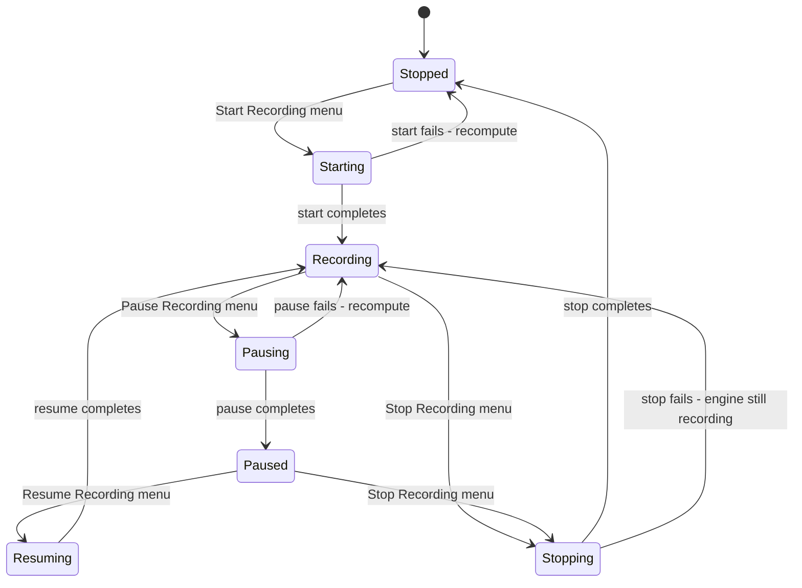
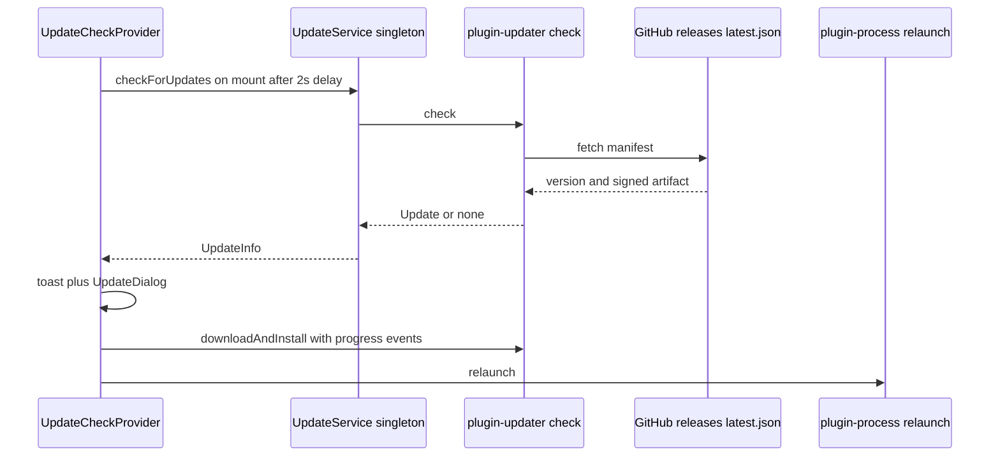
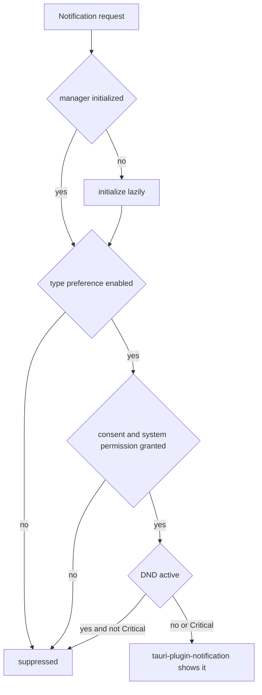

# Desktop Services

Beyond capture → transcribe → summarize, Meetily's desktop shell provides the services a user actually operates through: a **system tray** that mirrors and drives the recording lifecycle even when the window is hidden, a **notification manager** that gates OS notifications behind consent and preferences, an **opt-in PostHog analytics** client, an **auto-updater** pinned to GitHub releases, and **onboarding persistence** that remembers setup progress and model availability. These live in `frontend/src-tauri/src/tray.rs`, `notifications/`, `analytics/`, `onboarding.rs`, and the frontend `updateService.ts`/`AnalyticsProvider`, all wired in `lib.rs::run()`.

| Service | Rust home | Frontend home | Persistence |
| --- | --- | --- | --- |
| Tray + window lifecycle | `tray.rs` + `lib.rs` window/close handlers | `RecordingPostProcessingProvider`, `UpdateCheckProvider` | — (engine state) |
| Updater | `tauri-plugin-updater` + `tauri-plugin-process` | `services/updateService.ts`, `UpdateDialog` | `tauri.conf.json` (pubkey, endpoint) |
| Notifications | `notifications/` (`NotificationManager`) | `ConfigContext`, `PreferenceSettings` | `<config_dir>/meetily/notifications.json` |
| Analytics | `analytics/` (`AnalyticsClient`) | `lib/analytics.ts`, `AnalyticsProvider`, `AnalyticsConsentSwitch` | Tauri store `analytics.json` |
| Onboarding | `onboarding.rs` | `OnboardingContext`, `app/layout.tsx` | Tauri store `onboarding-status.json` |

## System tray

`create_tray` (`tray.rs`) builds a tray icon with id `"main-tray"`, the app icon, and the tooltip "Meetily", then immediately calls `update_tray_menu` so the initial `RecordingState::Stopped`/`can_record=true` placeholder menu is replaced with real engine state. The menu is **stateless between rebuilds**: it is always reconstructed from two inputs — the current recording state and whether recording is allowed — so every state change must end in a menu rebuild.

### Recording-state model and menu rebuilds

`RecordingState` has seven variants: `Stopped`, `Starting`, `Recording`, `Pausing`, `Paused`, `Resuming`, `Stopping`. Four of them are **transient**: `set_tray_state` swaps the menu optimistically the moment a user acts (assuming `can_record=true`, since a transition implies recording was allowed), and the async handler that follows either completes the transition via the recording commands' own `update_tray_menu` call or reverts with `update_tray_menu_async` on failure.



*Figure: tray menu states. Transient states are optimistic UI; the authoritative state is recomputed from the audio engine via `is_recording` / `is_recording_paused`.*

`update_tray_menu` is a sync wrapper that spawns a task, sleeps 100 ms (letting the engine flag settle), then runs `update_tray_menu_async`: it polls `get_current_recording_state()` (only `Stopped`/`Recording`/`Paused` are derivable from the engine) and `check_can_record()`, and rebuilds the menu. Every state transition calls it — `lib.rs::start_recording`/`stop_recording` after toggling `RECORDING_FLAG`, `recording_commands.rs` after start/stop/pause/resume succeed, and `parakeet_engine::commands` after a model download completes (which can flip `can_record` from false to true).

### Recording menu actions

The menu items per state: `Stopped` shows **Start Recording** (`toggle_recording`); `Recording` shows **Pause** + **Stop**; `Paused` shows **Resume** + **Stop**; transient states show a disabled progress label plus **Stop** where applicable. When `can_record` is false the entire recording section collapses to a single disabled **"⏳ Downloading transcription model..."** item.

`check_can_record` gates recording on onboarding: if `onboarding-status.json` says `completed`, recording is always allowed (the user may have configured Whisper or another provider); otherwise it asks `parakeet_has_available_models()`. Load failures default safely in opposite directions — unreadable onboarding status is assumed *complete*, a failed model check is assumed *not ready*.

The tray handlers invoke the same Rust commands the UI uses, not events:

- **Stop** (via `stop_recording_handler` or the stop branch of `toggle_recording_handler`) computes a save path `app_data_dir/recording-<YYYY-MM-DDTHH-MM-SS>.wav` (mirroring `RecordingControls.tsx`), calls `audio::recording_commands::stop_recording` directly, and on success emits the `recording-stop-complete` event so `RecordingPostProcessingProvider` runs the full post-processing flow (SQLite save, navigation, analytics) from any page. Failure reverts the menu.
- **Start** (the other branch of `toggle_recording_handler`) sets `sessionStorage.autoStartRecording = 'true'` and navigates the webview to `/` via `window.location.assign`; `useRecordingStart` consumes the flag on mount and auto-starts after re-checking Parakeet readiness.
- **Pause/Resume** call `pause_recording`/`resume_recording`; the commands themselves emit the frontend events and refresh the tray.

### Static menu actions and window lifecycle

Every menu also carries a separator, **Open Main Window**, **Settings**, **Check for Updates**, and **Quit**. All but Quit first run `focus_main_window` (unminimize → show → set_focus → `window.eval("window.focus()")`). **Settings** additionally navigates the main webview to `/settings` with `window.location.assign`. **Check for Updates** dispatches the `check-updates-from-tray` DOM `CustomEvent`, which `UpdateCheckProvider` handles by forcing an update check and opening the dialog. **Quit** calls `app.exit(0)` (this is the only path that truly exits; see below).

Closing the main window does not quit the app: `on_window_event` intercepts `CloseRequested` for the `"main"` label, calls `prevent_close`, and hides the window instead — the tray becomes the only surface left, and **Quit** is the sole menu item that terminates the process. A `tauri_plugin_single_instance` callback (desktop platforms only) focuses the main window whenever a second launch is attempted, and macOS `RunEvent::Reopen` (dock click) does the same.

## Auto-updater

### Plugin configuration

`lib.rs` registers `tauri_plugin_updater` and `tauri_plugin_process`; `tauri.conf.json` grants the `main` window `updater:default` and `process:default` and pins the trust configuration under `plugins.updater`:

- **pubkey** — an embedded minisign public key; update artifacts are verified against it, so builds must be signed with the matching private key (`TAURI_SIGNING_PRIVATE_KEY` in CI).
- **endpoints** — `https://github.com/Zackriya-Solutions/meeting-minutes/releases/latest/download/latest.json`, i.e. the always-latest release asset.
- `bundle.createUpdaterArtifacts: true` — produces `.tar.gz`/installer + `.sig` update artifacts at build time.

The release workflow (`release.yml`) creates a draft release and lets `tauri-action` upload the platform artifacts (macOS DMG + `app.tar.gz` + `.sig`; Windows MSI/NSIS signed via `signCommand` + `.sig`) along with the auto-generated `latest.json` manifest that the endpoint serves.

### Frontend update flow



*Figure: update check on startup or from the tray, download/install through the plugin, and relaunch through plugin-process.*

`UpdateService` (`frontend/src/services/updateService.ts`) is a singleton exported as `updateService`. `checkForUpdates(force)` guards against concurrent checks, and unless `force` is set it skips entirely when the last check is younger than `CHECK_INTERVAL_MS` = 24 h, returning `{ available: false }`. When an update exists it surfaces `version`, `date`, and release `body`. `downloadAndInstall` sequences `update.download()` → `update.install()` → `relaunch()` from `@tauri-apps/plugin-process`.

The UX layer adds policy:

- `useUpdateCheck` checks once on mount (2 s delay so startup is not blocked) and **silently swallows failures** for background checks; `wasCheckedRecently()` applies the same 24 h throttle at the hook level.
- `UpdateCheckProvider` provides the app-wide context, shows a toast (`UpdateNotification`) when an update is available, and listens for `check-updates-from-tray` to force a check and open the dialog — this is the tray item's entire effect.
- `UpdateDialog` re-invokes `check()` to obtain the live `Update` object, streams `Started`/`Progress`/`Finished` download events into a progress bar, blocks closing (button, ESC, outside click) while downloading, then relaunches.
- The About settings screen calls `checkForUpdates(true)` for an on-demand forced check.

## Notifications

### Manager structure and lifecycle

`NotificationManager<R>` (`notifications/manager.rs`) composes three collaborators: `SystemNotificationHandler` (thin wrapper over `tauri_plugin_notification`), `ConsentManager` (settings persistence), and an in-memory `RwLock<NotificationSettings>` plus an `initialized` flag. It is held in managed state as `NotificationManagerState<R> = Arc<RwLock<Option<NotificationManager<R>>>>`.

The state is managed **as `None` at startup**; `setup` spawns an async task that constructs and initializes the manager, then sets **default consent `true`** and requests system permission before publishing the manager into the state. Until that publish lands, every notification command short-circuits with `"Notification manager not initialized"` — a startup race window the helper commands `initialize_notification_manager_manual` and `test_notification_with_auto_consent` can close on demand.

### Gating rules

All notifications funnel through `show_notification` → `should_show_notification`, which enforces four layers in order:

1. **Lazy init** — a not-yet-initialized manager initializes itself first.
2. **Consent + permission** — both `consent_given` and `system_permission_granted` must be true.
3. **Do Not Disturb** — when `is_dnd_active()` is true only `NotificationPriority::Critical` passes.
4. **Per-type preference** — `NotificationType` maps to one flag in `notification_preferences`; `Test` always passes.



*Figure: the suppression chain every notification passes through before reaching the OS.*

The typed helpers (`show_recording_started`, `show_recording_stopped`, `show_recording_paused`, `show_recording_resumed`, `show_transcription_complete`, `show_meeting_reminder`, `show_system_error`) each re-check their specific preference flag *before* building a `Notification`, so a disabled preference short-circuits without logging a "skipped" notification attempt. Defaults (`NotificationPreferences::default`) are deliberately asymmetric: recording **started/stopped notifications are off by default**, while paused/resumed/transcription-complete/reminders/system-errors are on, with reminder offsets `[15, 5]` minutes. Test notifications bypass the preference gate entirely.

DND has two inputs: `manual_dnd_mode` short-circuits to active, and system DND is consulted only when `respect_do_not_disturb` is set. In practice `SystemNotificationHandler::is_dnd_active`/`get_system_dnd_status` both return `false` — the app manages DND exclusively through its own settings — so the effective DND signal today is the manual toggle. Likewise `request_permission` returns `Ok(true)` unconditionally ("automatic for Tauri apps"), meaning the `system_permission_granted` flag tracks app-level bookkeeping rather than a real OS prompt; `clear_notifications` is a logged no-op.

### Persistence and commands

`ConsentManager` serializes `NotificationSettings` (consent flags, permission, manual DND, per-type preferences) to a plain JSON file at `<config_dir>/meetily/notifications.json` via the `dirs` crate — not a Tauri store. `update_settings` validates first (meeting reminder offsets ≤ 1440 minutes), saves to disk, then swaps the in-memory copy.

The command surface (`notifications/commands.rs`) exposes settings read/write, permission request, custom and test notifications, DND queries/set, consent set, clear, readiness check, manual init, auto-consent test, and stats (`get_notification_stats` returning a JSON snapshot of consent/DND/preference state). The frontend reaches it through `ConfigContext` (`get_notification_settings` / `set_notification_settings`); `PreferenceSettings` toggles `show_recording_started` and `show_recording_stopped` together as a single "notifications of start and end of meeting" switch.

### Recording lifecycle notifications

Recording notifications are fired **from the Rust side, not the UI**: after `start_recording`, `start_recording_with_devices_and_meeting`, and `stop_recording` succeed in `lib.rs`, they call `show_recording_started_notification` / `show_recording_stopped_notification`. These helpers use the published manager when present; when the manager is still missing they re-check the relevant preference from disk and fall back to building the notification directly through `tauri_plugin_notification` — so a slow startup degrades to the same visible notification instead of dropping it. Equivalent helpers for paused/resumed/transcription-complete/system-error exist but currently have no production call sites.

## Analytics (PostHog)

### Rust client

`analytics/analytics.rs` wraps `posthog-rs` in `AnalyticsClient`. The client is an `Option<Arc<Client>>`: `AnalyticsClient::new` only creates a real client when `config.enabled && !config.api_key.is_empty()`, and every method is a silent no-op (`Ok(())`) when it is `None` — enabling/disabling analytics is literally constructing or dropping the client. Two invariants shape all event flow:

- **No anonymous users.** `track_event` drops events (with a warning) if `identify` has not stored a `user_id`; events are never sent with an anonymous identity.
- **Sanitization before capture.** `sanitize_analytics_properties` strips a denylist (`SENSITIVE_ANALYTICS_KEYS`) covering meeting titles/names (both snake and camel case), file/folder/path keys, `device_name`, and `user_agent` — applied in `identify`, `track_event`, and `set_user_properties`. `track_event` also stamps `app_version` (from `CARGO_PKG_VERSION`) and current `session_id`/`session_duration` onto every event.

A fixed event vocabulary is built on `track_event`: session start/end, `daily_active_user`, `user_first_launch`, `app_started`, `feature_used`, recording/meeting started/stopped/deleted with `meeting_id` only, `settings_changed`, and the summary/model family (`summary_generation_started/completed`, `summary_regenerated`, `model_changed`, `custom_prompt_used`). `track_meeting_ended` is the richest, carrying providers and model names, duration breakdowns, **privacy-safe device *types*** (not names), chunk/segment counts, and `had_fatal_error`. Consent is itself instrumented: `analytics_enabled`, `analytics_disabled`, and `analytics_transparency_viewed` — the disable path fires `track_analytics_disabled` *before* the client is dropped, since after `disable_analytics` nothing more can be captured.

### Command surface and consent flow

`analytics/commands.rs` holds the client in a global `static ANALYTICS_CLIENT: Mutex<Option<Arc<AnalyticsClient>>>`. `init_analytics` constructs it with `enabled: true`, the US PostHog host (`https://us.i.posthog.com`), and a hardcoded public PostHog project key; `disable_analytics` drops it. Every `track_*`/`identify_user` command returns `Err("Analytics client not initialized")` when the global is empty, and `is_analytics_enabled` reports `is_enabled()` (config enabled **and** client present).

The consent decision lives entirely on the frontend, and the backend never initializes itself:

- `AnalyticsProvider` reads `analyticsOptedIn` from the Tauri store `analytics.json`. Missing or non-`true` values are coerced to `false`, and a one-time migration flag (`analyticsDefaultOffMigrationV1`) forces opt-in off for pre-migration installs — analytics is **off by default**.
- Only when opted in does it call `Analytics.init()` → `invoke('init_analytics')`, then identify the user with a persistent `user_id` from `analytics.json`, start a session, and track first launch / app start / daily usage.
- Every static method on `Analytics` (`lib/analytics.ts`) no-ops unless `initialized`, so stray `Analytics.track(...)` calls across components are harmless when consent is off.
- `AnalyticsConsentSwitch` (in About → settings) is the only toggler: enabling runs the full init sequence and fires `track_analytics_enabled`; disabling first shows a transparency modal (firing `track_analytics_transparency_viewed`), then fires `track_analytics_disabled`, then calls `Analytics.disable()` → `invoke('disable_analytics')`. The persisted `analyticsOptedIn` flag is written optimistically and reverted on failure.

This keeps the system consistent with the local-first posture documented in `PRIVACY_POLICY.md`: analytics content is limited to usage metrics with generated IDs, and no meeting content or metadata leaves the machine unless the user opts in — enforced by the sanitization denylist plus consent-gated construction.

### Backend-emitted events

One high-value event bypasses the frontend: when a recording stops, `recording_commands.rs::stop_recording` assembles `track_meeting_ended` directly from the recording manager's stats. Device names are reduced to a `classify_device_type` result — `Bluetooth` or `Wired` only — before submission, so even this backend path cannot leak hardware names. Failures are logged, never fatal to the stop flow.

## Onboarding persistence

### OnboardingStatus store

`onboarding.rs` persists progress in the Tauri store **`onboarding-status.json`** under the single key `"status"`:

```json
{
  "version": "1.0",
  "completed": false,
  "current_step": 1,
  "model_status": {
    "parakeet": "not_downloaded",
    "summary": "not_downloaded",
    "selected_summary_model": null
  },
  "last_updated": "..."
}
```

`model_status.parakeet` / `.summary` hold `"downloaded" | "not_downloaded" | "downloading"`. Reads are defensive: store access or deserialization failures fall back to `OnboardingStatus::default()` (step 1, nothing downloaded), and `get_onboarding_status` returns `None` when the key was never written so the UI can distinguish "fresh install" from "default values". `reset_onboarding_status` deletes the key rather than the file, and every save stamps `last_updated`.

### The complete_onboarding ordering invariant

`complete_onboarding` enforces a deliberate ordering: it first writes the model configuration rows to SQLite — summary provider `builtin-ai` with the chosen model (and a legacy `large-v3` whisper-model placeholder), transcription provider `parakeet` with `DEFAULT_PARAKEET_MODEL` (`parakeet-tdt-0.6b-v3-int8`) — and only after both succeed marks `completed = true`, `current_step = 4`, both models `downloaded`, and records `selected_summary_model`. A crash therefore cannot leave a completed flag without its backing configuration. The frontend's `completeOnboarding` guards the reverse race too: an `isCompletingRef` flag suppresses the context's auto-save during completion so a download-finished event cannot overwrite the completed status.

`model_status.selected_summary_model` is `#[serde(default)]`/skipped when `None`, so statuses written before the field existed still deserialize — locked by the `onboarding_status_deserializes_without_selected_summary_model` test.

### Who reads the store

- `app/layout.tsx` calls `get_onboarding_status` on mount; `null`/`false`/an error all show the onboarding flow (fail-closed toward onboarding).
- `OnboardingContext` reloads it, then **verifies claims against disk** before trusting them: it runs `parakeet_has_available_models` and `builtin_ai_is_model_ready` (falling back to `builtin_ai_get_recommended_model`) rather than believing `model_status`, clamps `current_step` to the 4-step flow, but trusts `completed` outright so background downloads do not drag the user back into setup.
- The tray's `check_can_record` reads the same store on every menu rebuild, making onboarding completion the tray's recording-unlock condition.

### ModelManager startup and lazy fallback

The BuiltInAI `ModelManager` backing onboarding's summary model is managed as `ModelManagerState(Arc<Mutex<Option<Arc<ModelManager>>>>)`, also starting as `None`. Setup spawns `init_model_manager_at_startup`, which points the manager at `app_data_dir/models/summary`; on failure it only logs a warning that the manager "will be lazy-initialized on first use" — every `builtin_ai_*` command re-checks the state and calls `init_model_manager` itself when empty. Startup failure thus degrades to slower first use, never to a broken feature.

## Focused tests

- `analytics.rs` — `analytics_properties_drop_sensitive_meeting_metadata` verifies every denylisted key is stripped while operational keys (`meeting_id`, `duration_seconds`, `model_name`, `platform`) survive; `meeting_started_properties_do_not_include_title` pins the "ID, never title" rule for meeting events.
- `onboarding.rs` — `onboarding_status_deserializes_without_selected_summary_model` locks backward compatibility of the store schema.
- `summary_engine/commands.rs` — recommendation thresholds (`qwen3.5:2b` below the 14 GB RAM floor, `qwen3.5:4b` at/above it) and model priority ordering, which determine what onboarding downloads.

The tray, updater, and notification manager have no unit tests; their behavior is guarded by the frontend flows (`useUpdateCheck`, `RecordingPostProcessingProvider`) and the command contracts described above.
