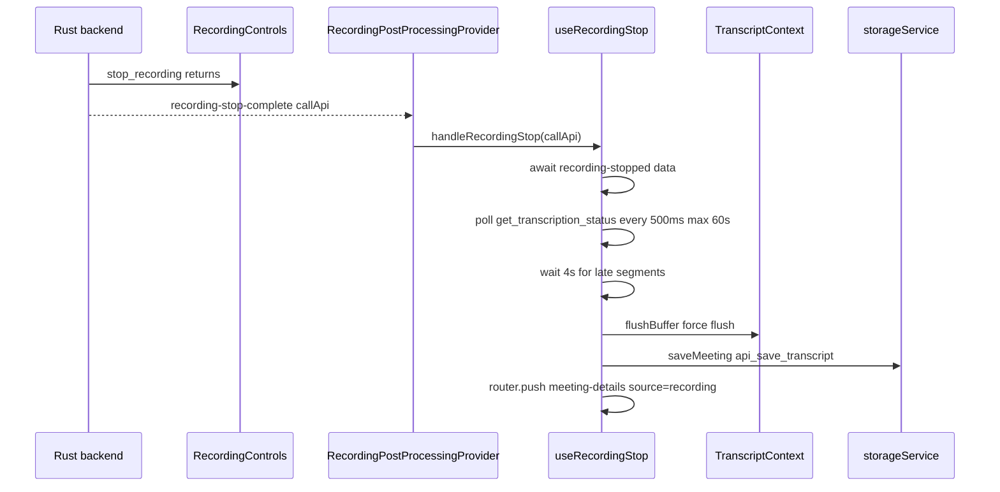
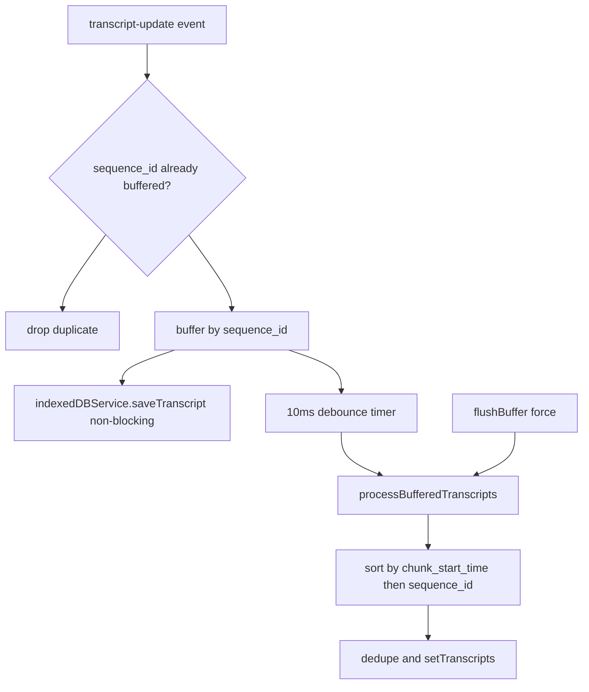

# Frontend State & Services

The Next.js app under `frontend/src/` is the only UI layer. It holds no business logic of its own: it invokes Rust commands, listens for Tauri events, and organizes the results into a small set of React contexts plus page-level hooks. This page maps that runtime — who owns which state, how the recording lifecycle flows, where transcripts are buffered and recovered, and which pages and component groups exist.

## The state flow pattern

All cross-boundary state follows one pattern:

1. A component or hook calls a Rust **command** (`invoke`). The command mutates native state.
2. Rust **emits a Tauri event** (`recording-started`, `transcript-update`, `recording-stop-complete`, …).
3. A **frontend listener** — usually registered inside a context provider — updates React state.
4. **Components consume** the context; they never re-derive backend state themselves.

`frontend/src/services/` exists purely to make step 1 and 2 uniform: each service is a **pure 1:1 wrapper** over `invoke`/`listen` with "no error handling changes, exact same behavior as direct invoke/listen calls" (`recordingService.ts`, `transcriptService.ts`, `configService.ts`, `storageService.ts`, `updateService.ts`). New backend commands should be wrapped there rather than invoked ad hoc from components. Some components still call `invoke` directly (e.g. `RecordingControls`, recovery hooks); the wrapper rule is the convention for new code, not a hard barrier.

## Provider tree

`app/layout.tsx` mounts every global provider in a fixed order:

```
AnalyticsProvider > RecordingStateProvider > TranscriptProvider > ConfigProvider
  > OllamaDownloadProvider > OnboardingProvider > UpdateCheckProvider
  > SidebarProvider > TooltipProvider > RecordingPostProcessingProvider > ImportDialogProvider
```

`RecordingStateProvider` sits outside `TranscriptProvider` because the transcript context consumes recording state (`useRecordingState`) for reload sync. The layout also decides between `OnboardingFlow` and the main app from `get_onboarding_status`, forwards the tray's `request-recording-toggle` to the `start-recording-from-sidebar` DOM event, and hosts the drag-and-drop import overlay and dialog (gated on the `importAndRetranscribe` beta feature).

## Contexts

### ConfigContext — user configuration

`ConfigContext` (`contexts/ConfigContext.tsx`) owns user-facing configuration: summary **model config** (provider/model/whisperModel/endpoint plus custom-OpenAI fields), **transcript model config** (e.g. Parakeet), **selected devices**, **language**, confidence-indicator and auto-summary toggles, **beta features** (localStorage-backed via `loadBetaFeatures`/`saveBetaFeatures`), per-provider **API keys** (claude/groq/openai/openrouter), and lazily loaded **notification settings** and **storage locations** (database/models/recordings directories).

On mount it loads saved config from the backend (`api_get_model_config`, `api_get_transcript_config`, `get_recording_preferences`, `api_get_api_key` per provider), seeds a per-provider model cache in localStorage, and re-fetches the Ollama model list (`get_ollama_models`) whenever the endpoint changes. It subscribes to the `model-config-updated` event so saves from other pages (e.g. meeting-details' model modal) update the shared config. Language changes persist to `localStorage.primaryLanguage` and sync to Rust via `set_language_preference` (also on startup, fixing a desync where the backend started recording with the wrong language). Notification settings and storage locations are **lazy loaded** once via `loadPreferences()` (guarded by refs), not at mount.

### RecordingStateContext — lifecycle status

`RecordingStateContext` is the **single source of truth** for the recording lifecycle, replacing per-component `isRecording` booleans. Its `RecordingStatus` enum drives the UI phases:

| Status | Meaning |
| --- | --- |
| `IDLE` | Not recording |
| `STARTING` | Initiating recording |
| `RECORDING` | Active recording |
| `STOPPING` | Stop initiated, waiting for backend |
| `PROCESSING_TRANSCRIPTS` | Transcription completion wait |
| `SAVING` | Saving to database |
| `COMPLETED` | Successfully saved |
| `ERROR` | Error occurred |

The provider keeps `isRecording/isPaused/isActive/recordingDuration/activeDuration` in sync with the backend three ways: event listeners on `recording-started/stopped/paused/resumed` (started → `RECORDING` + begin polling; stopped → `STOPPING` unless already deeper in the stop flow, and stop polling), an **initial sync on mount** (`get_recording_state`) that fixes the refresh-desync bug where the backend records but the reloaded UI shows stopped, and **500 ms polling** of `get_recording_state` while recording. Derived helpers `isStopping/isProcessing/isSaving` and a `setStatus(status, message?)` setter are exposed to the whole tree.

### TranscriptContext — live transcript buffer

`TranscriptContext` (`contexts/TranscriptContext.tsx`) owns the live transcript list, meeting title, auto-scroll behavior, and the IndexedDB write-through used for crash recovery.

**Buffering.** The main listener subscribes to `transcript-update` via `transcriptService`. Each update is buffered in a `Map` keyed by `sequence_id` (duplicates dropped), then a **10 ms debounce timer** runs `processBufferedTranscripts`, which drains consecutive sequence ids, plus any stale/recent entries, sorts by `chunk_start_time` then `sequence_id`, dedupes against already-rendered `sequence_id`s, and merges into React state. A `finalFlushRef` exposes a **force-flush** variant (`flushBuffer()`) that processes all remaining buffered entries regardless of timing — used by the stop flow before saving.

**Meeting bookkeeping.** On `recording-started` it generates `meeting-{timestamp}` as the IndexedDB meeting id (also mirrored to `sessionStorage.indexeddb_current_meeting_id` as a fallback), initializes meeting metadata with the backend meeting name (`get_recording_meeting_name`, with a timestamp fallback), and persists the recording folder path (`get_meeting_folder_path`, later refreshed from the `recording-stopped` payload). While a meeting id is active, every transcript update is saved to `indexedDBService` **non-blocking** — IndexedDB failures are logged and swallowed so recording is never interrupted. On reload during an active recording with an empty local list, it pulls the full segment history from `get_transcript_history` and the meeting name from the backend (the reload-sync counterpart of the state fix above).

**Display.** Auto-scroll fires only when the user is already at the bottom (10 px tolerance), delayed 150 ms to match the entry animation. `copyTranscript` formats `[MM:SS]` recording-relative timestamps from `audio_start_time`.

### SidebarProvider — meetings list and summary polling

`SidebarProvider` (`components/Sidebar/SidebarProvider.tsx`) owns the meetings list (`refetchMeetings` → `api_get_meetings`), the current meeting (`{id, title}`, reset to "+ New Call" on `/`), transcript search (`api_search_transcripts`), and sidebar recording initiation: `handleRecordingToggle` dispatches `start-recording-from-sidebar` when already on the home page, otherwise sets `sessionStorage.autoStartRecording = 'true'` and navigates to `/`.

It also hosts **summary polling**: `startSummaryPolling(meetingId, processId, onUpdate)` polls `api_get_summary` every 5 s per meeting (tracked in a `Map` of interval ids), stopping on `completed/error/failed/cancelled` (or `idle` after the first poll, meaning the process vanished), with a **200-poll (~16.5 min) timeout** that reports an error. `useSummaryGeneration` on meeting-details drives it; the page stops polling on unmount.

### Supporting providers

- **`OnboardingContext`** — onboarding wizard state: current step, Parakeet and summary-model download progress/status, permission results, and `completeOnboarding()` persisting to the backend (tauri store `onboarding-status.json`, see Desktop Services).
- **`OllamaDownloadContext`** — app-lifetime listeners for `ollama-model-download-progress/complete/error`, keeping per-model progress and a downloading set alive across modal unmounts so background downloads keep reporting.
- **`RecordingPostProcessingProvider`** — listens for the Rust `recording-stop-complete` event and runs the full `useRecordingStop` post-processing flow **from any page**, covering stops that did not originate in the main UI (tray menu, global shortcut, overlay button). Its `setIsRecording` props are no-ops because the global context already owns that state.
- **`ImportDialogContext`** — exposes `openImportDialog(filePath?)`, gated on the `importAndRetranscribe` beta feature; the actual dialog/overlay live in `app/layout.tsx`.

## Services layer

| Service | Scope | Notable surface |
| --- | --- | --- |
| `recordingService` | Recording lifecycle | `start_recording_with_devices_and_meeting`, `stop_recording`, `pause/resume_recording`, `get_recording_state`, `get_recording_meeting_name`; events `recording-started/stopped/paused/resumed`, `chunk-drop-warning`, `speech-detected` |
| `transcriptService` | Transcription | `get_transcript_history`, `get_transcription_status`; events `transcript-update`, `transcription-complete`, `transcription-error` (structured), `transcript-error` (legacy), `model-download-complete` |
| `configService` | Configuration | transcript/model config getters, custom-OpenAI get/save/test, `get_recording_preferences` |
| `storageService` | SQLite persistence | `api_save_transcript` (returns `meeting_id`), `api_get_meeting`, `api_get_meetings` |
| `indexedDBService` | Crash-recovery store | IndexedDB `MeetilyRecoveryDB` (see below) |
| `updateService` | Auto-update | tauri updater `check()` with a 24 h throttle and concurrency guard, `downloadAndInstall` + relaunch |

## Key hooks

### Recording lifecycle

**`useRecordingStart`** gates every start on transcription-model readiness: it runs `parakeet_init` + `parakeet_has_available_models` and, if a model is still downloading (`parakeet_get_available_models`), blocks with a toast; otherwise it opens the model selector. It generates a `Meeting DD_MM_YY_HH_MM_SS` title, sets `STARTING`, calls `start_recording_with_devices_and_meeting` with the devices chosen in `ConfigContext`, then flips local `isRecording`/sidebar state and shows the recording notification. Three entry paths share this logic: the manual button, the `sessionStorage.autoStartRecording` flag (sidebar navigation from another page — also used by the tray's start), and the `start-recording-from-sidebar` DOM event (direct start while already on `/`, forwarded by the layout from the tray).

**`useRecordingStop`** implements everything after `stop_recording` returns. Note the division of labor: `RecordingControls.stopRecordingAction` computes the save path under the app data dir, invokes `stop_recording`, and then merely calls `onRecordingStop(callApi)` — the hook owns post-stop processing:



*Figure: the stop sequence. `recording-stopped` (from any stop source) delivers `folder_path`/`meeting_name`, which the hook parks in `sessionStorage` for the save step.*

Concretely, the hook: awaits the `recording-stopped` listener's data promise (folder path and meeting name stored in `sessionStorage.last_recording_*`), guards against concurrent stops with a ref, transitions `STOPPING → PROCESSING_TRANSCRIPTS`, and polls `get_transcription_status` every **500 ms for up to 60 s**, treating transcription as complete when the queue is empty and nothing is processing — or when there has been no activity for 8 s with an empty queue. It then waits 4 s for late segments, calls `flushBuffer()`, and — **only when `callApi` is true and transcription completed** — saves the complete transcript array via `storageService.saveMeeting` (preferring the backend meeting name and folder path), applies or detects the pinned summary language, calls `markMeetingAsSaved()`, refetches sidebar meetings, sets the current meeting, shows a success toast, and after 2 s navigates to `/meeting-details?id=…&source=recording`, clearing transcripts and resetting status to `IDLE`. Failures surface `ERROR` status and an error toast; the hook also exposes `window.handleRecordingStop` so Rust-side callbacks can trigger it.

**`useRecordingStateSync`** (home page) adds a 1 s `is_recording` poll that flips the local `isRecording` flag to match the backend and owns the `isRecordingDisabled` flag used to prevent re-recording while processing.

**`usePermissionCheck`** derives `hasMicrophone`/`hasSystemAudio` from the Input/Output counts returned by `get_audio_devices`; the home page hides `RecordingControls` until a microphone exists (or recording is active).

### Transcript display

**`useTranscriptStreaming`** renders a typewriter reveal for the newest segment while recording: 5 characters immediately, then reveals over **800 ms in 15 ms ticks** (scaled `charsPerTick`), driven by segment id changes. **`usePaginatedTranscripts`** serves meeting-details: it loads `api_get_meeting_metadata` plus transcripts in **100-segment pages** from `api_get_meeting_transcripts`, dedupes by id, sorts by `audio_start_time`, debounces `loadMore` (100 ms), resets on meeting change, and supports `refetch` after retranscription.

### Import and processing

**`useImportAudio`** drives the import-audio beta feature end to end: `select_and_validate_audio_command` (native picker) or `validate_audio_file_command` (drag-drop path) produce file info; `start_import_audio_command` begins transcription with optional language/model/provider; progress, completion, and errors arrive as `import-progress`/`import-complete`/`import-error` events; `cancel_import_command` cancels, with a ref-based guard so late events cannot update state after cancel. On completion it applies the pinned summary language and `ImportAudioDialog` navigates to the new meeting. **`useProcessingProgress`** is a client-side chunk-progress tracker (default 30 s chunks) with per-chunk timing, estimated remaining time, pause/resume/cancel, and `localStorage` persistence under `transcription_progress` for resume.

## IndexedDB buffering and recovery

`indexedDBService` owns **`MeetilyRecoveryDB`** (v1) with two stores: `meetings` (keyPath `meetingId`, indexes on `lastUpdated` and `savedToSQLite`) and `transcripts` (auto-increment id, index on `meetingId`). Metadata records the title, timestamps, transcript count, `savedToSQLite` flag, and the recording folder path. All write failures are logged and swallowed — recovery persistence must never interrupt recording.



*Figure: transcript buffering. Every segment is written to IndexedDB as it arrives; the rendered list is assembled from the buffer with dedupe and ordering rules.*

**Startup cleanup and the recovery dialog** live in `app/page.tsx`. On mount (unless recording or mid-stop — `STOPPING`/`PROCESSING_TRANSCRIPTS`/`SAVING` all skip it), the page runs `indexedDBService.deleteOldMeetings(7)` (meetings older than **7 days**) and `deleteSavedMeetings(24)` (meetings **saved to SQLite more than 24 hours** ago), then `checkForRecoverableTranscripts()`. If unsaved meetings remain, the `TranscriptRecovery` dialog opens **once per session** (flagged by `sessionStorage.recovery_dialog_shown`).

`useTranscriptRecovery` lists unsaved meetings updated within the last 7 days but older than ~2 s (so a just-stopped, not-yet-saved meeting is not offered), and for each verifies audio checkpoint availability via `has_audio_checkpoints` (clearing the folder path on failure so the UI can show "no audio"). `recoverMeeting` loads the stored transcripts, attempts audio reconstruction with `recover_audio_from_checkpoints` (48 kHz) when a folder path exists, saves the meeting through `storageService.saveMeeting`, applies the pinned summary language, marks the meeting saved in IndexedDB, removes it from the list, and best-effort cleans up checkpoint files (`cleanup_checkpoints`, non-fatal). The page wraps this with toasts, sidebar refetch, and auto-navigation to the recovered meeting.

## Page map

| Route | Role |
| --- | --- |
| `app/page.tsx` | Recording home: `TranscriptPanel`, floating `RecordingControls`, `StatusOverlays` for processing/saving, settings modals, and the startup recovery check + `TranscriptRecovery` dialog |
| `app/meeting-details` | Transcript + summary view. `usePaginatedTranscripts` feeds a virtualized transcript list; the page normalizes summaries in three formats (BlockNote `summary_json`, `markdown`, legacy sectioned JSON), and auto-generates a summary when navigated with `source=recording` and `isAutoSummary` is on (falling back to a `gemma3:1b` check only when the DB has no model) |
| `app/notes/[id]` | Static placeholder note editor (`generateStaticParams` with sample data) — not wired to the backend |
| `app/settings` | Tabbed settings: General, Recordings, Transcription, Summary, Beta |

### Component groups worth knowing

- **`RecordingControls`** — start/stop/pause/resume pill; enforces a 2 s minimum recording duration, parses backend errors into device-specific alerts, listens for `transcript-error`/`transcription-error`/`speech-detected`, and delegates post-stop work to `onRecordingStop`.
- **`Sidebar/`** — `SidebarProvider` (above) plus the navigation list with search.
- **`AISummary/`** — sectioned summary editor (Agenda/Decisions/Action Items/…) with unique block ids, selection, and undo/redo; `BlockNoteEditor/` provides the BlockNote editor used by `BlockNoteSummaryView`.
- **Model managers** — `WhisperModelManager`, `ParakeetModelManager`, `BuiltInModelManager`, `ModelDownloadProgress` handle transcription/summary model downloads.
- **`DeviceSelection`** — device pickers with live `AudioLevelMeter`s and `AudioBackendSelector`.
- **`TranscriptRecovery/`** — the recovery modal (list, preview of first 10 segments, recover/delete).
- **`ImportAudio/`** — `ImportAudioDialog` and the full-window `ImportDropOverlay`.
- **`app/_components/`** — home-page pieces: `TranscriptPanel`, `StatusOverlays`, `SettingsModal`; `useModalState` centralizes modal visibility and the chunk-drop/error event listeners.
