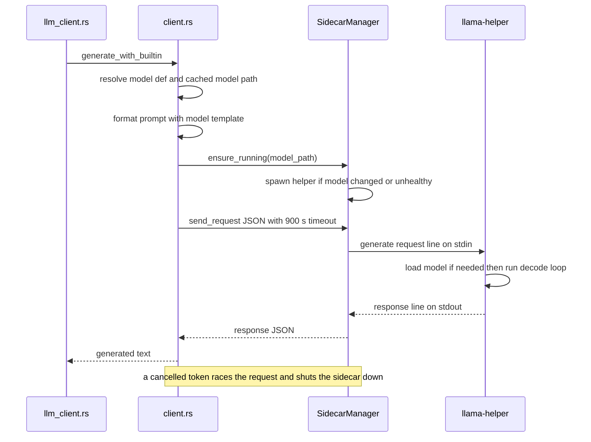
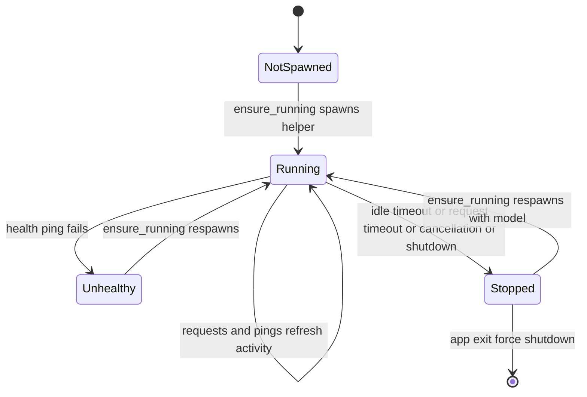
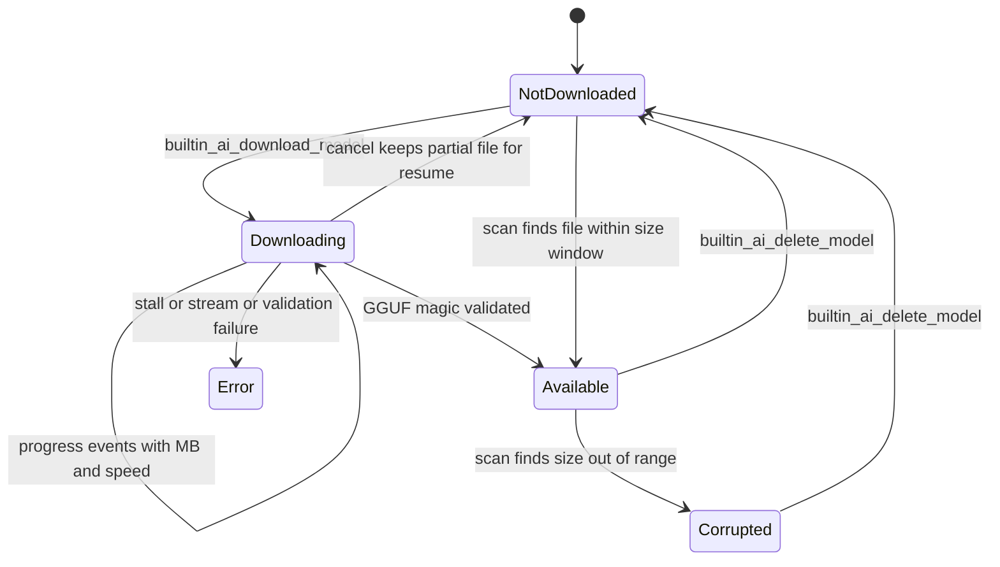

# llama-helper Sidecar

`llama-helper` is a standalone binary crate (`/llama-helper`) and workspace member that wraps [`llama-cpp-2`](https://crates.io/crates/llama-cpp-2) for on-device GGUF inference. It is never linked into the app: the Rust core spawns it as a child process and drives it over a line-delimited JSON protocol on stdin/stdout. Everything the app calls "BuiltInAI" — local summary generation with no API key and no network LLM — is this sidecar plus the `summary/summary_engine` module that supervises it.

The division of labor:

| Concern | Owner |
| --- | --- |
| GGUF loading, GPU offload, token sampling, stop tokens | `llama-helper/src/main.rs` (sidecar process) |
| Process spawn, health, keep-alive, shutdown | `summary/summary_engine/sidecar.rs` (`SidecarManager`) |
| High-level generation API, global manager, model path cache | `summary/summary_engine/client.rs` |
| Model catalog, prompt templates, sampling presets, constants | `summary/summary_engine/models.rs` |
| GGUF download, validation, status tracking | `summary/summary_engine/model_manager.rs` (`ModelManager`) |
| Tauri command surface (`builtin_ai_*`) | `summary/summary_engine/commands.rs` |

## Wire protocol (JSON over stdin/stdout)

The protocol is one JSON object per line. The sidecar reads requests from stdin and writes responses to stdout (flushed immediately); all diagnostics go to stderr, which the parent inherits so helper logs appear in the app log. Both enums are serde-tagged on `"type"` with `snake_case` names:

| Type | Direction | Payload |
| --- | --- | --- |
| `generate` | app → helper | `prompt`, optional `max_tokens`, `context_size`, `model_path`, sampling params (`temperature`, `top_k`, `top_p`, `presence_penalty`, `frequency_penalty`, `repeat_penalty`, `penalty_last_n`), `stop_tokens` |
| `ping` | app → helper | — |
| `shutdown` | app → helper | — |
| `response` | helper → app | `text`, `error?` |
| `pong` | helper → app | — |
| `goodbye` | helper → app | — |
| `error` | helper → app | `message` |

The client side mirrors a subset of these types in `client.rs` (`Request` has only `Generate`; ping/shutdown are emitted by `SidecarManager` as ad-hoc `json!` objects).

### Generate semantics on the helper

- `max_tokens` defaults to 512 and `context_size` to 2048 when omitted.
- If `model_path` is present, `ModelState::load_model_if_needed` runs first. A model is reused when both the path and the requested context size match what is already loaded; otherwise the GGUF is loaded fresh with computed GPU offload. A load failure is reported as a `response` message with `error` set (not the `error` variant), and the loop continues.
- Generation failures likewise return `response { error }`. Only an unparseable request line produces the `error` variant.
- Stop tokens are checked against the accumulated output after each token; on a match the stop string is stripped and the output trimmed before returning.

Helper-side sampling defaults (`SamplingConfig::from_request`) are defensive: non-finite or negative temperature → 0.0 (greedy), `top_k` default 64 with a floor of 1, `top_p` default 0.95 forced to 1.0 unless in `(0, 1]`, presence/frequency penalties floored at 0, `repeat_penalty` default 1.0 and forced > 0, `penalty_last_n` default 0. Temperature ≤ 0 selects a greedy sampler; penalty stages are prepended only when `penalty_last_n > 0` and at least one penalty deviates from neutral. In practice the app always sends every field explicitly after sanitizing on its side, so these defaults mainly guard other/manual invocations.

*Figure: one BuiltInAI generation. The app formats the prompt and owns cancellation; the sidecar owns inference.*

### Keep-alive and termination

The helper's main loop checks its idle timeout before every read: `LLAMA_IDLE_TIMEOUT` (seconds, default 300) read from the environment at startup. On idle expiry it emits `goodbye` and exits; the same happens on a `shutdown` request, while stdin EOF simply breaks the loop. `ping` → `pong` refreshes the activity timestamp, which is how the app keeps an idle-but-wanted sidecar alive.

## Inference internals

- **GPU offload heuristic** — `detect_vram_gb` queries Metal via `sysctl hw.memsize` (assumes the GPU can use ~60% of system memory) or CUDA via `nvidia-smi --query-gpu=memory.free`, falling back to a conservative 4 GB. `get_default_gpu_layers` estimates the layer count from file size (>2.5 GB → 33 layers, else 28), and `calculate_gpu_layers` budgets weights + KV cache per layer (KV estimated at 0.25 GB per 1k context for large models, 0.12 GB otherwise) against VRAM minus a 0.5 GB safety margin. If the model file size cannot be read, zero layers are offloaded (CPU-only).
- **Context and threads** — the context and batch size both come from `context_size`; inference threads are `max(1, cores / 2 + 2)` so generation does not starve the UI. The prompt is tokenized with `AddBos::Always` and decoded as one batch, then tokens are produced one at a time.
- **Sampling chain** — greedy (`temperature ≤ 0`) or `penalties → top_k → top_p → temp → dist` seeded from wall-clock milliseconds.
- **Decoding** — token pieces are decoded incrementally as UTF-8 via `encoding_rs`, retrying with a larger buffer when `token_to_piece_bytes` reports `InsufficientBufferSpace`. The loop ends on `max_tokens`, an end-of-generation token, or a stop-token hit. Token/timing statistics are logged to stderr.

## Sidecar lifecycle (`SidecarManager`)

`SidecarManager` (`sidecar.rs`) owns the child process: `child_process`, `stdin_writer`, and `stdout_reader` behind tokio mutexes, `last_activity` (`Instant`), `is_healthy` / `should_shutdown` atomics, `active_request_count`, `current_model_path`, the resolved `helper_binary_path`, and `idle_timeout_secs`.

### Binary resolution

`resolve_helper_binary` walks a fixed order and errors with build instructions if nothing matches:

1. `MEETILY_LLAMA_HELPER` env var (dev override), if the path exists.
2. Next to the current executable: `llama-helper-<target triple>[.exe]` exactly, then any file starting with `llama-helper` that does not end in `.d` (fuzzy match).
3. `RESOURCE_DIR` env var: same exact-then-fuzzy matching.
4. Dev fallback from `CARGO_MANIFEST_DIR`: `target/release|debug/llama-helper[.exe]` at the workspace root.

The triple is taken from `TARGET` when set, else derived per-platform with `cfg!`. The exact-name-then-fuzzy search exists because Tauri's `externalBin` bundling renames the binary to `llama-helper-<triple>` beside the executable.

### Spawn

`spawn` first shuts down any existing process, then launches the helper with piped stdin/stdout, **inherited stderr**, and `LLAMA_IDLE_TIMEOUT` set from the manager's configured timeout. On Unix the process is launched through `nice -n 10`; on Windows it uses `CREATE_NO_WINDOW | BELOW_NORMAL_PRIORITY_CLASS`. After storing the handles, marking `is_healthy` and resetting `should_shutdown`, it starts two background loops. Because the helper receives the model path again in every `generate` request, model loading is tracked on both sides of the pipe.

### Health and idle loops

Two `tokio::spawn`ed loops run for the life of the process, both exiting when `should_shutdown` is set:

- **Health check (every 30 s)** — skips when unhealthy or when requests are active; otherwise sends `ping` and expects `pong` within 5 s. A failed ping clears `is_healthy`. Health pings deliberately do **not** go through `send_request`, so they never inflate `active_request_count` and cannot block a graceful shutdown.
- **Idle check (every 60 s)** — while requests are active it refreshes `last_activity` (so a long generation cannot be killed as "idle" the moment it finishes); otherwise, once idle time exceeds the timeout it shuts the sidecar down and exits.

*Figure: sidecar process lifecycle as tracked by `SidecarManager`. Any terminal condition is recoverable — the next `ensure_running` simply spawns a fresh helper.*

### Request framing and timeouts

`send_request(request_json, timeout)` acquires a `RequestGuard` (RAII increment/decrement of `active_request_count`), writes the JSON line plus newline and flushes, then awaits one response line under a `tokio::time::timeout`. An empty line read means the sidecar's stdout closed (crash or exit) and is surfaced as an error. On timeout the manager **shuts the sidecar down** — the protocol has no cancel message, so killing the process is the only way to stop a running generation.

`ensure_running(model_path)` short-circuits only when the manager's `current_model_path` matches the request and the process is healthy; any model change, unhealthy state, or dead process triggers a full shutdown + respawn.

### Shutdown paths

- `shutdown_gracefully` sets `should_shutdown`, then polls `active_request_count` every 500 ms for up to **10 minutes** (covering long generations) before calling `shutdown`.
- `shutdown` sends the `shutdown` JSON line if the process is healthy (errors ignored), waits up to **3 s** for exit, then kills; it clears stdin/stdout handles, the model path, and the health flag.
- The `Drop` impl only sets `should_shutdown` — async cleanup cannot run in `Drop`, so it is best-effort.

At the client layer:

- `shutdown_sidecar_gracefully` detaches the global manager (takes it out of `SIDECAR_MANAGER`) and drains in a spawned background task. It is called when the user saves a model configuration in `api/api.rs`, so a provider/model switch retires the old sidecar without blocking the UI.
- `force_shutdown_sidecar` detaches and calls `shutdown()` directly, and is called from `RunEvent::Exit` in `lib.rs` so the helper never outlives the app.

## Client layer (`summary_engine/client.rs`)

- **`SIDECAR_MANAGER`** — a `lazy_static` global `Arc<Mutex<Option<Arc<SidecarManager>>>>`. `generate_with_builtin` lazily creates and installs a manager on first use; `init_sidecar_manager` and `is_sidecar_healthy` exist as explicit helpers for the same global.
- **`MODEL_PATH_CACHE`** — a `Lazy<RwLock<HashMap<String, PathBuf>>>` read-through cache over `models::get_model_path`. Hits re-validate that the file still exists (a deleted model invalidates the entry); misses take the write lock with double-checking, resolve the path, and error if the GGUF is absent.
- **`generate_with_builtin`** — the single entry point for BuiltInAI text generation. It looks up the `ModelDef`, resolves the cached path, formats the prompt with the model's chat template (`models::format_prompt`), sanitizes the model's sampling preset, builds a `generate` request with `DEFAULT_MAX_TOKENS` (4096) and the model's `context_size`, and sends it with `GENERATION_TIMEOUT_SECS` (900 s). A `CancellationToken` is raced against the request via `tokio::select!` — cancellation (before start, during startup, mid-generation, or before parsing) returns an error, and mid-generation cancellation shuts the sidecar down to stop the token stream.

These constants live in `models.rs`: `DEFAULT_MAX_TOKENS = 4096`, `DEFAULT_IDLE_TIMEOUT_SECS = 300` (both sides also honor the `LLAMA_IDLE_TIMEOUT` override), `GENERATION_TIMEOUT_SECS = 900`.

The boundary above this layer is `summary/llm_client.rs`: `LLMProvider::BuiltInAI` (parsed from `"builtin-ai"`, `"local-llama"`, or `"localllama"`) bypasses the HTTP path entirely and routes to `generate_with_builtin`, requiring an `app_data_dir` for model resolution.

## Model management

`ModelManager` (`model_manager.rs`) handles download and lifecycle of the local GGUF models, explicitly modeled on the transcription engines (`whisper_engine` / `parakeet_engine`): the same scan-and-status approach, the same `ModelStatus` shape — with `NotDownloaded` where those engines say `Missing`, including the distinctive `Corrupted { file_size, expected_min_size }` variant — and the same MB-based `DownloadProgress` (`downloaded_mb`, `total_mb`, `speed_mbps`, `percent`). Models live in `app_data_dir/models/summary`.

### Catalog and presets (`models.rs`)

`get_available_models()` is the extension point: adding a `ModelDef` makes the system detect, download, and use a new model. The current catalog:

| Name | GGUF file | Size | Context | Layers | Sampling preset | Template |
| --- | --- | --- | --- | --- | --- | --- |
| `qwen3.5:2b` | `Qwen3.5-2B-Q4_K_M.gguf` | 1221 MB | 32768 | 24 | `qwen35_summary` | `qwen3.5_nonthinking` |
| `qwen3.5:4b` | `Qwen3.5-4B-Q4_K_M.gguf` | 2614 MB | 32768 | 32 | `qwen35_summary` | `qwen3.5_nonthinking` |
| `gemma3:4b` | `gemma-3-4b-it-Q4_K_M.gguf` | 2374 MB | 32768 | 35 | `gemma3_instruct` | `gemma3` |
| `gemma3:1b` | `gemma-3-1b-it-Q8_0.gguf` | 1019 MB | 32768 | 26 | `gemma3_instruct` | `gemma3` |

Download URLs point at Hugging Face (unsloth for Qwen, bartowski for Gemma). Each preset carries stop tokens: `<|im_end|>` for Qwen, `<end_of_turn>` for Gemma.

Sampling presets are sanitized by `SamplingParams::sanitize_for_llama_helper` before going over the wire: NaN/negative temperature → 0.0, out-of-range `top_p` → 1.0, negative penalties → 0, non-positive `repeat_penalty` → 1.0, negative `penalty_last_n` → 0, `top_k` floored at 0.

Prompt templates are static strings: the Gemma template uses `<start_of_turn>` turns, and the Qwen "non-thinking" template opens the assistant turn with an **empty `<think></think>` block** so summaries are generated in direct-response mode. `format_prompt` escapes user-supplied control markers (`<|im_start|>`, `<end_of_turn>`, `<think>`, …) in the user prompt so transcript content cannot break out of the template.

### Download pipeline

`download_model_detailed` enforces one active download per model (`active_downloads`) and drives `ModelStatus`:

*Figure: `ModelStatus` transitions driven by downloads, scans, and the delete command.*

Resume and integrity behavior:

- An existing file within ±10% of the expected size short-circuits the download (status `Available`, 100% reported). A file **larger** than expected is deleted and re-downloaded; a **smaller** file is treated as a partial download and resumed.
- Resume uses an HTTP `Range: bytes=<existing>-` request; a `206 Partial Content` response appends to the file, otherwise the download restarts fresh. The reqwest client is tuned for large files (`tcp_nodelay`, 1 h overall timeout, 30 s connect timeout) and writes through an 8 MB `BufWriter`.
- Progress is reported on percent change or every 500 ms, with speed computed from bytes since the last report.
- A 30-second per-chunk timeout detects stalled connections and sets `ModelStatus::Error` (so the UI can offer retry); stream errors are categorized (timeout/connect/body) into user-facing messages.
- User cancellation sets a per-model flag the loop checks per chunk; the partial file is flushed and **kept** for a future resume, the model returns to `NotDownloaded`, and the error carries a `CANCELLED:` prefix so the command layer can distinguish it from real failures.
- After a completed download the file is validated by GGUF magic number (`GGUF`, plus legacy `ggjt`/`ggla`/`ggml`); an invalid file is deleted and the model lands in `Error`.

`scan_models` (run at init and refreshable) checks each catalog entry's file size against the ±10% window to produce `Available`, `Corrupted { file_size, expected_min_size }`, `Error`, or `NotDownloaded`, and preserves an in-progress `Downloading` status for active downloads. `is_model_ready(name, refresh)` optionally rescans before answering.

## Tauri command surface (`builtin_ai_*`)

`commands.rs` exposes the manager to the frontend; `lib.rs` manages `ModelManagerState` and registers the commands (initialization happens at startup in a spawned task, with lazy re-init as a fallback inside each command):

| Command | Behavior |
| --- | --- |
| `builtin_ai_list_models` | All catalog models with status |
| `builtin_ai_get_model_info` | One model's `ModelInfo` |
| `builtin_ai_download_model` | Starts download; emits `builtin-ai-download-progress` events |
| `builtin_ai_cancel_download` | Sets the cancel flag; emits a `cancelled` event |
| `builtin_ai_delete_model` | Removes the GGUF file; status → `NotDownloaded` |
| `builtin_ai_is_model_ready` | Readiness check with optional `refresh` rescan |
| `builtin_ai_get_available_summary_model` | Highest-priority `Available` model after a fresh scan |
| `builtin_ai_get_recommended_model` | RAM-based recommendation |

Progress events (`builtin-ai-download-progress`, consumed by `BuiltInModelManager.tsx`, `OnboardingContext`, and the onboarding/toast components) always carry `status: "downloading"` from the progress callback; the `completed` event is emitted by the command **only after** the download task fully finishes validation, real errors emit `status: "error"`, and cancellations emit nothing from this path (the cancel command already emitted `cancelled`).

Selection logic is pinned by tests:

- `builtin_ai_get_available_summary_model` picks by priority `qwen3.5:4b` > `qwen3.5:2b` > `gemma3:4b` > `gemma3:1b`.
- `builtin_ai_get_recommended_model` returns `qwen3.5:4b` when system RAM ≥ **14 GB**, else `qwen3.5:2b`, ignoring platform. (The command's doc comment still describes an 8 GB / macOS-specific rule — the implementation and its tests use the flat 14 GB threshold.)

One integration gap: the TypeScript wrapper `BuiltInAIAPI.getModelsDirectory()` invokes `builtin_ai_get_models_directory`, but the Rust backend defines and registers no such command, so that wrapper call cannot succeed.

## Building and bundling

The crate is a workspace member and pins `llama-cpp-2 = "=0.1.146"`. Its features (`metal`, `cuda`, `vulkan`) forward to the llama-cpp-2 backend and mirror the main app's GPU feature set (there is no CoreML; the GPU build script maps a `coreml` detection to `metal`). The release profile optimizes for size (`codegen-units = 1`, `lto = true`, `opt-level = "s"`) to keep startup fast and the bundle small.

Because the helper is built separately from the app, every build path must produce it before `tauri build`:

- `frontend/build-gpu.sh` builds the helper with the detected GPU feature, detects the target triple with `rustc -vV`, removes stale `llama-helper*` binaries, and copies `target/release/llama-helper` to `frontend/src-tauri/binaries/llama-helper-<triple>[.exe]`.
- CI (`build.yml` and friends) does the same per platform: macOS builds `--features metal`; Windows and Linux release builds are CPU-only (the Windows release notes cite a CMake race in `llama-cpp-sys-2` Vulkan builds; the app itself still uses Vulkan for Whisper); the `build-devtest.yml` matrix builds Vulkan on Windows. The binary lands at `frontend/src-tauri/binaries/llama-helper-<target>` before `tauri-action` runs.

`tauri.conf.json` declares the sidecar under `bundle.externalBin` as `binaries/llama-helper` alongside `binaries/ffmpeg`; Tauri appends the target triple when bundling — which is exactly the filename `resolve_helper_binary` looks for next to the installed executable.

## Focused tests

- `llama-helper/src/main.rs` — sampling translation: omitted penalty fields default to neutral and disable the penalty chain; a full Qwen-style penalty set deserializes and activates `uses_penalties`.
- `summary_engine/client.rs` — request serialization emits `"type":"generate"` with all sampling fields; `response` and `error` messages deserialize.
- `summary_engine/models.rs` — catalog metadata for all four models (files, URLs, sizes, contexts, layers, presets); template formatting including the Qwen empty think block; control-marker escaping in both templates; `sanitize_for_llama_helper` clamping (NaN, out-of-range, negative, zero `top_k`).
- `summary_engine/commands.rs` — the 14 GB recommendation boundary (13 GB → 2b, 14 GB → 4b) and the priority ordering of `summary_model_priority`.

## Related pages

- `/openwiki/concepts/summary-engine.md` — the summary engine that consumes this sidecar.
- `/openwiki/integrations/llm-providers.md` — the provider abstraction and `BuiltInAI` routing.
- `/openwiki/operations/build-and-release.md` — full build, bundle, and release pipeline.
- `/openwiki/architecture/overview.md` — where the sidecar sits in the system.
