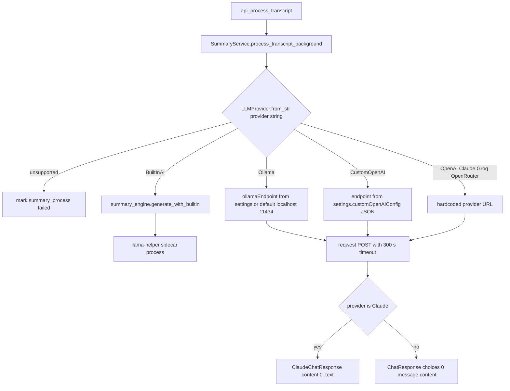
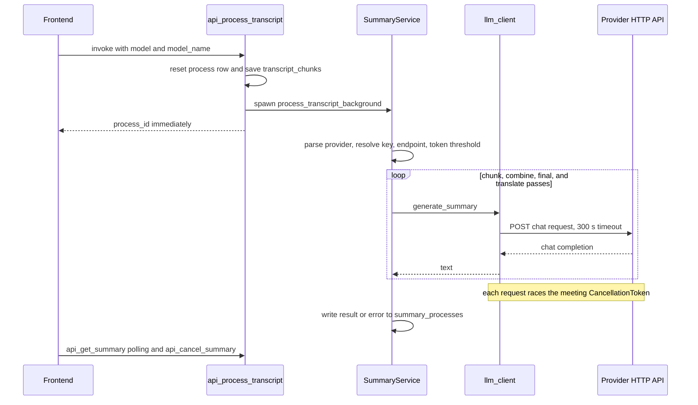

# LLM Provider Integrations

Meetily generates meeting summaries through one of seven interchangeable LLM backends. All of them share a single entry point — `generate_summary` in `frontend/src-tauri/src/summary/llm_client.rs` — but they split into three transport families:

1. **OpenAI-compatible HTTP** — OpenAI, Groq, and OpenRouter use fixed cloud URLs and a generic chat-completions request/response shape.
2. **Ollama and custom OpenAI endpoints** — the same generic shape, but against a user-configured base URL (the `ollamaEndpoint` settings column, or the `customOpenAIConfig` JSON document).
3. **Claude** — its own URL, its own headers, and its own request/response bodies.

A seventh provider, **BuiltInAI**, never issues HTTP at all: `generate_summary` short-circuits before endpoint selection and delegates to the `summary_engine` module, which drives the local `llama-helper` sidecar (see [llama-helper Sidecar](/openwiki/integrations/llama-helper-sidecar.md)).

## Provider registry and parsing

`LLMProvider` (`summary/llm_client.rs`) is the single enum every layer passes around:

| Variant | Accepted strings (case-insensitive) | Transport |
| --- | --- | --- |
| `OpenAI` | `openai` | HTTP, fixed URL |
| `Claude` | `claude` | HTTP, Claude-specific shape |
| `Groq` | `groq` | HTTP, fixed URL |
| `Ollama` | `ollama` | HTTP, configurable base URL |
| `OpenRouter` | `openrouter` | HTTP, fixed URL |
| `BuiltInAI` | `builtin-ai`, `local-llama`, `localllama` | local sidecar |
| `CustomOpenAI` | `custom-openai` | HTTP, configured base URL |

`LLMProvider::from_str` lowercases the input and maps these aliases; anything else returns `Err("Unsupported LLM provider: …")`. The summary service parses the provider string at the start of every background run, and a parse failure immediately marks the `summary_processes` row as failed — the provider string is *not* normalized before use, so the raw DB/frontend name (e.g. `builtin-ai`, `custom-openai`) is what the parser and the `SettingsRepository` key mapping both expect.

*Figure: how a summary run resolves its provider. The parser is the gate — everything downstream branches on the enum, and only BuiltInAI leaves the HTTP path.*

## Where provider configuration lives

All provider state is persisted in the singleton row of the SQLite `settings` table (`id = '1'`), owned by `SettingsRepository` (`database/repositories/setting.rs`) and surfaced to the UI through Tauri commands in `api/api.rs`:

| Concern | Storage | Written by | Read by |
| --- | --- | --- | --- |
| Provider + model + whisper model | `provider`, `model`, `whisperModel` columns | `api_save_model_config` | `api_get_model_config` |
| OpenAI key | `openaiApiKey` column | `SettingsRepository::save_api_key` | `api_get_api_key` |
| Claude key | `anthropicApiKey` column | same | same |
| Groq key | `groqApiKey` column | same | same |
| OpenRouter key | `openRouterApiKey` column | same | same |
| Ollama | `ollamaApiKey` column + `ollamaEndpoint` override | `save_api_key` / `save_model_config` | `api_get_api_key` / summary service |
| BuiltInAI | none — no key or endpoint | — | — |
| CustomOpenAI | whole config as JSON in `customOpenAIConfig` | `api_save_custom_openai_config` | `api_get_custom_openai_config`, `get_api_key` |

The columns were introduced incrementally: the initial schema shipped the four original key columns, `openRouterApiKey` arrived in migration `20250920155811_add_openrouter_api_key.sql`, `ollamaEndpoint` in `20251010153942_add_ollama_endpoint.sql`, and `customOpenAIConfig` in `20251105120000_add_pro_license_custom_openai.sql`. One column is currently dead schema: migration `20251229000000_add_gemini_api_key.sql` adds `geminiApiKey`, but no Gemini variant exists in `LLMProvider`, `SettingsRepository`, or the frontend provider union — a provider stub awaiting implementation.

### The settings command surface

- `api_get_model_config` returns the whole row as `ModelConfig` (provider, model, whisperModel, resolved apiKey, ollamaEndpoint). For `custom-openai` the resolved key comes from the JSON config, not a column.
- `api_save_model_config` upserts the row (keyed on id `'1'` for backward compatibility) and, when a non-empty key is supplied for any provider *other than* `custom-openai`, writes it to the mapped column. It then triggers `summary_engine::shutdown_sidecar_gracefully()` so that switching provider or model tears down a running BuiltInAI sidecar in the background without blocking the UI.
- `api_get_api_key(provider)` returns the stored key or an empty string when absent — the frontend calls this on demand (for example `ConfigContext` prefetches the claude/groq/openai/openrouter keys on mount) rather than relying on keys embedded in the config row.

### Custom OpenAI configuration JSON

The `custom-openai` provider deliberately keeps everything in one document. `CustomOpenAIConfig` (`summary/mod.rs`) holds `endpoint`, `apiKey`, `model`, `maxTokens`, `temperature`, `topP` and is serialized into `settings.customOpenAIConfig`. The commands enforce the contract before saving:

- `api_save_custom_openai_config` requires a non-empty endpoint starting with `http://` or `https://`, a non-empty model, `temperature` in 0.0–2.0, `top_p` in 0.0–1.0, and `max_tokens` ≥ 1. It filters out blank API keys.
- `save_api_key` and `delete_api_key` refuse to treat `custom-openai` as a column-backed provider; deleting the config nulls the whole JSON column.
- `get_api_key("custom-openai")` parses the JSON and returns its `apiKey` field, so downstream code can treat key lookup uniformly.

`api_test_custom_openai_connection` is the save-time smoke test: it posts a minimal chat completion (`"Hi"`, `max_tokens: 5`, 30 s timeout, `Authorization: Bearer` only when a key is present) to `{endpoint}/chat/completions` and reports success only when the 200 response contains `choices[0]` with a `message.content` *or* `message.reasoning_content` field — a 200 that is not OpenAI-shaped is an error, which catches endpoints that accept requests but return incompatible bodies (a common failure with some reasoning-model gateways).

## Request shapes, timeout, and cancellation

### Generic OpenAI-compatible shape

Every non-Claude HTTP provider serializes `ChatRequest`: `model`, a two-message `messages` array (a `system` message with the system prompt and a `user` message with the user prompt), and optional `max_tokens`/`temperature`/`top_p` fields that are skipped when `None`. Only `CustomOpenAI` forwards caller-supplied sampling parameters — for the fixed cloud providers the three fields stay `None`, so their requests are minimal. The response is parsed as `ChatResponse` → `choices[0].message.content` (trimmed).

### Claude-specific shape

Claude gets a dedicated `ClaudeRequest`: the system prompt moves into a top-level `system` field, `messages` contains only the user turn, and `max_tokens` is hardcoded to `2048`. Headers are `x-api-key` and `anthropic-version: 2023-06-01` instead of a Bearer token. The response is parsed as `ClaudeChatResponse` → `content[0].text`.

### Timeout and cancellation

`REQUEST_TIMEOUT_DURATION` is 300 seconds, applied per request via reqwest's `.timeout(...)`. Every request is also raced against the meeting's `CancellationToken` with `tokio::select!`: if the token fires first, generation stops immediately with `"Summary generation was cancelled"`. Two quirks are worth knowing when reading logs:

- On a reqwest timeout the error message text still says *"LLM request timed out after 60 seconds"* even though the constant is 300 s — the string was never updated.
- HTTP failures surface the provider's response body verbatim (`LLM API request failed: {body}`), which is where provider-side quota/model errors appear.

Non-2xx responses never reach parsing; the body is returned as the error string, and the summary service writes it into the `summary_processes.error` column.

## Model discovery per provider

Each provider has a Tauri command that lists models for the settings UI. They differ meaningfully in caching, authentication, and fallback behavior:

| Command | Source | Auth | Cache | Fallback |
| --- | --- | --- | --- | --- |
| `get_ollama_models` | `{endpoint}/api/tags` (+ CLI fallback) | none | none (frontend caches per endpoint) | `ollama list` CLI, localhost only |
| `get_openai_models` | `https://api.openai.com/v1/models` | Bearer key | 300 s global | hardcoded list of 23 ids |
| `get_anthropic_models` | `https://api.anthropic.com/v1/models` | `x-api-key` + version header | 300 s global | 4 hardcoded Claude ids |
| `get_groq_models` | `https://api.groq.com/openai/v1/models` | Bearer key | 300 s global | `llama-3.3-70b-versatile` |
| `get_openrouter_models` | `https://openrouter.ai/api/v1/models` | none (public catalog) | none | none — errors propagate |
| `builtin_ai_list_models` | local model registry + filesystem | — | manager state | — |

The three key-bearing commands share a template: with no/blank key they return their hardcoded fallback list immediately; otherwise they check a per-crate global `MODELS_CACHE` (300 s TTL), fetch with a 5 s timeout, filter to chat-capable models, and — on any transport, HTTP-status, parse, or empty-result failure — log a warning and return the same fallback list instead of an error. The filters are provider-specific: OpenAI keeps `gpt-*`/`o1-*`/`o3-*`/`o4-*`/`chatgpt-*` while excluding embedding/tts/whisper/dall-e/babbage/davinci/instruct/realtime/audio; Groq excludes anything containing `whisper`, `embed`, `guard`, or `tool-use`; Anthropic keeps only ids starting with `claude-`.

`get_openrouter_models` is the odd one out: it uses a **blocking** reqwest client (the command itself is sync, not async), requires no key because OpenRouter's model catalog is public, applies no cache, and returns richer per-model data (`name`, `context_length` — preferring `top_provider.context_length` — and prompt/completion pricing). Errors propagate to the UI rather than degrading to a fallback.

### Ollama discovery and management

Ollama gets the richest tooling because it is also a download manager:

- `get_ollama_models` validates the endpoint scheme (must be `http://` or `https://` if non-empty), wraps everything in a 5 s overall timeout, and calls HTTP `GET {endpoint}/api/tags` with up to two retries using exponential backoff (300 ms initial). Certain errors (invalid endpoint, 404) abort retrying. If HTTP fails and the endpoint is localhost/empty, it falls back to executing `ollama list` and parsing its table output — the only CLI escape hatch in the provider stack. An empty result is an error (`NoModelsFound`), not an empty list.
- `pull_ollama_model` posts to `/api/pull` with `"stream": true` and a 10-minute timeout, then consumes the NDJSON stream, emitting `ollama-model-download-progress` (integer percent), `ollama-model-download-error`, and `ollama-model-download-complete` events to the frontend. A global `DOWNLOADING_MODELS` set rejects duplicate downloads of the same model and is cleaned up on every exit path (HTTP error, stream error, Ollama-side error, completion).
- `delete_ollama_model` issues `DELETE /api/delete` with a 30 s timeout.
- `get_ollama_model_context` reports a model's context window in tokens.

### The Ollama metadata cache (5-minute TTL)

`ModelMetadataCache` (`ollama/metadata.rs`) caches `ModelMetadata` (name, `context_size`, parameter count, family) keyed by `{model}::{endpoint}` in a tokio `RwLock`, with entries expiring after a 300 s TTL. Two independent instances exist: one static in `ollama.rs` behind `get_ollama_model_context`, and another static in `summary/service.rs` used for chunk-size planning (below). Resolution inside `fetch_model_info` is a cascade:

1. `POST {endpoint}/api/show` with `verbose: true`; extract `context_length` from `model_info` keys (trying `{family}.context_length`, `{family}.context_size`, then bare `context_length`/`context_size`).
2. If that yields nothing, regex the `modelfile` for `PARAMETER num_ctx <n>`.
3. If still nothing, use the hardcoded family table (`llama` 4096, `mistral`/`qwen`/`gemma` 8192, `codellama`/`deepseek` 16384, `phi` 2048, `neural-chat` 4096).
4. The ultimate fallback, also the value returned by `get_ollama_model_context` when fetching fails entirely, is **4000**.

## Provider-specific behavior in the summary pipeline

`SummaryService::process_transcript_background` (`summary/service.rs`) translates the settings row into per-provider parameters before any prompt is built:

- **API keys.** Ollama, BuiltInAI, and CustomOpenAI skip key retrieval (empty string); CustomOpenAI's key is then replaced by the `apiKey` from its JSON config. Every other provider *requires* a stored key — a missing/empty one fails the run with `API key not found for {provider}`. Note that the `ollamaApiKey` column is not consulted by this path; Ollama requests go out with an empty Bearer header.
- **Endpoints.** The Ollama endpoint override is read from the settings row (falling back to the `http://localhost:11434` default inside `generate_summary`). CustomOpenAI loads its full config; a missing config fails the run.
- **Token thresholds.** Ollama uses the metadata cache's `context_size − 300` (fallback 4000); BuiltInAI uses its model registry's `context_size − 300` (fallback 1748 for an unknown model); all cloud providers including CustomOpenAI get 100000, effectively unbounded.

`generate_meeting_summary` (`summary/processor.rs`) then picks a strategy: single-pass when the provider is not Ollama/BuiltInAI *or* the transcript is under the threshold, otherwise chunked map-combine (chunks of `threshold − 300` tokens with 100-token overlap, each summarized sequentially with a cancellation check before every chunk, combined joined by `---`). The final report renders the selected template's markdown structure; if the target output language is non-English, a translation pass re-runs the same `generate_summary` path over the English summary. Because the threshold derivation lives in the service, cloud providers always summarize in one pass regardless of transcript length.

*Figure: the end-to-end generation lifecycle. The command returns before any LLM traffic; all provider calls happen inside the spawned background task and their outcome is read back from the database.*

### Cancellation semantics

Cancellation is per-meeting and registry-based: `SummaryService` keeps a global `CANCELLATION_REGISTRY` map from meeting id to `CancellationToken`. `api_cancel_summary` cancels the token and marks the row cancelled; every stage of `generate_meeting_summary` (before start, before each chunk, before the final report, before each transform pass) checks the token, and `generate_summary` additionally races it against the HTTP request itself. Errors containing the substring `cancelled` are recorded as `cancelled` status rather than `failed` — this string match is the contract between `llm_client`/`processor` error messages and the service's status classification, so renaming the cancellation message would silently change DB outcomes.

## BuiltInAI: the non-HTTP provider

When the parsed provider is `BuiltInAI`, `generate_summary` requires an `app_data_dir` and calls `summary_engine::generate_with_builtin`, which:

1. Looks the model up in the hardcoded catalog (`qwen3.5:2b`, `qwen3.5:4b`, `gemma3:4b`, `gemma3:1b` — all 32768-token contexts, GGUF files under `app_data_dir/models/summary`).
2. Formats the prompt with the model's chat template (e.g. `qwen3.5_nonthinking`, which pre-opens an empty think block) and applies the model's sanitized sampling preset.
3. Ensures the `llama-helper` sidecar is running with that model and sends a JSON `generate` request with `DEFAULT_MAX_TOKENS = 4096` and a 900 s generation timeout, raced against the cancellation token — cancellation here actively shuts the sidecar down.

The sidecar's wire protocol, lifecycle, and model downloads are documented in [llama-helper Sidecar](/openwiki/integrations/llama-helper-sidecar.md). Two integration points matter from this page's perspective: `api_save_model_config` triggers `shutdown_sidecar_gracefully` on every save (so provider switches clean up the sidecar), and `builtin_ai_list_models` — not an HTTP listing command — feeds the settings UI's BuiltInAI model picker from the local registry.

Fresh installs default to this provider: `initialize_fresh_database` writes provider `builtin-ai` with the RAM-based recommendation (`qwen3.5:4b` for ≥ 14 GB RAM, else `qwen3.5:2b`), keeping everything local out of the box.

## Frontend wiring

The frontend never talks to LLM APIs directly. `ModelConfig.provider` is a union type (`'ollama' | 'groq' | 'claude' | 'openai' | 'openrouter' | 'builtin-ai' | 'custom-openai'`) whose members double as the DB-level provider strings. The settings modal (`ModelSettingsModal.tsx`):

- Loads the config via `api_get_model_config`, fetches the key via `api_get_api_key` for providers that need one, and for `custom-openai` additionally loads the JSON config and merges its fields.
- Treats only `claude`, `groq`, `openai`, and `openrouter` as `requiresApiKey`; `ollama`, `builtin-ai`, and `custom-openai` save without a key.
- Populates model pickers per provider: `get_openai_models`/`get_anthropic_models`/`get_groq_models` when the respective key is present (falling back to frontend hardcoded lists when empty), `get_openrouter_models` on demand, `get_ollama_models` per endpoint (cached per endpoint in the component), `builtin_ai_list_models` for BuiltInAI, and a manually typed model name for `custom-openai`.
- For `custom-openai`, saves the JSON config first (`api_save_custom_openai_config`), optionally runs `api_test_custom_openai_connection`, and then saves the provider row with the custom model as the `model` field.

Summary generation sends `model: modelConfig.provider` and `modelName: modelConfig.model` to `api_process_transcript`, which is the string that `LLMProvider::from_str` later parses.

## CSP boundary

`tauri.conf.json` allows the webview to reach `connect-src: 'self' http://localhost:11434 http://localhost:5167 http://localhost:8178 https://api.ollama.ai` — `localhost:11434` is the Ollama default port, `5167` is the hardcoded legacy backend URL in `api.rs`, and `8178` is the archived whisper-server port. All LLM chat traffic, however, is issued by the Rust core through `reqwest`, which is native HTTP unaffected by webview CSP; the allowlist governs any direct webview-side requests (and keeps the Ollama port reachable for them), not the summary path itself. Adding a provider that the webview must call directly would require extending this list.

## Extending the provider set

Adding a new provider touches five places, all of which currently assume the seven-variant enum:

1. A `LLMProvider` variant plus a `from_str` arm (with any aliases) in `summary/llm_client.rs`.
2. An endpoint/headers match arm in `generate_summary` — or an early-return branch like BuiltInAI's for non-HTTP transports.
3. A key-column mapping arm in `SettingsRepository::save_api_key`/`get_api_key`/`delete_api_key` plus a migration for the column (or a JSON config like `customOpenAIConfig`).
4. A model-listing command registered in `lib.rs`'s `invoke_handler` if the provider needs discovery.
5. The frontend provider union and, as appropriate, `modelOptions`, `requiresApiKey`, and any fallback list in `ModelSettingsModal.tsx`.

The `geminiApiKey` migration shows steps 3 was started without 1–2: the column exists but no provider reads or writes it.

## Failure semantics summary

| Failure | Where handled | Observable result |
| --- | --- | --- |
| Unknown provider string | service start | `summary_processes` row failed with the parse error |
| Missing API key (cloud providers) | service start | failed with `API key not found for {provider}` |
| CustomOpenAI config missing | service start | failed with `Custom OpenAI provider selected but no configuration found` |
| HTTP non-2xx | `generate_summary` | error string contains the provider response body; row failed (or cancelled if it contains "cancelled") |
| Request timeout (300 s) | `generate_summary` | error text says "timed out after 60 seconds" (stale string) |
| Cancellation | token race | row status `cancelled`; error message contains "cancelled" |
| Ollama unreachable | `get_ollama_models` | CLI fallback (localhost) or error; model list empty → `NoModelsFound` |
| Ollama metadata fetch fails | metadata cache | fallback context size 4000 (never an error to the caller) |
| Cloud model listing fails | listing commands | hardcoded fallback list, never an error |

The focused tests that pin this behavior down live in `summary/service.rs` (cache-source equality and title stripping), `summary/processor.rs` (the language-action matrix and the rule that a cancelled normalization is not swallowed as success), and `summary_engine/client.rs` (sidecar request serialization shape).
