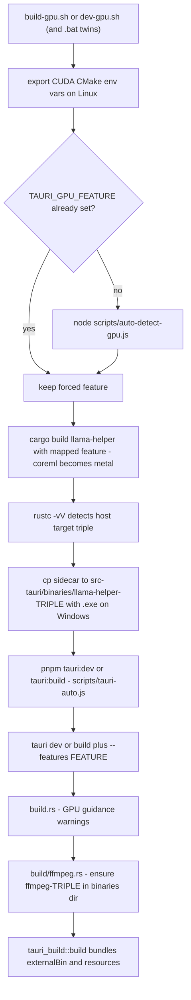
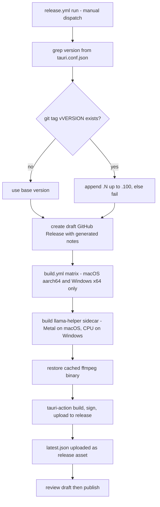

# Build, Bundling & Release

Meetily ships as a Tauri 2.x desktop app produced by a Cargo workspace (`frontend/src-tauri` + `llama-helper`) and a pnpm/Next.js frontend. Building it means resolving three questions before `tauri build` ever runs: which GPU acceleration to compile in, where the two external executables (`llama-helper` sidecar and `ffmpeg`) come from, and how the resulting installers get signed. This page covers the local build scripts, the build-time bundling hooks, the `tauri.conf.json` bundle contract, the GitHub Actions matrix, and the release/updater artifact pipeline.

## Where the GPU decision is made

### Cargo feature matrix

GPU acceleration is a compile-time choice on the app crate (`frontend/src-tauri/Cargo.toml`):

| Feature | Forwards to | Platform role |
| --- | --- | --- |
| `platform-default` (default) | — | Delegates to the per-OS `whisper-rs` dependency declarations below |
| `metal` | `whisper-rs/metal` | macOS Apple Metal (auto-enabled on macOS) |
| `coreml` | `whisper-rs/coreml` | macOS CoreML acceleration for Apple Silicon |
| `cuda` | `whisper-rs/cuda` | NVIDIA CUDA on Windows/Linux |
| `vulkan` | `whisper-rs/vulkan` | Vulkan on Windows/Linux (AMD/Intel/NVIDIA) |
| `hipblas` | `whisper-rs/hipblas` | AMD ROCm HIP on Linux |
| `openblas` | `whisper-rs/openblas` | Optimized CPU BLAS fallback |
| `openmp` | `whisper-rs/openmp` | OpenMP parallel processing |

The asymmetry lives in the target-specific dependency sections: on macOS `whisper-rs` is declared with `features = ["raw-api", "metal", "coreml"]` — Metal and CoreML are **always compiled in** — while the Windows and Linux declarations carry only `["raw-api"]`, so acceleration there exists only when a cargo feature is passed explicitly. macOS needs no feature flag; every other platform is opt-in.

The `pnpm` scripts in `frontend/package.json` are the user-facing surface for this matrix:

- `tauri:dev` / `tauri:build` → `node scripts/tauri-auto.js dev|build` (auto-detects the feature),
- `tauri:dev:<backend>` / `tauri:build:<backend>` for `cuda`, `vulkan`, `metal`, `coreml`, `openblas`, `hipblas` → plain `tauri dev/build -- --features <backend>`,
- `tauri:dev:cpu` / `tauri:build:cpu` → plain `tauri dev`/`tauri build` with no feature flag (the platform default handles the rest).

### Auto-detection priority

`scripts/auto-detect-gpu.js` implements the detection priority and prints **only the feature token to stdout** (all diagnostics go to stderr, so scripts can capture the value cleanly):

1. **macOS**: Apple Silicon (`arm64`) → `coreml`; Intel → `metal`. Metal is always available.
2. **NVIDIA CUDA** (Windows/Linux): `nvidia-smi` exists **and** (`CUDA_PATH` or `nvcc`) → `cuda`. Drivers without the toolkit fall back to CPU.
3. **AMD ROCm** (Linux only): `rocm-smi` exists **and** (`ROCM_PATH` or `hipcc`) → `hipblas`; otherwise CPU.
4. **Vulkan**: `vulkaninfo` (or `C:\VulkanSDK` on Windows) **and** both `VULKAN_SDK` and `BLAS_INCLUDE_DIRS` env vars → `vulkan`; missing either var falls back to CPU.
5. **OpenBLAS**: `BLAS_INCLUDE_DIRS` set → `openblas`.
6. Otherwise → nothing (CPU-only).

`scripts/tauri-auto.js` (behind `tauri:dev`/`tauri:build`) honors a `TAURI_GPU_FEATURE` environment override first, otherwise shells out to the detector; for Linux+CUDA it also exports `CMAKE_CUDA_ARCHITECTURES=75`, `CMAKE_CUDA_STANDARD=17`, and `CMAKE_POSITION_INDEPENDENT_CODE=ON` before invoking `tauri dev|build -- --features <feature>`. An empty or `none` result means a CPU-only build.

### Runtime backend resolution

The compiled backend is resolved at runtime by `whisper_engine/acceleration.rs::WhisperCompiledBackend::current()` with precedence **cuda → vulkan → hipblas → (macOS or `metal` feature → Metal) → Cpu**. `WhisperEngine` uses it to decide whether to attempt GPU acceleration, and `whisper_context_acceleration_for` enables flash attention only for the Metal and CUDA backends on High/Ultra performance tiers (inline tests cover these combinations). Note that `coreml` is a whisper-rs feature only — the runtime backend enum has no CoreML variant; Apple Silicon reports `Metal`.

## Local build orchestration

*Figure: the GPU-aware build pipeline shared by `build-gpu.sh` (release) and `dev-gpu.sh` (debug). The `.bat` twins implement the same steps on Windows; the thin `.ps1` wrappers diverge (see below).*

`frontend/build-gpu.sh` and `frontend/dev-gpu.sh` run from the repo root or `frontend/`, pick `pnpm` or `npm`, then:

1. Export the Linux CUDA CMake env vars (same values as `tauri-auto.js`).
2. Run `scripts/auto-detect-gpu.js` unless `TAURI_GPU_FEATURE` is already set.
3. Build the **llama-helper sidecar** with the mapped feature — `coreml` becomes `metal` because `llama-cpp-2` has no CoreML support. `build-gpu.sh` builds `--release`; `dev-gpu.sh` builds debug.
4. Detect the host triple with `rustc -vV`, delete stale `llama-helper*` files, and copy the binary to `frontend/src-tauri/binaries/llama-helper-<triple>[.exe]` — exactly the filename Tauri's `externalBin` contract expects.
5. Invoke `pnpm tauri:build` (with `NO_STRIP=true`, set because AppImage bundling breaks when symbols are stripped) or `pnpm tauri:dev`; the package script routes through `tauri-auto.js`, which sees the exported `TAURI_GPU_FEATURE`.

The Windows `.bat` twins (`build-gpu.bat`, `dev-gpu.bat`) mirror this pipeline and additionally kill processes on port 3118, set `LIBCLANG_PATH`, and call `vcvars64.bat` (with manual `LIB`/`INCLUDE` fallbacks) to establish the MSVC environment before detecting, building, and copying the sidecar.

The `.ps1` wrappers are different: `build-gpu.ps1` / `dev-gpu.ps1` skip detection and the sidecar steps entirely and hard-code the Vulkan feature by calling `pnpm run tauri:build:vulkan` / `tauri:dev:vulkan`. Use them only when the sidecar binary already exists for the target triple.

`frontend/build.ps1` is the signed Windows entry point: it loads `TAURI_SIGNING_PRIVATE_KEY(_PASSWORD)` from `.env` via `scripts/load-env.ps1`, refuses to build without them, delegates to `build-gpu.bat`, and scrubs the signing variables from the environment afterwards. `.env.example` documents both variables (the key must be a single line of base64).

## Build-time bundling work in `build.rs`

`frontend/src-tauri/build.rs` runs three things in order:

1. `detect_and_report_gpu_capabilities()` — emits `cargo:warning` guidance per OS and feature: macOS prints that Metal is enabled (plus CoreML when the `coreml` feature is on); Windows/Linux report which of cuda/vulkan/hipblas/openblas was enabled, and in CPU-only mode probe for `nvidia-smi` and `rocm-smi` to suggest the right feature flag.
2. On macOS, links the `AVFoundation`, `Cocoa`, and `Foundation` frameworks.
3. `build/ffmpeg.rs::ensure_ffmpeg_binary()` — **downloads ffmpeg at build time** (see below).
4. `tauri_build::build()` — the standard Tauri bundler.

### ffmpeg download, cache, and verification

`build/ffmpeg.rs` guarantees a verified ffmpeg binary at `frontend/src-tauri/binaries/ffmpeg-<target>[.exe]`:

- **Cache first**: if the file exists and passes a `ffmpeg -version` subprocess check, the download is skipped; a corrupted cache is deleted and re-downloaded.
- **Download URLs are per target triple**, pinned to the `Zackriya-Solutions/ffmpeg-binaries` release `0.0.1`: `ffmpeg-8.0.1-essentials_build.zip` (Windows), `ffmpeg80arm.zip` / `ffmpeg-8.0.1.zip` (Apple Silicon / Intel), and static `tar.xz` archives for Linux ARM64 / x86_64.
- **Extraction** handles ZIP (Windows/macOS, with Zip-Slip protection via `enclosed_name()`) and TAR.XZ (Linux), finds the binary in flat, `bin/`, or nested layouts, and sets mode `0755` on Unix.
- **Failure is fatal**: a failed download or a downloaded binary that fails `-version` verification panics the build.

CI keeps the download out of the hot path with an `actions/cache` entry over `frontend/src-tauri/binaries/ffmpeg-*` whose key hashes `build.rs` and `build/ffmpeg.rs`.

### Runtime ffmpeg resolution

The build-time download is only the first preference. At runtime, `audio/ffmpeg.rs::find_ffmpeg_path()` (memoized in a `Lazy`) walks a fallback chain: the bundled binary next to the executable (which is what `externalBin` provides), then `PATH`, `$HOME/.local/bin` (macOS), the current directory, exe-relative `Resources` (macOS) / `lib` (Linux), and finally installs ffmpeg itself via the `ffmpeg-sidecar` crate. The audio decoder consults it to pre-convert formats Symphonia cannot demux (`mkv`, `webm`, `wma`) to temporary WAV before transcription — its inline tests pin the extension sets on both sides.

## `tauri.conf.json` bundle facts

The bundle block (`frontend/src-tauri/tauri.conf.json`) is the contract between builds and installers:

| Field | Value | Meaning |
| --- | --- | --- |
| `bundle.active` / `targets` | deb, appimage, msi, nsis, app, dmg | One config covers every platform; workflows select subsets with `--bundles` |
| `bundle.createUpdaterArtifacts` | `true` | Emits `.tar.gz`/installer + `.sig` updater artifacts on every build |
| `bundle.resources` | `templates/*.json` | Ships the meeting-summary template JSON files as app resources |
| `bundle.externalBin` | `binaries/llama-helper`, `binaries/ffmpeg` | Sidecar binaries; Tauri appends the target triple, so the build must place `llama-helper-<triple>[.exe]` and `ffmpeg-<target>[.exe]` there first |
| `bundle.macOS.entitlements` | `entitlements.plist` | Audio-input, audio-output, microphone, and screen-capture entitlements |
| `bundle.macOS.hardenedRuntime` | `true` | Required for notarization |
| `bundle.macOS.signingIdentity` | `"-"` | Default ad-hoc signing; CI overrides by passing `APPLE_SIGNING_IDENTITY` (Developer ID) to tauri-action |
| `bundle.windows.signCommand` | `powershell -ExecutionPolicy Bypass -File scripts/sign-windows.ps1 -FilePath %1` | Tauri invokes this per installer file |

The **updater plugin** block pins trust for the auto-update flow: an embedded minisign `pubkey` (update artifacts are verified against it) and the endpoint `https://github.com/Zackriya-Solutions/meeting-minutes/releases/latest/download/latest.json`. Builds must be signed with the matching `TAURI_SIGNING_PRIVATE_KEY` or clients cannot verify the released `.sig` files.

The **security block** is equally load-bearing: the CSP allowlist limits `connect-src` to `'self'`, `http://localhost:11434` (Ollama), `http://localhost:5167`, `http://localhost:8178`, and `https://api.ollama.ai`; `assetProtocol` is enabled scoped to `$APPDATA/**`; and the `main`-window capability grants the fs (scoped to `$APPDATA`), store, notification, updater, process, and core permissions the UI relies on. A new HTTP endpoint called from the webview must be added here or the request will be blocked.

## CI: workflows and their signals

Every build workflow is **manual dispatch only** (`workflow_dispatch`) — there are no push or pull-request triggers anywhere in `.github/workflows/`:

| Workflow | Trigger model | Platforms | Default signing | Retention | Purpose |
| --- | --- | --- | --- | --- | --- |
| `build.yml` | `workflow_call` (reusable) | caller-dependent | input-driven | input-driven | Shared build used by `build-test.yml` and `release.yml` |
| `build-devtest.yml` | manual dispatch | all (macOS, Windows, Ubuntu 22.04/24.04) | OFF (optional checkbox) | 14 days | Fast development builds |
| `build-macos.yml` | manual dispatch | macOS Apple Silicon only | optional | 30 days | macOS-specific verification |
| `build-windows.yml` | manual dispatch | Windows x64 | optional | 30 days | Windows-specific verification |
| `build-linux.yml` | manual dispatch | Ubuntu 22.04/24.04 | optional | 30 days | DEB/AppImage/RPM verification |
| `build-test.yml` | manual dispatch | all | ON | 30 days | Signed all-platform pre-release builds (`meetily-test-` prefix) |
| `release.yml` | manual dispatch | macOS + Windows only | REQUIRED | permanent (release assets) | Production draft releases |
| `pr-main-check.yml` | manual dispatch | — (no build) | — | — | Version/branch validation, no builds |

`pr-main-check.yml` and `build-test.yml` are the lightweight validation and pre-release signals respectively — both manual dispatch, no builds vs. signed builds across all four matrix legs. The former extracts the version from `tauri.conf.json`, reports which branch kind you are on, and warns when the version is not plain `X.Y.Z` semver (non-numeric pre-release identifiers such as `0.1.2-pro-trial` break the Windows MSI build); the latter fans out to the reusable `build.yml` with `sign-binaries: true` under the `meetily-test-` artifact prefix. Artifact names follow `meetily-{workflow}-{platform}-{target}-{version}`; every workflow greps the version out of `tauri.conf.json`, making it the single version source of truth.

### Shared build pipeline (`build.yml`)

`build.yml` encapsulates the per-platform steps all callers share:

- **Feature selection** (`Determine build features`): Windows → `--features vulkan`, Ubuntu → `--features openblas`, macOS → nothing (Metal is default). These flags are appended to `tauri-action` args.
- **Sidecar build**: macOS builds `cargo build --release -p llama-helper --features metal`; Windows and Linux build the helper **CPU-only** — the Windows step documents a CMake race in `llama-cpp-sys-2` Vulkan builds, while the app itself still ships Vulkan Whisper on Windows. The binary is copied to `binaries/llama-helper-<target>` before tauri-action runs. (`build-devtest.yml` is the exception: its Windows leg builds the helper with `--features vulkan`.)
- **Platform prerequisites**: Vulkan SDK 1.4.309.0 installed and verified on Windows (with `Vulkan_LIBRARY`/`Vulkan_INCLUDE_DIR`/`VK_SDK_PATH` exported), pinned `libwebkit2gtk-4.1 = 2.44.0-2` packages on Ubuntu 24.04, `libopenblas-dev` on Ubuntu, and FUSE plus an AppImage repackaging step that extracts the AppImage, deletes `libwayland-client.so*`, and rebuilds it with `appimagetool --no-appstream`. One caveat: a Windows step copies `vulkan-1.dll` into `frontend/src-tauri/vulkan-runtime`, but that directory is **not** listed in `bundle.resources`, so the DLL is not shipped by the bundle config — the workflow's own fallback note says the system will use the user's installed Vulkan runtime.
- **ffmpeg cache** keyed on the build-script hashes (see above).
- **Secrets plumbing**: every `tauri-action` invocation receives `TAURI_SIGNING_PRIVATE_KEY`/`TAURI_SIGNING_PRIVATE_KEY_PASSWORD` (updater signatures), `MEETILY_RSA_PUBLIC_KEY` (embedded at build time for license validation), and `SUPABASE_URL`/`SUPABASE_ANON_KEY`; Apple and DigiCert variables are added only when `sign-binaries` is true.
- **Artifact upload** (when enabled): macOS DMG + `.app` + `.app.tar.gz(.sig)`, Windows MSI/NSIS + `.sig`, Linux DEB/AppImage/RPM — 30-day retention.

### macOS signing

When signing is on, the base64 `APPLE_CERTIFICATE` is imported into a temporary `build.keychain`, and the `Developer ID Application` identity is extracted into `CERT_ID`, exported as `APPLE_SIGNING_IDENTITY` for tauri-action. `APPLE_ID`, `APPLE_PASSWORD`, and `APPLE_TEAM_ID` drive notarization. `build-macos.yml` then verifies the result with `codesign --verify --deep --strict` and `spctl -a -vvv` (Gatekeeper/notarization acceptance). `frontend/src-tauri/.cargo/config.toml` additionally pins the deployment target (`MACOSX_DEPLOYMENT_TARGET=14.2` plus `-mmacosx-version-min=14.2` link args), and CI installs only the `aarch64-apple-darwin` target — Intel macOS is not built.

### Windows signing (DigiCert KeyLocker)

The DigiCert flow is the most elaborate: `SM_*` secrets are exported, `SM_CLIENT_CERT_FILE_B64` is decoded to `D:\Certificate_pkcs12.p12`, the `digicert/ssm-code-signing` action installs `smctl`, `smctl windows certsync` syncs the cloud-HSM certificate into the Windows certificate store, the keypair alias discovered via `smctl keypair ls` is exported as `DIGICERT_KEYPAIR_ALIAS`, and the config's `signCommand` then runs `scripts/sign-windows.ps1` per installer. That script **no-ops when `DIGICERT_KEYPAIR_ALIAS` is unset** (so unsigned dev builds still bundle cleanly), otherwise signs with `smctl sign --keypair-alias` and hard-fails when `Get-AuthenticodeSignature` does not report `Valid`.

## Release pipeline

*Figure: `release.yml` — draft release first, then signed builds uploaded directly as release assets, with the updater manifest generated alongside them.*

`release.yml` runs in three jobs:

1. **`create-release`** — reads the version from `tauri.conf.json`; if tag `v<version>` already exists it auto-increments a fourth component (`0.1.1` → `0.1.1.1` → …) up to `.100`, then errors instructing a bump of `tauri.conf.json`. It creates a **draft** GitHub release with auto-generated notes. A `concurrency` group `release-<ref>` with `cancel-in-progress: false` prevents duplicate releases without canceling in-flight ones.
2. **`build-all-platforms`** — calls `build.yml` with `sign-binaries: true` for **macOS `aarch64-apple-darwin` and Windows `x86_64-pc-windows-msvc` only** (Linux is excluded; use `build-linux.yml` for Linux testing). `upload-artifacts: false` because tauri-action uploads directly to the release, producing the DMG, `app.tar.gz` + `.sig`, signed MSI/NSIS + `.sig` files, and the auto-generated `latest.json` updater manifest.
3. **`release-summary`** — lists the assets, prints the `latest.json` content, and surfaces next steps (review the draft, publish) plus a manual upload path (`s3://meetily-updates/latest.json`).

For **local/manual** updater artifacts, `scripts/generate-update-manifest-github.js` scans a bundle directory (default `frontend/src-tauri/target/release/bundle/updater`) for `.tar.gz`/`.zip`/`.dmg`/`.exe`/`.msi`/`.AppImage`/`.deb` files, maps filenames to platform keys (`darwin-aarch64` by default on macOS, `windows-x86_64`, `linux-x86_64`), pairs each bundle with its `.sig` file, and writes a `latest.json` whose URLs point at the GitHub release download for tag `v<version>`. `scripts/test-update-locally.js` serves that file at `http://localhost:8080/latest.json` so the update flow can be exercised before publishing (point the endpoint there temporarily).

The verification chain closes the loop: tauri-action signs artifacts with `TAURI_SIGNING_PRIVATE_KEY`, the app verifies them against the embedded `plugins.updater.pubkey`, and clients fetch the manifest from the `releases/latest/download/latest.json` endpoint (see `/openwiki/concepts/desktop-services.md` for the client-side flow).

## Branch strategy and versioning

`CONTRIBUTING.md` defines the branch model: **`main`** is the production branch, **`devtest`** is the development/testing branch, and feature branches are cut **from `devtest`**. Pull requests go from a feature branch to `devtest`, must link the related issue, pass CI, and receive at least one maintainer review before merging. `pr-main-check.yml` reflects this by printing which of the three branch kinds you are on and what to run next.

Versioning rules:

- `frontend/src-tauri/tauri.conf.json` `version` is the single source of truth — every workflow greps it, `release.yml` derives tags from it, and it should stay in sync with `package.json` and the crate manifests.
- Keep it plain `X.Y.Z`: a non-numeric pre-release suffix breaks the Windows MSI build.
- Re-running a release against an existing tag auto-increments the fourth component (capped at `.100`), after which `tauri.conf.json` itself must be bumped.

## Related pages

- `/openwiki/concepts/transcription-engines.md` — how the compiled GPU backend is selected and used at runtime.
- `/openwiki/integrations/llama-helper-sidecar.md` — the sidecar's protocol, lifecycle, and how the bundled binary is resolved.
- `/openwiki/concepts/desktop-services.md` — the updater's client-side check/install/relaunch flow.
- `/openwiki/concepts/audio-pipeline.md` — the runtime ffmpeg consumers (encoding, mixing, format conversion).
- `/openwiki/quickstart.md` — installing prerequisites and running the first build.
