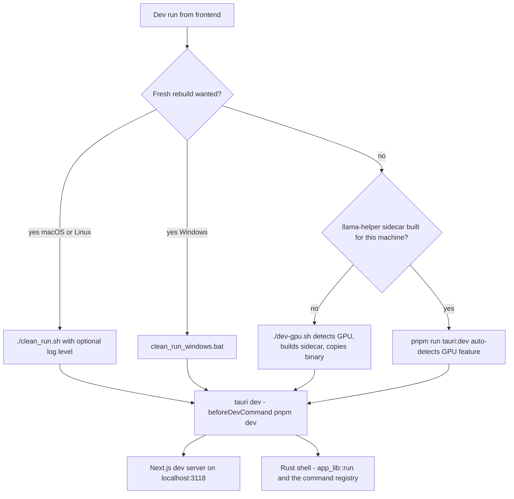

# Quickstart

Meetily is a privacy-first meeting assistant shipped as a single [Tauri 2.x](https://tauri.app/) desktop app: a Next.js UI (`frontend/src`) rendered in the Tauri webview, and a Rust core (`frontend/src-tauri`, library crate `app_lib`) that owns audio capture, transcription, persistence, and summary orchestration. This page gets a dev environment running and routes every common change to the right wiki page. It is orientation only — **source code and tests are authoritative**; this wiki and the repo docs describe behavior, they do not define requirements.

## The repo split: `frontend/` is the app

- **Supported tier** — `frontend/` contains the whole product. The Next.js + TypeScript UI lives in `frontend/src`; the Rust core lives in `frontend/src-tauri` and is registered as the crate `app_lib`. There is no separate server tier: meeting persistence, local transcription, and summary generation are all handled inside the Tauri app through Tauri commands and events.
- **Cargo workspace** — the root `Cargo.toml` has exactly two members: `frontend/src-tauri` (the app) and `llama-helper` (the standalone GGUF sidecar the app spawns as an external process; it is never linked into the app).
<!-- openwiki: broken internal link [/openwiki/architecture/legacy-and-dead-code.md] file "/openwiki/architecture/legacy-and-dead-code.md" does not exist. Fix the href or restore the target, then delete this comment. -->
- **`backend/` is archive-only legacy context** — `CLAUDE.md` frames the old Python/FastAPI + Docker + whisper-server tier as archived and unsupported for development, installs, production deployments, and issue triage. In the current tree that directory has been **removed entirely** (git history: "Remove archived Python/FastAPI backend"), so doc references to `backend/` describe a historical layout. The only live ties to that era are intentional compat surfaces: legacy-database import and a couple of dev-mode model-path fallbacks. Never build on, run, or "fix" that code — see [Legacy Archive & Unwired Code](/openwiki/architecture/legacy-and-dead-code.md), which also catalogues the unwired `audio_v2` module and the `lib_old_complex.rs` monolith inside `src-tauri`.

## Prerequisites

| Platform | Required |
| --- | --- |
| All | Node.js 18+, pnpm v8+, Rust stable toolchain (workspace `rust-version` is 1.77), CMake, network access for the first build |
| macOS | Xcode Command Line Tools; Metal/CoreML are compiled in automatically. System-audio capture needs a virtual device (BlackHole) at runtime |
| Windows | Visual Studio Build Tools with the "Desktop development with C++" workload; CUDA/Vulkan SDKs optional |
| Linux | `build-essential`/`gcc-c++`, `cmake`, `git`; CUDA toolkit, ROCm, or Vulkan SDK optional for GPU acceleration |

Two first-build notes:

- The app crate's `build.rs` **downloads and verifies a platform `ffmpeg` binary at build time** into `frontend/src-tauri/binaries/` (cached afterwards), so the first compile needs internet and can fail fatally if the download fails.
- Tauri's `externalBin` contract expects `frontend/src-tauri/binaries/llama-helper-<target-triple>` to exist. If it is missing, run `./dev-gpu.sh` once (or build `llama-helper/` manually and copy the binary) before `tauri dev`.

## Run the app

All commands run from `frontend/`.

```bash
pnpm install              # once per checkout / after dependency changes
pnpm run tauri:dev        # standard dev loop (auto-detects GPU feature)
./dev-gpu.sh              # GPU-aware loop: builds + installs the llama-helper sidecar first
./clean_run.sh            # from-scratch run (macOS/Linux); ./clean_run.sh debug for verbose logs
clean_run_windows.bat     # Windows counterpart
```

| Entry point | What it actually does |
| --- | --- |
| `pnpm run dev` | Next.js dev server **only**, on port **3118**. The UI loads but every Tauri `invoke` fails — useful for pure styling work, useless for app behavior |
| `pnpm run tauri:dev` | `node scripts/tauri-auto.js dev`: honors a `TAURI_GPU_FEATURE` env override, otherwise auto-detects via `scripts/auto-detect-gpu.js`, then runs `tauri dev -- --features <feature>` (CPU-only when detection yields none) |
| `./dev-gpu.sh` | Detects the feature (or takes `TAURI_GPU_FEATURE`), builds the llama-helper sidecar (debug) with the mapped feature — `coreml` becomes `metal` because `llama-cpp-2` has no CoreML — copies it to `src-tauri/binaries/llama-helper-<triple>`, then calls `pnpm run tauri:dev` |
| `./clean_run.sh [info\|debug\|trace]` | Sets `RUST_LOG` from the argument (default `info`), deletes `node_modules`, `.next`, `.pnp.cjs`, `out`, reinstalls, builds the Next.js export, then runs plain `pnpm run tauri dev` — **no GPU auto-detection** |
| `clean_run_windows.bat` | Deletes `node_modules`, `pnpm install`, `pnpm run tauri dev`. No log-level handling, no GPU detection |
| `pnpm run tauri:dev:{cuda,vulkan,metal,coreml,openblas,hipblas,cpu}` | Explicit feature flags that bypass detection |

In dev, `tauri.conf.json` sets `devUrl: http://localhost:3118` and `beforeDevCommand: pnpm dev`, so `tauri dev` starts both the Next.js server on port 3118 and the native shell. Keep port 3118 free or the dev session breaks.



*Figure: dev entry points converge on `tauri dev`, which launches the Next.js server on port 3118 and the Rust shell. `clean_run.sh` skips GPU detection entirely; `dev-gpu.sh` and `tauri:dev` route through feature detection.*

Production builds (`pnpm run tauri:build`, `clean_build.sh`, `build-gpu.sh`, GPU feature matrix, signing, CI workflows, updater artifacts) are covered in [Build, Bundling & Release](/openwiki/operations/build-and-release.md).

## What happens on launch

`app_lib::run()` (in `frontend/src-tauri/src/lib.rs`) registers the full Tauri command surface — roughly 180 commands across recording, transcription, summaries, settings, onboarding, and import — then, in `setup`: creates the system tray, initializes the notification manager, points the Whisper and Parakeet engines at `app_data_dir/models`, spawns engine initialization, initializes the bundled summary-template directory, and **blocks** on `database::setup::initialize_database_on_startup`. That step creates `app_data_dir/meeting_minutes.sqlite` if missing — copying a legacy `meeting_minutes.db` over it when present — opens the pool, and runs the embedded `sqlx` migrations. On the `Exit` run event the app cleans up the database pool and force-shuts-down the llama-helper sidecar.

A first launch may show the legacy-database import prompt and the onboarding wizard (permissions, Parakeet download, summary-model download). That flow is documented in [Workflow: First Run & Model Setup](/openwiki/workflows/first-run-and-model-setup.md).

For a deeper map of the shell — module layout, managed state, events — start at [Architecture Overview](/openwiki/architecture/overview.md).

## Task routing map

| If you are touching… | Go to |
| --- | --- |
| Audio: capture, mixing, VAD, devices, Bluetooth buffering, platform backends | [concepts/audio-pipeline.md](/openwiki/concepts/audio-pipeline.md) |
<!-- openwiki: broken internal link [/openwiki/concepts/transcription-engines.md] file "/openwiki/concepts/transcription-engines.md" does not exist. Fix the href or restore the target, then delete this comment. -->
| Speech-to-text: Whisper/Parakeet engines, model catalogs and downloads, GPU acceleration, live/batch workers | [concepts/transcription-engines.md](/openwiki/concepts/transcription-engines.md) |
<!-- openwiki: broken internal link [/openwiki/concepts/summary-engine.md] file "/openwiki/concepts/summary-engine.md" does not exist. Fix the href or restore the target, then delete this comment. -->
| Summaries: the SummaryService pipeline, templates, language handling, caching, `summary_processes` | [concepts/summary-engine.md](/openwiki/concepts/summary-engine.md) and [integrations/llm-providers.md](/openwiki/integrations/llm-providers.md) |
| The llama-helper sidecar protocol, lifecycle, and bundling | [integrations/llama-helper-sidecar.md](/openwiki/integrations/llama-helper-sidecar.md) |
| Schema, migrations, per-meeting folders, Tauri store files | [concepts/data-model.md](/openwiki/concepts/data-model.md) |
<!-- openwiki: broken internal link [/openwiki/architecture/tauri-command-surface.md] file "/openwiki/architecture/tauri-command-surface.md" does not exist. Fix the href or restore the target, then delete this comment. -->
| Adding a new Tauri command or event | [architecture/tauri-command-surface.md](/openwiki/architecture/tauri-command-surface.md) |
| Tray/window lifecycle, notifications, analytics consent, auto-updater, onboarding persistence | [concepts/desktop-services.md](/openwiki/concepts/desktop-services.md) |
| Frontend contexts, service wrappers, hooks, IndexedDB buffering | [concepts/frontend-state.md](/openwiki/concepts/frontend-state.md) |
| The flagship flow: start → capture → transcript → stop → save | [workflows/live-recording.md](/openwiki/workflows/live-recording.md) |
| Summary generation from a saved transcript | [workflows/summary-generation.md](/openwiki/workflows/summary-generation.md) |
| Importing audio files or re-transcribing recordings | [workflows/audio-import-retranscription.md](/openwiki/workflows/audio-import-retranscription.md) |
| Build scripts, bundling, CI, signing, releases | [operations/build-and-release.md](/openwiki/operations/build-and-release.md) |
| Tests, logging controls, debugging, validation expectations | [testing/validation-and-debugging.md](/openwiki/testing/validation-and-debugging.md) |
<!-- openwiki: broken internal link [/openwiki/architecture/legacy-and-dead-code.md] file "/openwiki/architecture/legacy-and-dead-code.md" does not exist. Fix the href or restore the target, then delete this comment. -->
| Archived or dead code you must not build on (`backend/`, `audio_v2`, `lib_old_complex.rs`) | [architecture/legacy-and-dead-code.md](/openwiki/architecture/legacy-and-dead-code.md) |
| The whole system on one page | [architecture/overview.md](/openwiki/architecture/overview.md) |

## Verifying your changes

Run the narrowest check that proves the behavior: inline Rust unit tests via `cargo test` in `frontend/src-tauri`, Bun frontend tests under `frontend/tests/lib/`, and `scripts/inject_transcript.py` to seed a meeting without recording one. Logging is controlled with `RUST_LOG` (e.g. `RUST_LOG=app_lib::audio=debug ./clean_run.sh`), and hot paths use the zero-overhead `perf_debug!`/`perf_trace!` macros. Details and repo-specific expectations live in [Testing & Debugging](/openwiki/testing/validation-and-debugging.md).
