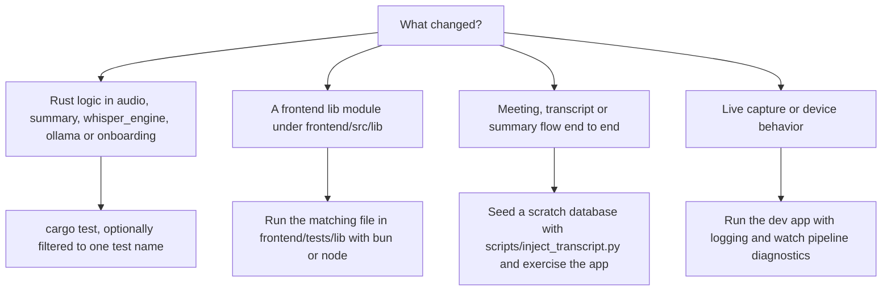
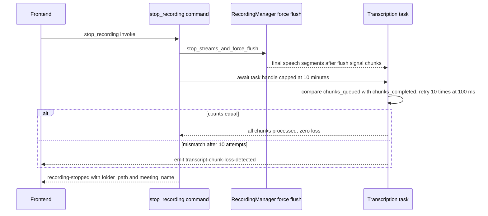

# Testing & Debugging

Verification in this repo happens at three layers, none of which is wired into CI:

1. **Rust unit tests** — inline `#[cfg(test)] mod tests` blocks throughout the app crate, run with `cargo test`.
2. **Frontend lib tests** — three standalone files under `frontend/tests/lib`, run directly with `bun` or `node` (there is no `test` script in `package.json`).
3. **Database-level seeding** — `scripts/inject_transcript.py` fills the platform Meetily SQLite database with synthetic recorded meetings so meeting/summary flows can be exercised without recording.

Debugging a running app relies on `env_logger` with a **forced `info` baseline** in `main.rs`, `RUST_LOG` module filters, compile-time-eliminated `perf_debug!`/`perf_trace!` macros on hot paths, batched audio metrics, and the in-app developer console toggle.

The repo's stated norm (from `AGENTS.md`): **prefer the narrowest quiet validation that proves the changed behavior, and preserve complete failure output.** In practice: run the smallest command — one filtered `cargo test`, one frontend test file, one script invocation — that demonstrates the change, and when something fails, keep the whole error text for diagnosis instead of re-running loudly.

## Choosing a validation



*Figure: pick the narrowest check that proves the change; DB seeding and a logged dev run cover what unit tests cannot.*

GitHub Actions does not run any test suite. `.github/workflows/build-test.yml` ("Build Test", manual dispatch) builds and signs artifacts across a four-platform matrix (macOS aarch64, Ubuntu 22.04 deb, Ubuntu 24.04 AppImage/RPM, Windows) by delegating to `build.yml`, which installs pnpm/Rust dependencies and builds — there is no `cargo test` or frontend test step. `pr-main-check.yml` only validates that `frontend/src-tauri/tauri.conf.json` contains a semver version. Every test suite in the repo is therefore a local discipline.

## Rust unit tests (`cargo test`)

The workspace (`Cargo.toml`) has two members — `frontend/src-tauri` (crate name `meetily`) and `llama-helper`; only the app crate carries tests. Run from the repository root:

```bash
cargo test                          # whole workspace
cargo test -p meetily               # app crate only
cargo test test_vad_400ms_vs_2000ms_segmentation   # single test by name
cargo test strip_title_if_present   # name substring filter
```

Tests are inline `#[cfg(test)] mod tests` blocks (not a separate tests directory) spread across `audio/`, `summary/`, `whisper_engine/`, `ollama/`, `onboarding.rs` and `analytics/`. Compiling them compiles the whole Tauri app, so Linux needs the usual system dev libraries.

What the suites actually pin down — the ones that matter when changing behavior:

| Module | Behaviors under test |
| --- | --- |
| `audio/vad.rs` | Chunked vs single-pass segmentation agree (±1 segment); large files (>960,000 samples ≈ 60 s at 16 kHz) process in 10 s chunks with monotonic progress reaching 100% and callback cancellation; VAD state persists across 10-second chunk boundaries; 2000 ms redemption never yields more segments than 400 ms and segments stay ≥250 ms |
| `audio/import.rs`, `audio/retranscription.rs` | `VAD_REDEMPTION_TIME_MS == 2000` for batch paths (live pipeline uses 400 ms); import guard flag lifecycle; audio-file candidate discovery (`audio.mp4` wins, extension fallback scan, priority order) |
| `audio/device_detection.rs` | AirPods → `Bluetooth`, built-in names → `Unknown`, buffer-size classification (3840 frames @ 48 kHz ⇒ Bluetooth, 512 ⇒ Wired), timeout ranges (Wired 20–50 ms, Bluetooth 80–200 ms), `calculate_buffer_timeout` clamping (80 ms base × 2 ⇒ 160 ms), BlackHole → `Wired` |
| `audio/device_monitor.rs` | Bluetooth disconnect threshold 3 polls vs wired 2; monitor creation/stop |
| `audio/incremental_saver.rs` | 60 s of 48 kHz audio ⇒ exactly 2 checkpoints; `finalize()` merges into one file and deletes `.checkpoints/`; finalizing an empty recording errors with "No audio checkpoints" |
| `audio/decoder.rs` | `to_whisper_format` mono/stereo/48 kHz→16 kHz resampling; `chunked_resample_with_progress` identity, empty input, downsampling |
| `audio/ffmpeg_mixer.rs` | 50 ms window = 2400 samples at 48 kHz; `SourceBuffer` bookkeeping; RMS calculation; clipping prevention |
| `audio/buffer_pool.rs` | Pool reuse, RAII `PooledBuffer` return-on-drop, max-size eviction |
| `audio/common.rs` | Engine lifecycle lock serializes concurrent acquirers (tokio test) |
| `audio/capture/backend_config.rs` | Backend string round-tripping (`"coreaudio"`, `"core_audio"`, `"screencapturekit"`) |
| `summary/service.rs` | `strip_title_if_present` strips only a *leading* H1 (mid-document H1, `#NoSpace`, already-stripped input preserved) while `strip_leading_title` returns `""` without one; template cache fingerprint changes with rendered template; English-cache extraction rules (legacy `english_markdown` field is a miss; matching source + changed translation target reuses cache; same-language regeneration and changed inputs reject it) |
| `summary/processor.rs` | Chunk/combine/final prompts embed the English-base instruction; final-language action matrix (English target + non-English transcript ⇒ normalize, non-English target ⇒ translate, unknown ⇒ normalize); failed normalization falls back to original markdown while cancellation is *not* swallowed; cached-English matrix |
| `summary/language_detection.rs` | whatlang-based English/Chinese detection, weighted dominant language, tie ⇒ `None` with `Tie` reason, short/unsupported text ⇒ `None`, every mapped summary code has a language name |
| `summary/metadata.rs` | `summary_language` writes to `metadata.json` preserve existing fields; detected language is stored separately from the user override |
| `summary/templates/` | Built-in template lookup (`daily_standup`, `standard_meeting`), unknown-id errors, invalid-JSON validation |
| `whisper_engine/acceleration.rs` | Compiled Vulkan backend ignores a runtime-detected CUDA GPU when deciding Flash Attention |
| `whisper_engine/system_monitor.rs` | Resource snapshot ranges, safe worker count bounded 1–4 |
| `ollama/metadata.rs` | `num_ctx` parsing from Modelfile text (spacing, missing, multiple params) and per-model fallback context sizes (`llama3.2:1b` → 4096, `mistral:7b` → 8192, `phi4` → 2048, unknown → `ULTIMATE_FALLBACK`) |
| `onboarding.rs` | Legacy onboarding-status JSON without `selected_summary_model` still deserializes (serde default `None`) — backward compatibility with old stores |

Environment-dependent tests are kept quiet: hardware tests are marked `#[ignore]` (`capture/core_audio.rs` Core Audio capture, `system_detector.rs` detector loop — run manually with `--ignored`), and smoke tests around real platform APIs (`permissions.rs`, `system_audio_commands.rs`) print-and-continue when audio hardware or permissions are absent so the default run stays green on headless machines.

## Frontend lib tests (`frontend/tests/lib`)

There is **no `test` npm script** and no JS test-runner configuration; the three files are standalone and run directly. `bun` is not a repo dependency (no lockfile/bunfig) — install it separately if you don't have it. Run from `frontend/` after `pnpm install`:

```bash
bun test tests/lib/blocknote-markdown.test.ts          # bun:test
bun test tests/lib/summary-language-preferences.test.js # bun:test + mock.module
node tests/lib/onboarding-summary-model.test.mjs        # plain Node, silent on success
```

- **`blocknote-markdown.test.ts`** (bun) — pins `blocksToMarkdownSafely`: successful conversion returns `{ markdown, ok: true }`; a thrown conversion returns `fallbackMarkdown` with `ok: false` and logs `console.error("Failed to convert BlockNote blocks to markdown", { source, blocksCount, error })`; without a fallback, `markdown` is `undefined`.
- **`summary-language-preferences.test.js`** (bun) — mocks `@tauri-apps/api/core` via `mock.module` and stubs `window.localStorage` to pin the folderless-meeting fallback contract: when the backend answers `storage: "local_fallback"` (the meeting has no folder), the language is read from/written to `summaryLanguageFallback:<meetingId>`; saving `null` (Auto) clears the key; detected languages cache under `detectedSummaryLanguageFallback:<meetingId>`; a failing localStorage write rejects with `"Failed to save summary language on this device"`. This mirrors the Rust side, where `api_get_meeting_summary_language`/`api_save_meeting_summary_language` return `local_fallback` exactly when `resolve_meeting_folder` finds no `folder_path`.
- **`onboarding-summary-model.test.mjs`** (Node) — transpiles `src/lib/onboarding-summary-model.ts` with the `typescript` package and executes it in a `node:vm` context, then asserts with `node:assert/strict`: an explicitly selected model wins over the recommendation; the recommended model becomes selected when nothing is selected; `summaryModelDownloaded` is true only when the *selected* model is ready (legacy Gemma availability must not make an undownloaded Qwen model ready); the size table (`qwen3.5:2b` = 1221 MB, `qwen3.5:4b` = 2614 MB, `gemma3:1b` = 1019 MB, unknown = 0) and `~1.2 GiB`-style labels; `getDownloadTotalMb` prefers a real total over the per-model estimate. Because it uses bare asserts, silence means pass.

## Seeding the database: `scripts/inject_transcript.py`

`python scripts/inject_transcript.py` creates meeting entries **identical to normal recordings** in the Meetily SQLite database, so you can exercise the meeting list, transcript rendering, playback sync, and summary generation without recording anything. It is the tool for DB-level validation of flows that unit tests can't reach.

```bash
python scripts/inject_transcript.py --csv transcript.csv --title "Test Meeting"
python scripts/inject_transcript.py --csv transcript.csv --db /path/to/copy.sqlite
python scripts/inject_transcript.py --csv transcript.csv --created-at 2025-12-05T10:00:00Z --folder-path /some/folder
```

- **CSV format**: a header row containing a `text` column; every non-empty `text` value becomes one transcript segment. Anything else in the CSV is ignored; a missing `text` column or zero segments is an error.
- **Timing synthesis**: duration is estimated at ~150 words/minute (0.4 s per word, minimum 0.5 s); segments get `seg-<uuid4>` ids, ISO timestamps advancing by their duration, and cumulative `audio_start_time`/`audio_end_time`.
- **What it writes**: one transaction inserts a `meetings` row (`id = meeting-<uuid4>`, title, created/updated, optional `folder_path`) plus one `transcripts` row per segment (`transcript`, `timestamp`, `audio_start_time`, `audio_end_time`, `duration`). On any failure the transaction rolls back and the script exits non-zero.
- **Verification**: after insertion it re-queries the meeting row, segment count, and `MAX(audio_end_time)` (total duration) and prints a summary — "The meeting should now appear in the Meetily sidebar."
- **Database resolution**: with no `--db`, it picks the platform default — `~/Library/Application Support/Meetily/meeting_minutes.sqlite` (macOS), `%APPDATA%\Meetily\...` (Windows, with a `~/AppData/Roaming` fallback), `~/.config/Meetily/...` (Linux) — and refuses to run if the file doesn't exist ("Make sure Meetily has been run at least once"). Pass `--db` pointing at a **copy** when you want a scratch database instead of touching real app data.

The written columns (`folder_path` on meetings; `audio_start_time`, `audio_end_time`, `duration` on transcripts) are exactly the ones added by migration `20251006000000_add_audio_sync_fields.sql`, so injected meetings support the same audio-transcript playback sync as recorded ones. Injected meetings have no audio file unless `--folder-path` points at a real folder.

## Logging controls

### `RUST_LOG` baseline and filters

`main.rs` sets `RUST_LOG=info` and initializes `env_logger` before calling `app_lib::run()` — this is the app's log baseline. The `set_var` call is **unconditional**, so a `RUST_LOG` exported by the shell (including `./clean_run.sh debug`, which accepts `info|debug|trace` and exports the variable) is overwritten before `env_logger` reads it; when you need finer-grained levels in the current code, that line in `main.rs` is the knob. The filter syntax it feeds is standard env_logger targeting, e.g. `RUST_LOG=app_lib::audio=debug` to raise only the audio module (the recipe documented in `CLAUDE.md` for testing audio changes), or `RUST_LOG=app_lib::audio=trace` for the capture callbacks.

`console_utils::show_console` also sets `RUST_LOG=info` and initializes `env_logger` when it allocates a fresh Windows console, so console-allocated sessions start at info too.

Two more log sources matter when debugging transcription: `whisper_engine` sets `GGML_METAL_LOG_LEVEL=1` and `WHISPER_LOG_LEVEL=1` at engine creation to suppress whisper.cpp/Metal C-library logs that bypass Rust logging, and the transcription worker emits structured Tauri events (`transcript-update`, `transcription-error`, `transcription-progress`, `transcription-queue-complete`, `speech-detected`) that are visible in the frontend DevTools console rather than the Rust log.

### Hot-path macros: `perf_debug!` / `perf_trace!`

`lib.rs` defines `perf_debug!` and `perf_trace!` under `#[cfg(debug_assertions)]` to expand to `log::debug!`/`log::trace!` and to **nothing** in release builds (`#[cfg(not(debug_assertions))]`), re-exported crate-wide with `pub(crate) use`. They exist because per-chunk logging in the audio hot path caused measurable latency (see `frontend/src-tauri/LOGGING_OPTIMIZATIONS.md`: hot-path log removal, conditional compilation, async logging, and metrics batching were a coordinated fix). Use them for any log statement inside capture callbacks, the pipeline loop, or per-segment transcription work:

- `audio/pipeline.rs` logs its periodic summary ("Pipeline processed N chunks…") through `perf_debug!`, gated to every 200 chunks or 60 seconds.
- `whisper_engine/whisper_engine.rs` logs transcription completions through `perf_debug!` (only for significant results) and per-segment text through `perf_trace!` (only for audio longer than 30 s).

Remember when reviewing logs: **release builds contain none of these lines**, and `log::debug!` calls added directly are *not* eliminated — only the macros are.

### Async logger

`audio/async_logger.rs` provides a non-blocking alternative: an `AsyncLogger` holding an unbounded tokio mpsc channel, a 1000-message buffer flushed when full or every 100 ms, and drop-tolerant sends so audio threads never block on I/O. The `async_debug!`/`async_info!`/`async_warn!` macros route through a global `OnceCell` that lazy-initializes only inside a tokio runtime context. `main.rs` notes it "will be initialized lazily when first needed (after Tauri runtime starts)"; today no module calls it, so it is ready-made infrastructure for new hot paths rather than an active log channel.

### Metrics batching

Instead of logging per chunk, `AudioPipeline::run` feeds an `AudioMetric` (chunk id, sample count, duration ms, average level) into an `AudioMetricsBatcher` via the `batch_audio_metric!` macro. The batcher aggregates every 50 chunks or 5 seconds into an `AudioMetricsSummary` with `total_chunks`, `total_samples`, `total_duration_ms`, `average_level`, `timespan`, and `chunks_per_second`, retrievable programmatically via `get_summaries()`. This replaces what used to be one log line per chunk.

## Audio pipeline metrics to watch

`CLAUDE.md` lists the key signals emitted while recording; here is where each comes from:

- **Buffer sizes (mic/system)** — `AudioMixerRingBuffer::add_samples` logs "📊 Ring buffer status: mic=…, sys=… samples (max=…)" at debug every 200 calls. The ring buffer mixes in fixed 600 ms windows (28,800 samples at 48 kHz; the adjacent "50 ms" comment is stale) with a cap of 8× the window per side.
- **Dropped chunks / overflow** — when a side exceeds the cap, oldest samples are dropped *after* logging: a `warn` for microphone overflow and an `error` for system audio — "🔴 SYSTEM AUDIO BUFFER OVERFLOW … THIS CAUSES DISTORTION!". These lines are the definitive signal that the mixing stage lost audio.
- **VAD detection** — each accepted speech segment logs "📤 Sending VAD segment: N ms, M samples" at info; segments under 800 samples (50 ms at 16 kHz) log "⏭️ Dropping short VAD segment" at debug. Batch import additionally logs "VAD detected N speech segments (redemption_time=2000ms)" plus avg/min/max segment-duration statistics.
- **Throughput/level** — the `AudioMetricsSummary` fields above (chunks/sec, average level) summarize the hot path at 50-chunk/5 s granularity.
- **Diagnostics helpers** — `audio/diagnostics.rs` exports `log_device_capabilities`, `log_detection_summary`, `log_buffer_health` (warns above 80% utilization, flags Bluetooth-specific risk), `log_mixer_status`, and `log_performance_summary` for session summaries; they are available for instrumenting new code paths.

## Verifying shutdown: the chunk-loss check

When debugging "the transcript tail is missing", the shutdown path has a built-in verification loop you can watch in the logs:



*Figure: stop sequencing. The transcription task verifies queued vs completed chunk counters and reports loss explicitly rather than silently dropping the tail.*

The transcription task counts queued and completed chunks with atomic counters; after the workers finish it retries the comparison up to 10 times (100 ms apart) before emitting the `transcript-chunk-loss-detected` event with the counts. `stop_recording` waits for the task with a 10-minute cap (emitting `recording-shutdown-progress` stages while waiting) so a stuck worker cannot hang shutdown forever, then emits `recording-stopped` carrying `folder_path` and `meeting_name` for the frontend save. A mismatch in the logs means chunks were lost between the pipeline and the workers — start from the flush-signal handling in `AudioPipeline::run` and the channel-closure path.

## Known caveats to check after audio changes

- **Bluetooth playback distortion is playback-side.** `BLUETOOTH_PLAYBACK_NOTICE.md` documents that recordings are correct 48 kHz mono AAC files; distorted, sped-up, or "chipmunk" playback through Bluetooth headphones comes from macOS resampling to the headset's negotiated rate (8–44.1 kHz depending on profile/codec). Verify with `ffprobe path/to/audio.mp4` (expect `sample_rate=48000`, `channels=1`, `codec_name=aac`) and re-test through speakers or wired headphones — do not "fix" the recording pipeline for this. `playback_monitor::get_active_audio_output` (name heuristics per platform) feeds the `BluetoothPlaybackWarning` component, which polls every 5 seconds on playback screens and recommends wired playback.
- **System-audio buffer overflow causes distortion in recordings.** When the system side of `AudioMixerRingBuffer` overflows, oldest samples are dropped and the saved mixed audio audibly distorts. If a recording sounds wrong, check the Rust log for the "SYSTEM AUDIO BUFFER OVERFLOW … THIS CAUSES DISTORTION!" error and the periodic ring-buffer status line before suspecting the encoder.
- **VAD redemption constants are load-bearing.** The live pipeline passes 400 ms on all platforms (both branches of the `cfg!` in `pipeline.rs`; the comment musing about 900 ms on macOS is not what the code does), while import/retranscription use 2000 ms because whole-file VAD would otherwise fragment speech at every sentence gap. Changing thresholds, `min_speech_time` (250 ms), or the 800-sample minimum segment length should come with a re-run of the `vad.rs` tests.
- **Release builds silently change log behavior**: `perf_debug!`/`perf_trace!` compile out and `RUST_LOG` is forced to `info` by `main.rs`, so a hot path that looks instrumented in a debug run may be unobservable in production builds. If you need a line in release, use `log::info!`/`log::warn!` deliberately.

## Related pages

- [Audio Pipeline](/openwiki/concepts/audio-pipeline.md) — the pipeline whose logs and metrics this page explains.
- [Data Model & On-Disk Layout](/openwiki/concepts/data-model.md) — the SQLite schema and meeting folders that `inject_transcript.py` writes into.
- [Frontend State & Services](/openwiki/concepts/frontend-state.md) — the contexts and services the frontend lib tests target.
- [Build, Bundling & Release](/openwiki/operations/build-and-release.md) — the CI build matrix and GPU feature choices that affect debug vs release behavior.
