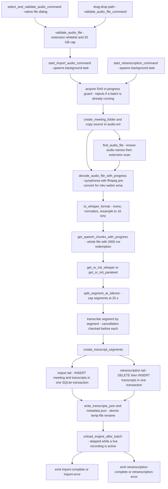
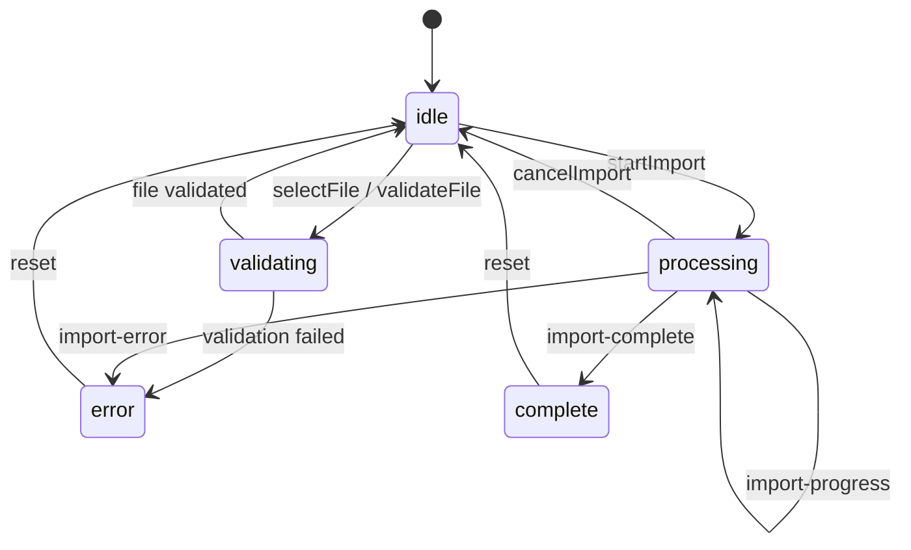

# Audio Import & Retranscription

Meetily has two *batch* audio paths, both gated behind the `importAndRetranscribe` beta feature flag (`frontend/src/types/betaFeatures.ts`):

- **Import** (`frontend/src-tauri/src/audio/import.rs`) — bring an external audio file into the app as a **brand-new meeting**, transcribed from scratch.
- **Retranscription** (`frontend/src-tauri/src/audio/retranscription.rs`) — re-process the audio already stored in an existing meeting's folder and **replace** that meeting's transcripts, typically with a different language or model.

Both flows run the same body of work and share their helpers in `audio/common.rs` (which the module docs describe as "shared utilities for import and retranscription"). They differ only at the head (validate + copy a new file vs. locate a stored one) and the tail (insert a new meeting vs. delete-and-reinsert transcripts of an existing one).

## Two flows, one pipeline

| | Import | Retranscription |
| --- | --- | --- |
| Input | Path to an external audio file (file dialog or drag-drop), a user-editable title | `meeting_id` + `meeting_folder_path` from the meetings table |
| File location | Validated with `validate_audio_file`, then **copied** into a new meeting folder as `audio.<ext>` | Found in place by `find_audio_file` (candidates `audio.mp4`, `audio.m4a`, `audio.wav`, … then a directory scan against `AUDIO_EXTENSIONS`) |
| Folder | Created by `create_meeting_folder` under `get_default_recordings_folder()` — the platform default recordings folder, *not* the user's saved `recording_preferences.save_folder` | Already exists (the meeting's `folder_path`) |
| Speech-less audio | Non-fatal: the meeting is still created with zero transcripts and an `import-warning` event is emitted; no engine is even initialized | Fatal: `run_retranscription` returns "No speech detected in audio file" |
| Database tail | `INSERT INTO meetings` (`meeting-{uuid}`) + transcript rows in one transaction, with `folder_path` set | `DELETE FROM transcripts WHERE meeting_id = ?` + re-inserts in one transaction; the `meetings` row is untouched |
| metadata.json | Written fresh with `"source": "import"` | Updated in place: existing fields preserved, `retranscribed_at` added, `detected_summary_language` removed |
| Cancellation cleanup | Removes the partially created meeting folder | Nothing to clean — the DB transaction is only committed at the end |

The pipeline itself (see the [Audio Pipeline](/openwiki/concepts/audio-pipeline.md) page for the live-recording counterpart):



*Figure: the shared batch spine. Import enters through validation and folder creation; retranscription enters through `find_audio_file`. Everything from decode onward is common code, and both flows end with the engine unload and terminal events.*

## Pipeline stages

### Selection and validation (import only)

`select_and_validate_audio_command` opens a native file dialog filtered to `AUDIO_EXTENSIONS`, then runs `validate_audio_file`, which enforces, in order:

1. the file exists,
2. its lowercase extension is in `AUDIO_EXTENSIONS` — ten formats: `mp4, m4a, wav, mp3, flac, ogg, aac, mkv, webm, wma` (`audio/constants.rs`, mirrored by `frontend/src/constants/audioFormats.ts` with a "keep in sync" comment),
3. size ≤ `MAX_FILE_SIZE_BYTES` = 20 GB (guards against OOM and runaway processing).

Duration is resolved with a **metadata-only fast path**: a lightweight Symphonia probe reads `n_frames / sample_rate` without decoding; if metadata is unavailable (some MP3s), it falls back to a full decode. The result is an `AudioFileInfo { path, filename, duration_seconds, size_bytes, format }`; the file stem becomes the suggested meeting title. `validate_audio_file_command` runs the same validation for the drag-drop path.

### Decode and conversion to 16 kHz mono

`audio/decoder.rs` decodes with **Symphonia** (`decode_audio_file` / `decode_audio_file_with_progress`, reporting progress every ~10%). Formats Symphonia cannot demux — `FFMPEG_ONLY_EXTENSIONS = ["mkv", "webm", "wma"]` — are first converted to a temporary WAV by an ffmpeg subprocess (`convert_to_wav_with_ffmpeg`, `-vn -acodec pcm_s16le`); the temp file lives in the input's directory and is auto-deleted by its `TempPath` guard when decoding ends, even on error. If ffmpeg cannot be found, the error tells the user it will be downloaded on next launch.

`DecodedAudio::to_whisper_format` then produces the engine input:

1. **Mono downmix** if multi-channel (the decoder also corrects the channel count from the first decoded packet when metadata is wrong),
2. **Normalization** — samples exceeding ±1.0 are scaled down, non-finite samples zeroed, everything clamped,
3. **Resampling to 16 kHz** with the sinc resampler. Files above `LARGE_FILE_THRESHOLD` (14.4 M samples ≈ 5 min at 48 kHz) are resampled in **parallel 60-second chunks** via rayon and merged with a 100 ms cross-fade, falling back to single-pass `resample_audio` if any chunk fails. A comment records why: linear interpolation (no anti-aliasing filter) once caused VAD to miss ~99% of speech in long recordings. After resampling, samples are clamped again because the sinc filter can overshoot ±1.0 (Gibbs phenomenon), which Silero VAD rejects.

### Whole-file VAD

Both flows run **whole-file VAD** via `get_speech_chunks_with_progress` with `VAD_REDEMPTION_TIME_MS = 2000` — deliberately four times the 400 ms redemption the live pipeline uses, because batch VAD sees the entire file at once and a short redemption fragments speech at every natural sentence pause. The function processes files longer than one minute in 10-second chunks, reports `(progress_percent, segments_found)` through a callback, and **aborts with "VAD processing cancelled"** if the callback returns `false` — this is how cancellation reaches inside the long VAD pass. Segments under 1600 samples (100 ms at 16 kHz) are skipped before transcription.

### Segment splitting

Speech segments longer than 25 seconds (`MAX_SEGMENT_SAMPLES = 25 × 16000`) are split by `split_segment_at_silence` (`audio/common.rs`). Instead of hard cuts, it scans ±3 s around each target split point for the 100 ms window with the lowest RMS energy and cuts at its center when the window is genuinely silent (RMS ≤ 0.02); when no silence is found it falls back to a 1-second **overlap** split — advancing the cursor past the overlap so the overlapped audio is not transcribed twice. Timestamps are reconstructed linearly from sample positions.

### Engine selection and per-segment transcription

`get_or_init_whisper` / `get_or_init_parakeet` (duplicated in each module) reuse the **global** engine singletons (`WHISPER_ENGINE` / `PARAKEET_ENGINE`). The target model is the explicitly requested one, else the `transcript_settings` row (`provider = localWhisper|whisper` for Whisper, `parakeet` for Parakeet), else `DEFAULT_WHISPER_MODEL` (`large-v3-turbo`) / `DEFAULT_PARAKEET_MODEL` (`parakeet-tdt-0.6b-v3-int8`). The model is (re)loaded only when `get_current_model()` differs — with a non-fatal `discover_models()` first. One asymmetry: when no model is requested and the configured provider doesn't match, **import** silently falls back to the default model, while **retranscription's** Whisper resolution errors with "Retranscription requires Whisper. Current provider '…' does not support retranscription with language selection."

Per segment: Whisper uses `transcribe_audio_with_confidence(samples, language)`; Parakeet uses `transcribe_audio` with a fixed confidence of 0.9 and no language argument — the frontend disables language selection for Parakeet models and sends `null`. Empty transcriptions are dropped; only non-empty `(text, start_ms, end_ms)` tuples accumulate.

## Concurrency control: guards, cancellation, and the engine lifecycle lock

### RAII in-progress guards

Each module owns a static flag pair, e.g. import:

- `IMPORT_IN_PROGRESS` / `RETRANSCRIPTION_IN_PROGRESS` — "a batch is running",
- `IMPORT_CANCELLED` / `RETRANSCRIPTION_CANCELLED` — "a cancel was requested".

The in-progress flag is guarded by an RAII type (`ImportGuard` / `RetranscriptionGuard`). `acquire()` performs `compare_exchange(false → true)` and returns the error string **"Import already in progress"** / **"Retranscription already in progress"** when the flag is already set; `Drop` stores `false` unconditionally. Because the guard is held for the whole `start_import` / `start_retranscription` body, the flag is cleared on **every** exit path — early returns and panics alike — with no manual reset.

The `start_*` commands pre-check the flag and surface that error string to the UI before spawning; the RAII guard inside the spawned task then re-checks atomically, closing the check-then-spawn race. Both `start_import_audio_command` and `start_retranscription_command` return an "… started" response immediately after `tauri::async_runtime::spawn` — results arrive asynchronously as events.

### Cancellation

`cancel_import_command` / `cancel_retranscription_command` set the cancelled flag (and fail with "No import/retranscription in progress" when idle); `is_*_in_progress_command` exposes the flag state. Inside the batch, the flag is checked:

- between every pipeline stage,
- before each transcription segment,
- inside the VAD progress callback (returning `false` aborts VAD).

On cancellation, import **deletes the meeting folder** it created (`remove_dir_all`) at each checkpoint; retranscription needs no cleanup because its `DELETE`+`INSERT` runs in a single SQLite transaction committed only at the end — an abort before commit leaves the stored transcripts intact. Note the flag is *reset at the start* of each run, so a stale cancellation from a previous batch cannot poison the next one.

### Engine lifecycle lock and unload

Both flows end by calling `common::unload_engine_after_batch(use_parakeet)` — after success, failure, **or** cancellation. That function:

1. acquires the shared `ENGINE_LIFECYCLE_LOCK` (a process-wide `AsyncMutex`, handed out as an `OwnedMutexGuard`), serializing engine unload against any other lifecycle operation,
2. **skips unloading entirely if `recording_commands::is_recording()` is true** — live recording shares the same global engine instances, so freeing the model mid-recording would break the ongoing session,
3. otherwise calls `unload_model()` on the Whisper or Parakeet global, dropping the in-memory model.

A test in `common.rs` pins the serialization behavior: a second acquirer of the lifecycle lock stays blocked until the first guard drops.

## Progress, completion, and error events

Progress is emitted as Tauri events with a `{stage, progress_percentage, message}` payload (`ImportProgress`), with retranscription adding `meeting_id` (`RetranscriptionProgress`):

| Stage | Import range | Retranscription range |
| --- | --- | --- |
| `copying` | 5–10 | — |
| `decoding` | 15–20 (decode callback mapped ×0.05) | 5–15 |
| `resampling` | 20–25 | — (folded into `decoding`) |
| `vad` | 25–30 (VAD callback ×0.05) | 20–25 |
| `transcribing` | 30–80 (proportional to segment index) | 25–80 |
| `saving` | 85–90 | 80–90 |
| `complete` | 100 | 100 |

Terminal events, emitted in `start_import` / `start_retranscription` **after** the engine unload regardless of outcome:

- `import-complete` / `retranscription-complete` — payload includes `meeting_id`, `segments_count`, `duration_seconds` (+ `title` / `language`),
- `import-error` / `retranscription-error` — `{error}` / `{meeting_id, error}`,
- `import-warning` — non-fatal notice when VAD finds no speech (the meeting is still created); note the frontend currently has no dedicated listener for this event.

## Persistence

`create_transcript_segments` maps the `(text, start_ms, end_ms)` tuples to `TranscriptSegment`s: id `transcript-{uuid}`, trimmed text, RFC 3339 timestamp of "now", and `audio_start_time` / `audio_end_time` / `duration` in seconds derived from the VAD timestamps.

`write_transcripts_json` writes the per-folder `transcripts.json` (version `1.0`, `total_segments`, ordered `sequence_id`s) **atomically** — write to `.transcripts.json.tmp`, then rename — so a crash never leaves a truncated transcript file. metadata.json uses the same temp+rename pattern. Both flows treat sidecar-file write failures as logged warnings, never as batch failures: SQLite is the source of truth (see [Data Model & On-Disk Layout](/openwiki/concepts/data-model.md)).

Import's `create_meeting_with_transcripts` inserts the `meetings` row (`meeting-{uuid}`, `folder_path`) and all transcript rows in one transaction; retranscription's delete+insert runs the same way. Nothing partial can ever be observed in the database.

## Commands registered in lib.rs

```text
// Retranscription commands
audio::retranscription::start_retranscription_command
audio::retranscription::cancel_retranscription_command
audio::retranscription::is_retranscription_in_progress_command
// Import audio commands
audio::import::select_and_validate_audio_command
audio::import::validate_audio_file_command
audio::import::start_import_audio_command
audio::import::cancel_import_command
audio::import::is_import_in_progress_command
```

## Frontend wiring

### `useImportAudio` hook

`frontend/src/hooks/useImportAudio.ts` owns the client-side state machine and event plumbing:



*Figure: `ImportStatus` transitions. `isProcessing` is `processing`; `isBusy` covers `processing` and `validating`.*

The hook listens once for `import-progress`, `import-complete`, and `import-error`. On completion it tracks the `import_audio_completed` analytics event, applies the user's pinned summary language to the new meeting (`applyPinnedSummaryLanguageToMeeting`, warning via toast if that fails), and invokes `onComplete`. A `isCancelledRef` guard makes listeners ignore any events that arrive after the user cancelled. `startImport` tracks `import_audio_started` with file size/duration/language/model and invokes `start_import_audio_command`; `cancelImport` sets the ref *first*, then invokes `cancel_import_command`.

### Import UI

- **`ImportAudioDialog`** (`frontend/src/components/ImportAudio/`) uses the hook, pre-fills the title from the validated filename, and offers language + model selectors (models come from the shared `useTranscriptionModels` hook, keyed `provider:name`; language selection is hidden for Parakeet and `auto` is sent as `null`). While processing it blocks closing, Escape, and outside clicks; cancel calls `cancelImport`. On completion it refetches the sidebar meetings and navigates to the new meeting's details page.
- **Drag-drop** is handled app-wide in `frontend/src/app/layout.tsx`: `tauri://drag-enter` shows `ImportDropOverlay` (listing the supported formats from `getAudioFormatsDisplayList()`), and `tauri://drag-drop` picks the first path whose extension passes `isAudioExtension` and opens the dialog with that file preselected. Non-audio drops get a toast.
- **Beta gating**: the dialog only mounts when `betaFeatures.importAndRetranscribe` is on (default `true`), the drop handler rejects drops when it is off, and the Sidebar's "Import" entries go through `ImportDialogContext.openImportDialog`, which toasts "Enable … in Settings > Beta" when disabled.

### Retranscribe UI

`RetranscribeDialog` (`frontend/src/components/MeetingDetails/`) is rendered by `TranscriptButtonGroup` — the "Enhance" button — only when the beta flag is on **and** both `meetingId` and `meetingFolderPath` are available (`meeting.folder_path` flows from the meeting metadata through the details page). It listens for `retranscription-progress/complete/error` but **filters every event by `event.payload.meeting_id`**, so a dialog open on one meeting cannot be confused by a batch running on another. On completion it triggers a transcript refetch (`usePaginatedTranscripts.refetch`); the start button is disabled when no folder path exists.

## Focused tests

The meaningful tests live next to the code:

- `audio/common.rs` — the engine lifecycle lock serializes concurrent acquirers.
- `import.rs` — extension whitelist membership, `create_transcript_segments` (empty/single/multi/trim/unique ids), cancellation flag toggling, metadata-only duration extraction on the bundled `jfk.wav`/`jfk.mp3` samples, validation failures (nonexistent path, wrong extension), `split_segment_at_silence` (short/long/no-silence-overlap), atomic `write_transcripts_json`, and `write_import_metadata`. A `#[ignore]`d integration test (`TEST_AUDIO_PATH` env var) drives decode → resample → VAD with both 400 ms and 2000 ms redemption on a real file.
- `retranscription.rs` — the `VAD_REDEMPTION_TIME_MS == 2000` constant, `find_audio_file` priority order (`audio.mp4` beats `audio.m4a`; extension scan; empty/missing folder errors), and the full `AUDIO_EXTENSIONS` list.
- `decoder.rs` — mono conversion, 48 kHz → 16 kHz resampling, chunked-resample identity/length/range/single-pass equivalence.
