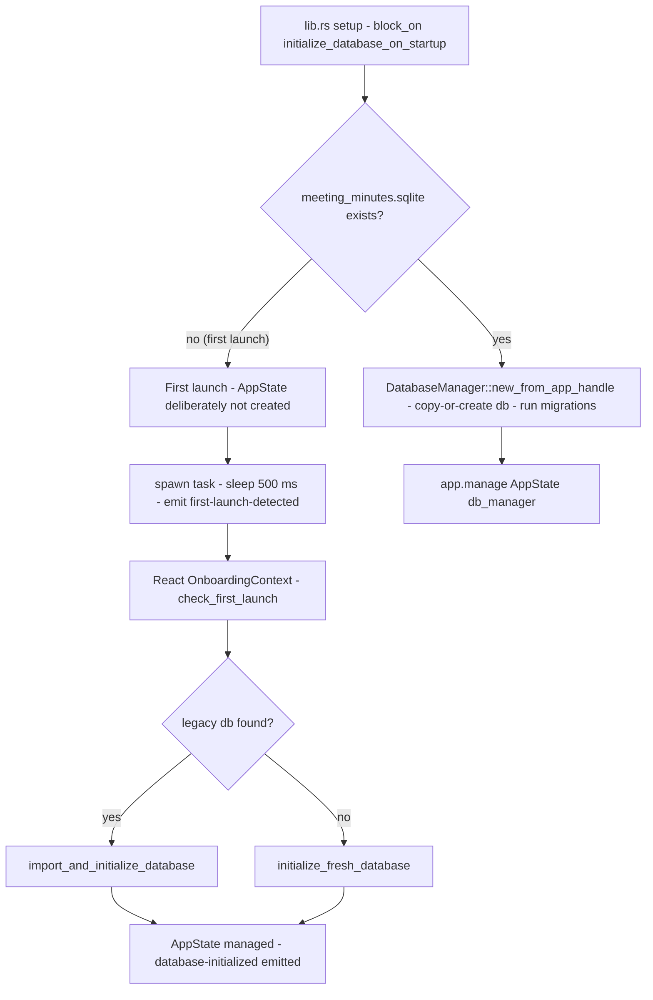
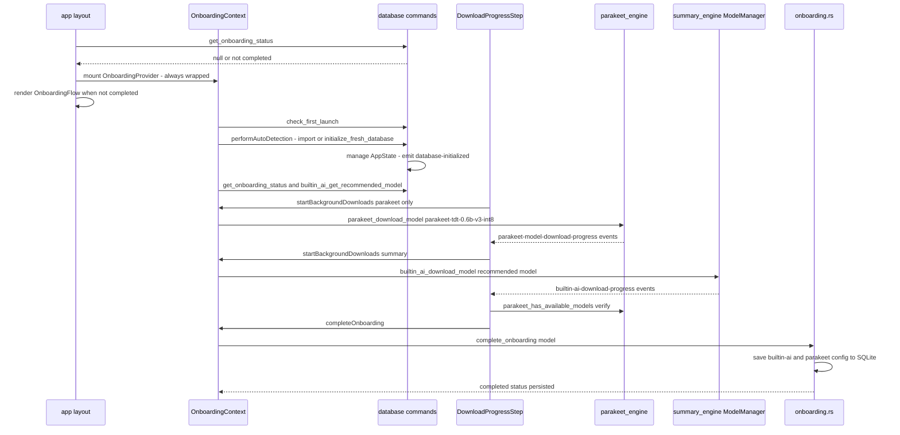
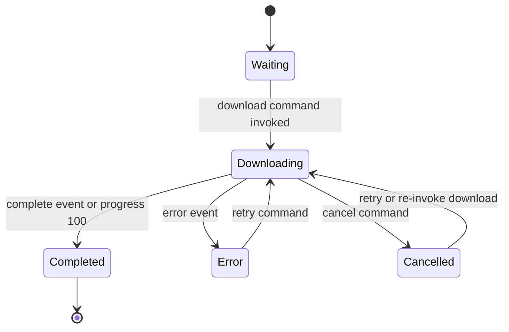

# First Run & Model Setup

Before a user can record their first meeting, three things must happen: the SQLite database must exist (or be imported from a legacy install), the onboarding wizard must run, and the AI models — Parakeet for transcription and a Qwen/Gemma GGUF for Built-in AI summaries — must be downloaded. These layers are deliberately decoupled so that none of them blocks the others more than necessary:

| Concern | Rust home | Frontend home | Backing storage |
| --- | --- | --- | --- |
| First-launch detection & DB init | `database/setup.rs`, `database/manager.rs`, `database/commands.rs` | `contexts/OnboardingContext.tsx` | `app_data_dir/meeting_minutes.sqlite` |
| Legacy database import | `database/commands.rs` | `contexts/OnboardingContext.tsx`, `components/DatabaseImport/` | copied `meeting_minutes.db` |
| Onboarding wizard | `onboarding.rs` | `components/onboarding/`, `contexts/OnboardingContext.tsx` | Tauri store `onboarding-status.json` |
| Model downloads | `parakeet_engine/`, `whisper_engine/`, `summary/summary_engine/` | `DownloadProgressStep`, `*ModelManager`, `DownloadProgressToast` | `app_data_dir/models/**` |

The whole flow is gated by `app/layout.tsx`: on mount it invokes `get_onboarding_status`, and `null`, `false`, or an error all render `OnboardingFlow` instead of the main app — an intentional fail-closed default toward onboarding. When onboarding completes, the layout calls `window.location.reload()` so the app boots fresh into the main UI.

## Startup: first-launch detection and deferred database init

Tauri's `setup` hook calls `database::setup::initialize_database_on_startup` synchronously via `block_on` (`frontend/src-tauri/src/lib.rs`). That function branches on `DatabaseManager::is_first_launch`, which is simply the **absence of `app_data_dir/meeting_minutes.sqlite`**:



*Figure: the startup branch. On a repeat launch the database is opened and managed immediately; on a first launch the webview's onboarding context finishes the job through Tauri commands.*

- **Non-first launch:** `DatabaseManager::new_from_app_handle` runs right away — it opens (or copies-or-creates) the SQLite file, runs `sqlx::migrate!("./migrations")`, and the resulting manager is published via `app.manage(AppState { db_manager })`. Every command that takes `State<AppState>` works from this point on.
- **First launch:** `AppState` is **deliberately not created**. Instead a task sleeps 500 ms — long enough for the window to be ready and React event listeners to register — and then emits the `first-launch-detected` event. The current webview does not subscribe to that event; `OnboardingContext` drives first-launch handling itself by invoking `check_first_launch` on mount and completing initialization through the commands below. Until one of them succeeds, any command requiring `State<AppState>` cannot run — including `complete_onboarding`, which is why the onboarding context kicks off database initialization as its first action.

Two defensive behaviors round out the database lifecycle:

- **WAL recovery** (`manager.rs`): if opening the database fails with an error containing "malformed" or "corrupt", the manager deletes the orphaned `meeting_minutes.sqlite-wal`/`-shm` files and retries the connection once. On application exit (`RunEvent::Exit`) the manager runs `PRAGMA wal_checkpoint(TRUNCATE)` and closes the pool; the cleanup path tolerates a missing `AppState` ("likely first launch").
- **Deferred engine setup is independent**: `lib.rs` setup also sets the whisper and Parakeet models directories (`app_data_dir/models`), spawns `whisper_init`/`parakeet_init`, and initializes the summary `ModelManager` non-blocking (with lazy per-command re-initialization as fallback). Engine availability therefore does not depend on database initialization succeeding.

## Legacy database import

### What counts as a legacy database

Older Meetily releases (the Python backend era) stored data in `meeting_minutes.db`; the Tauri app uses `meeting_minutes.sqlite`. The database commands expose the detection surface:

- `check_first_launch` — re-exported `is_first_launch` for the frontend.
- `select_legacy_database_path` — native file dialog filtered to `.db` files; returns `None` on cancel.
- `detect_legacy_database(selected_path)` — accepts either the `.db` file directly, a directory containing `meeting_minutes.db`, or a repository root containing `backend/meeting_minutes.db`.
- `check_default_legacy_database` — checks `app_data_dir/meeting_minutes.db`.
- `check_homebrew_database(path)` — returns `{ exists, size }` only when the file exists, is regular, and is **non-empty**; designed for detecting old Homebrew/Python installs.

### Automatic detection order

On mount, `OnboardingContext.initializeDatabaseInBackground` invokes `check_first_launch`. If the database already exists it does nothing; otherwise `performAutoDetection` tries, in order:

1. **Homebrew path (macOS only)** — `check_homebrew_database` at `/usr/local/var/meetily/meeting_minutes.db`; on success, `import_and_initialize_database`.
2. **Default legacy location** — `check_default_legacy_database` (`app_data_dir/meeting_minutes.db`); on success, import.
3. **Nothing found** — `initialize_fresh_database`.

Detection or import failures are logged and swallowed: a broken import must never block the onboarding wizard. Note that the context only probes the Intel Homebrew path; the standalone `HomebrewDatabaseDetector` component additionally probes `/opt/homebrew/var/meetily/meeting_minutes.db` for Apple Silicon and shows the detected size before offering the import.

### Manual import dialog

`components/DatabaseImport/LegacyDatabaseImport.tsx` is a self-contained dialog ("Do you have data from a previous Meetily installation?") that embeds `HomebrewDatabaseDetector` and offers a browse flow — `select_legacy_database_path` → `detect_legacy_database` → `import_and_initialize_database` → reload — plus a "Start Fresh" escape hatch that calls `initialize_fresh_database` and reloads. It is currently not mounted anywhere in the app tree (the auto-detection moved into `OnboardingContext`), so it survives as an opt-in component; see [Legacy & Dead Code](/openwiki/architecture/legacy-and-dead-code.md).

### The `.db` → `.sqlite` copy semantics

`DatabaseManager::new` implements the migration itself, and `import_legacy_database` leans on it:

1. `import_legacy_database(app, legacy_db_path)` copies the selected file into `app_data_dir/meeting_minutes.db`, then calls `new_from_app_handle`.
2. `new_from_app_handle` → `new(tauri_db_path, backend_db_path)`: **only if `meeting_minutes.sqlite` does not exist**, the code checks for `meeting_minutes.db` and, if present, does a plain `fs::copy` of it onto the `.sqlite` path; otherwise it creates a fresh database via `Sqlite::create_database`. Either way the pool is opened and `sqlx::migrate!("./migrations")` runs, lifting the imported schema to the current version.
3. Both terminal commands (`import_and_initialize_database`, `initialize_fresh_database`) then publish `AppState` and emit `database-initialized`.

Two consequences are worth internalizing:

- The import is a **file copy, not an open-and-convert** — once a `.sqlite` exists, a later `.db` copy is ignored. The `manager.rs` comment documents the manual recovery path for users who want to re-import on an existing install: quit the app, delete the `.sqlite`, start the app so it detects and copies the `.db`.
- `initialize_fresh_database` does more than create a file: it seeds the default model configuration — summary provider `builtin-ai` with the system-recommended model (falling back to `qwen3.5:2b`), a legacy `large-v3` whisper-model placeholder, and transcription provider `parakeet` with `DEFAULT_PARAKEET_MODEL` (`parakeet-tdt-0.6b-v3-int8`). The models themselves are *configured, not downloaded* at this point.

## Onboarding status store

`onboarding.rs` persists wizard progress in the Tauri store **`onboarding-status.json`** under the single key `"status"` (the store-level view is also covered in [Desktop Services](/openwiki/concepts/desktop-services.md)):

```json
{
  "version": "1.0",
  "completed": false,
  "current_step": 1,
  "model_status": {
    "parakeet": "not_downloaded",
    "summary": "not_downloaded",
    "selected_summary_model": null
  },
  "last_updated": "..."
}
```

`model_status.parakeet`/`.summary` hold `"downloaded" | "not_downloaded" | "downloading"`. Reads are defensive: store access or deserialization failures fall back to `OnboardingStatus::default()` (step 1, nothing downloaded), and `get_onboarding_status` returns `None` when the key was never written so the UI can distinguish a fresh install from default values. `selected_summary_model` is `#[serde(default)]`/skipped when `None`, so statuses written before the field existed still deserialize — pinned by the `onboarding_status_deserializes_without_selected_summary_model` unit test. `reset_onboarding_status` deletes the key (not the file), which is the supported way to re-run the wizard.

### The `complete_onboarding` ordering invariant

`complete_onboarding(app, state, model)` enforces a deliberate write order: it **first** writes the model configuration rows to SQLite — summary provider `builtin-ai` with the chosen model (plus the `large-v3` whisper placeholder) and transcription provider `parakeet` with `DEFAULT_PARAKEET_MODEL` — and only after both writes succeed marks `completed = true`, `current_step = 4`, both models `downloaded`, and records `selected_summary_model`. A crash therefore cannot leave a "completed" flag without its backing configuration. Note the dependency in the other direction: the command takes `State<AppState>`, so database initialization must already have succeeded.

The frontend guards the reverse race. `OnboardingContext.completeOnboarding` sets an `isCompletingRef` flag, clears any pending debounced auto-save, and the auto-save effect skips entirely while completing — so a download-finished event firing mid-completion cannot overwrite the completed status with a stale snapshot.

## The onboarding wizard



*Figure: first launch end to end — database initialization is a prerequisite of completion, while the two model downloads run concurrently and only Parakeet gates the Continue button.*

### Steps and navigation

`OnboardingFlow` renders a four-step wizard: **1 Welcome**, **2 Setup Overview**, **3 Download Progress**, **4 Permissions** — with step 4 shown only on macOS (detected via `@tauri-apps/plugin-os` with a user-agent fallback), so `totalSteps` is 4 there and 3 elsewhere. `goToStep`/`goNext`/`goPrevious` in `OnboardingContext` clamp navigation to 1..4, and the shared `OnboardingContainer`/`ProgressIndicator` chrome lets users click back to completed steps.

### Restore semantics: trust `completed`, verify the rest

When a saved (non-completed) status exists, `OnboardingContext.verifyModelStatus` does **not** trust the stored `model_status`: it re-initializes the Parakeet engine and calls `parakeet_has_available_models`, and checks the summary side via `builtin_ai_is_model_ready { refresh: true }` on the saved or recommended model, resolving the result through `resolveOnboardingSummaryModelStatus` (`lib/onboarding-summary-model.ts`). Only `completed` is taken at face value — so background downloads never drag a finished user back into setup. A saved step above 4 (a legacy longer flow) is clamped to step 3, and `checkActiveDownloads` restores the "download in progress" banner by inspecting `parakeet_get_available_models` for a `Downloading` status. When no status exists at all, `initializeSummaryModelSelection` fetches the recommendation and primes the selection the same way.

### Download Progress step

`DownloadProgressStep` starts the **Parakeet download immediately on mount** (`startBackgroundDownloads({ includeParakeet: true, includeSummary: false })` → `parakeet_download_model`), while the **summary download starts only after the backend recommendation resolves** (`selectedSummaryModel` non-empty) — summary readiness must never delay the transcription engine. The UI shows two cards (Transcription Engine ~670 MB; Summary Engine sized per model) fed by `parakeet-model-download-progress` and `builtin-ai-download-progress` listeners, with per-engine retry handlers: `parakeet_retry_download` for Parakeet, a direct re-invoke of `builtin_ai_download_model` for the summary (no retry command exists there).

The **Continue button is disabled until `parakeetDownloaded`**. When clicked it re-verifies reality — `parakeet_init` + `parakeet_has_available_models` — to catch state drift, and aborts with a toast if the engine reports an error state without an available model. If the summary model is still downloading, continuing is allowed: a toast explains downloads continue in the background (the in-page banner says the same once Parakeet has landed). On macOS the wizard advances to Permissions; elsewhere `completeOnboarding()` runs and the window reloads.

### Permissions step (macOS only)

`PermissionsStep` requests microphone access via `trigger_microphone_permission` and system-audio access via `trigger_system_audio_permission_command` (which creates a Core Audio tap and verifies the captured audio is not silence). Denied permissions route to `open_system_settings`. "Finish Setup" requires both `authorized` and calls `completeOnboarding()` followed by a reload; "I'll do this later" sets `permissionsSkipped` and finishes anyway — permissions can be granted later in settings.

## Model download lifecycles

All three engines share the same shape — a global engine/manager singleton, a download command with a progress callback that emits Tauri events, cancel/delete commands, and frontend listeners — but differ in storage layout, event payloads, and failure handling:



*Figure: the shared download lifecycle. Terminal "completed" status is always emitted by the command after the engine confirms success — never inferred from a mid-stream progress callback.*

| | Whisper | Parakeet | Built-in AI (summary) |
| --- | --- | --- | --- |
| Engine home | `whisper_engine/` | `parakeet_engine/` | `summary/summary_engine/` (`ModelManager`) |
| Download/cancel/delete commands | `whisper_download_model`, `whisper_cancel_download`, `whisper_delete_corrupted_model` | `parakeet_download_model`, `parakeet_retry_download`, `parakeet_cancel_download`, `parakeet_delete_corrupted_model` | `builtin_ai_download_model`, `builtin_ai_cancel_download`, `builtin_ai_delete_model` |
| Readiness commands | `whisper_has_available_models`, `whisper_validate_model_ready` | `parakeet_has_available_models`, `parakeet_validate_model_ready` | `builtin_ai_is_model_ready`, `builtin_ai_get_available_summary_model`, `builtin_ai_get_recommended_model` |
| Progress events | `model-download-progress` / `-complete` / `-error` (percent only) | `parakeet-model-download-progress` / `-complete` / `-error` (MB + speed) | single `builtin-ai-download-progress` with a `status` field (`downloading`/`completed`/`error`/`cancelled`) |
| Storage | `app_data_dir/models/ggml-<model>.bin` | `app_data_dir/models/parakeet/<model-name>/` (4 ONNX files) | `app_data_dir/models/summary/<gguf>` |
| Resume | none — each attempt rewrites the file | per-file HTTP `Range` resume with weighted multi-file progress | HTTP `Range` resume of the single GGUF |
| Post-download check | discovery marks `Corrupted` when size is under ~90% of expected or GGML validation fails | required-ONNX-files check + directory validation | `validate_gguf_file` — invalid file is **deleted** and status set to `Error` |
| Runtime backend | whisper.cpp (ggml) | ONNX (int8 / fp32) | llama-helper sidecar (GGUF) — see [Llama Helper Sidecar](/openwiki/integrations/llama-helper-sidecar.md) |

### Whisper

`whisper_download_model` wraps `WhisperEngine::download_model`, which fetches a single `ggml-<model>.bin` from the ggerganov/whisper.cpp Hugging Face repo (catalog in `config.rs::WHISPER_MODEL_CATALOG`, twelve models from `tiny` to `large-v3`). The progress callback carries only a `u8` percent, so the events are `model-download-progress { modelName, progress }`, `-complete { modelName }`, and `-error { modelName, error }`. A guard rejects a second download of the same model ("Download already in progress"). There is no resume: a retried download starts from byte zero. Corruption handling lives in discovery (`discover_models`): a file below ~90% of its expected size — or failing GGML validation — becomes `ModelStatus::Corrupted { file_size, expected_min_size }`, and `whisper_delete_corrupted_model` removes it to free space. `WhisperModelManager` persists its "downloading" set to `localStorage` (`downloading-models`) so a reload restores in-flight rows, and throttles progress updates (300 ms or a 5% jump).

### Parakeet

`parakeet_download_model` first runs `discover_models()` defensively (so `available_models` is populated), then calls `ParakeetEngine::download_model_detailed`. The engine downloads **four files per model** (`encoder-model.int8.onnx`, `decoder_joint-model.int8.onnx`, `nemo128.onnx`, `vocab.txt`) — v3 from the Meetily CDN, v2 from HuggingFace — with per-file `Range` resume, skip-if-complete with a 1% size tolerance, and weighted cross-file progress. Its callback emits the rich `parakeet-model-download-progress` payload (`modelName`, `progress`, `downloaded_mb`/`total_mb`, `speed_mbps`, `status`). On success the command emits `parakeet-model-download-complete` **and calls `tray::update_tray_menu`**, because a newly available Parakeet model can flip the tray's `can_record` gate. `parakeet_retry_download` is deliberately defensive: it clears a stale `active_downloads` entry, forces the model status to `Missing`, rediscovers from disk, then re-invokes the normal download. `parakeet_cancel_download` cancels via the engine flag and emits a progress event with `status: "cancelled"`. `parakeet_validate_model_ready` loads an already-loaded model, else auto-selects the first available model preferring int8, and fails with "No Parakeet models are available…" otherwise.

### Built-in AI (summary)

The `builtin_ai_*` commands are thin wrappers over `summary::summary_engine::ModelManager` (which the code comments describe as following the whisper engine's pattern). The manager is created at startup for `app_data_dir/models/summary`; if that init fails, every command lazily initializes it on first use. The model catalog (`models.rs::get_available_models`) defines `qwen3.5:2b` (1221 MiB), `qwen3.5:4b` (2614 MiB), and the legacy `gemma3:4b`/`gemma3:1b` tiers, each with its Hugging Face GGUF URL, prompt template, and sampling preset consumed by the llama-helper sidecar.

The download protocol has one subtlety: the progress callback emits `builtin-ai-download-progress` with `status: "downloading"` **always** — never "completed" — and the command emits the terminal `status: "completed"` event only after `download_model_detailed` returns `Ok` (which includes GGUF validation). Errors are emitted with `status: "error"` and the message, **unless** it starts with the `CANCELLED:` marker that the manager's cancel flag produces — cancellation already emitted its own `cancelled` event, so the error path stays silent. The manager streams to an 8 MB buffered writer with a 30-second per-chunk stall detector and classifies failures (timeout/connect/body) into user-facing messages.

Recommendation is RAM-based: `recommend_summary_model` returns `qwen3.5:4b` when system RAM is at least `QWEN35_4B_RECOMMENDED_RAM_GB` = 14 GB, else `qwen3.5:2b`; unit tests pin the 13/14 GB boundary and the qwen-over-gemma priority used by `builtin_ai_get_available_summary_model`. `builtin_ai_get_recommended_model` exposes this to the wizard and to `initialize_fresh_database`'s default config. How the downloaded GGUF is actually loaded and served by the sidecar at summary time is covered in [Llama Helper Sidecar](/openwiki/integrations/llama-helper-sidecar.md); the transcription engines' runtime behavior is covered in [Transcription Engines](/openwiki/concepts/transcription-engines.md).

Frontend consumers of these events are layered: `OnboardingContext`/`DownloadProgressStep` for the wizard, `ParakeetModelManager`/`WhisperModelManager`/`BuiltInModelManager` for settings-time management (both whisper and Parakeet managers throttle progress), and the app-level `DownloadProgressToast` provider, which turns raw events into global toasts ("Transcription Model (Parakeet)", "Summary Model (…)") with status-specific auto-dismiss timers. `ModelDownloadProgress` is the shared presentational progress bar for a `{ Downloading: percent }` status.

## Validation at recording start

Onboarding is not the last line of defense — every recording start re-validates the selected speech-to-text model, connecting this workflow to the live loop described in [Live Recording](/openwiki/workflows/live-recording.md) and [Audio Pipeline](/openwiki/concepts/audio-pipeline.md):

- **Backend gate.** `start_recording_with_meeting_name` and `start_recording_with_devices_and_meeting` call `transcription::validate_transcription_model_ready` before opening the audio stream. It reads the transcript config via `api_get_transcript_config` (defaulting to `parakeet` + `DEFAULT_PARAKEET_MODEL` when absent or unreadable), initializes the matching engine, and runs that engine's `*_validate_model_ready_with_config` — which loads the configured model or auto-selects an available one. Any provider other than `localWhisper`/`parakeet` is rejected for local recording. On failure the start is aborted and a `transcription-error` event is emitted with `actionable: false` and the message "Recording cannot start: Transcription model is still downloading. Please wait for the download to complete." — a toast, not a modal, because the download toast already occupies the corner. Failures later in the pipeline (`start_transcription_task` failing to get an engine) emit the same event with `actionable: true`.
- **Frontend pre-flight.** `useRecordingStart` checks `parakeet_init` + `parakeet_has_available_models` before invoking the backend, and distinguishes two failure shapes: a download in progress (`parakeet_get_available_models` shows a `Downloading` status) produces an informational "Model download in progress" toast, while a genuinely missing model produces a "Transcription model not ready" error toast plus `showModal('modelSelector', 'Transcription model setup required')` — the "Speech Recognition Setup Required" panel hosting `TranscriptSettings`.
- **Modal wiring.** `useModalState` maps `transcription-error`'s `actionable` flag to modal-vs-toast, and closes the model-selector modal automatically when `model-download-complete` fires for the currently selected whisper model.
- **Tray gate.** During onboarding, the tray's `check_can_record` requires `parakeet_has_available_models` (once onboarding is `completed`, recording is always allowed); this is why Parakeet's download-complete path refreshes the tray menu, and why an incomplete setup shows the disabled "⏳ Downloading transcription model…" item.
