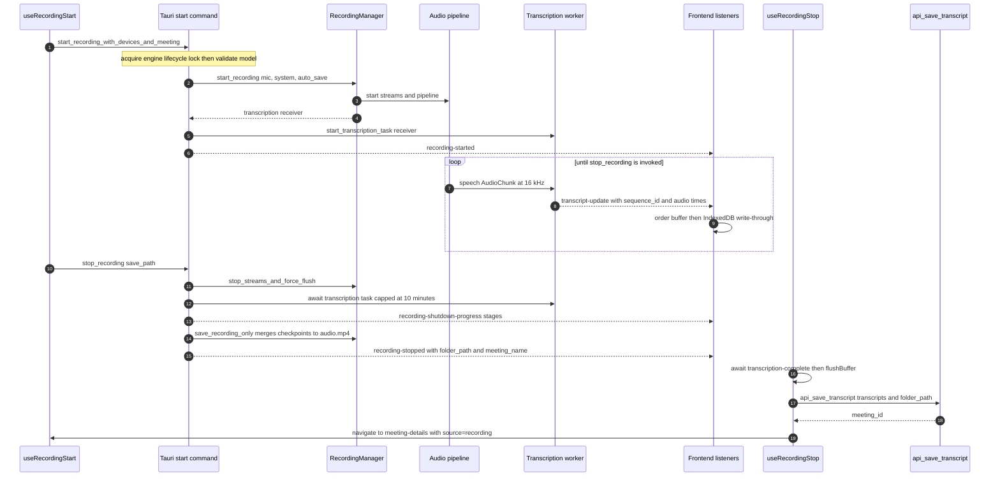
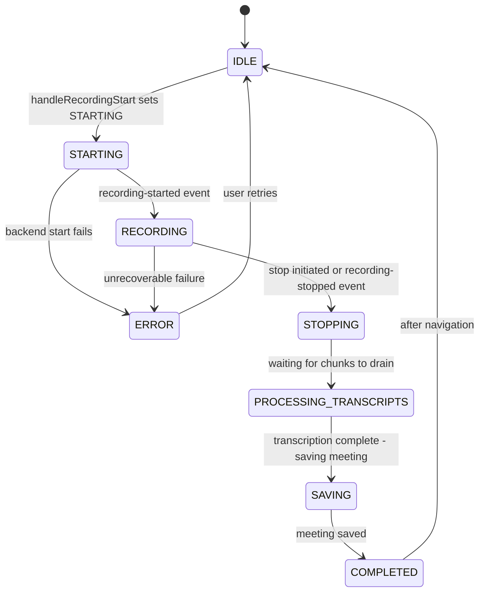

# Live Recording Workflow

Live recording is the product's core loop, and it is split across two runtimes that cooperate through Tauri commands and events:

- A **Rust session** (`frontend/src-tauri/src/audio/`) owns the audio streams, the mixing pipeline, the transcription worker, and incremental persistence. A single global `RecordingManager` (plus `IS_RECORDING`) represents the session for as long as it lives — even if the webview reloads.
- A **React lifecycle** (`frontend/src/`) drives the UI: `useRecordingStart` initiates, `RecordingStateContext` tracks status, `TranscriptContext` renders and journals transcripts, and `useRecordingStop` performs the post-stop save-and-navigate choreography.

The capture/mix/VAD internals of the pipeline are documented on [Audio Pipeline](/openwiki/concepts/audio-pipeline.md); this page covers the orchestration: who starts what, in what order, what is guaranteed, and what happens when things fail or crash.

## End-to-end flow

*Figure: the full live-recording loop. The backend owns capture, mixing, VAD, transcription, and checkpoint persistence; the frontend owns lifecycle status, transcript rendering/journaling, the SQLite save, and navigation.*

## Starting a recording

### Frontend entry points and the readiness gate

`useRecordingStart` (`frontend/src/hooks/useRecordingStart.ts`) exposes `handleRecordingStart` and serves three distinct entry points, all funnelling through the same call — `recordingService.startRecordingWithDevices(mic, system, title)`:

1. **Manual start** — the home-page button (`handleRecordingStart`).
2. **Auto-start from navigation** — a `useEffect` watches `sessionStorage.autoStartRecording` (set by the sidebar before navigating to `/`), removes the flag, and starts recording.
3. **Direct start while already on the home page** — a `window` event listener for `start-recording-from-sidebar`, dispatched by the sidebar.

Before any backend call, every entry point runs a **Parakeet readiness gate**: `invoke('parakeet_init')` + `invoke('parakeet_has_available_models')`. If not ready, it checks `parakeet_get_available_models` for a `Downloading` status — showing a "wait for the download" toast while downloading, or an error toast plus the model-selector modal otherwise — and returns without starting. On success it generates the meeting title (`Meeting DD_MM_YY_HH_MM_SS`), stores it in `TranscriptContext`, sets status `STARTING`, and only then invokes the backend; failures reset local state, set status `ERROR`, and re-throw so `RecordingControls` can render device-specific error hints.

### The backend start sequence

The frontend calls `start_recording_with_devices_and_meeting` (`frontend/src-tauri/src/lib.rs`), which delegates to `start_recording_with_meeting_name` (defaults) or the devices variant in `frontend/src-tauri/src/audio/recording_commands.rs`. That function is a strictly ordered pipeline:

1. **Engine lifecycle lock.** `super::common::acquire_engine_lifecycle_lock()` takes `ENGINE_LIFECYCLE_LOCK` *before* anything else. This serializes the start against batch jobs (import/retranscription), whose `unload_engine_after_batch` takes the same lock and skips unloading while a live recording is active (`audio/common.rs`).
2. **Single-session guard.** `IS_RECORDING` (a global `AtomicBool`) is checked; a second start returns `"Recording already in progress"`.
3. **Model validation before recording.** `transcription::validate_transcription_model_ready` resolves the transcript config (missing/unreadable config defaults to `parakeet`), initializes the matching engine, and validates the model is actually loaded. On failure the backend emits `transcription-error` with `actionable: false` (a toast — download progress already shows in the UI) and aborts **before any stream is opened**. The frontend mirrors this gate, so users normally never reach the backend error.
4. **Device resolution (Preference → Default → Error).** A preferred microphone name is parsed via `parse_audio_device`; if unavailable it falls back to `default_input_device`, and if that also fails the start fails. System audio is resolved the same way but is **optional**: failing to find a preferred/default output logs a warning and recording continues mic-only. On macOS, default-device selection additionally overrides Bluetooth capture devices to built-in wired ones for stable sample rates (see [Audio Pipeline](/openwiki/concepts/audio-pipeline.md)).
5. **Meeting name.** The provided name — or a generated `Meeting <timestamp>` fallback — is always set via `manager.set_meeting_name`, so the incremental saver's folder structure is guaranteed to initialize.
6. **Session start.** `RecordingManager::start_recording` starts the dual-path pipeline and streams, starts device monitoring, and returns the transcription channel receiver. The manager is stored in the global `RECORDING_MANAGER` static, `IS_RECORDING` is set true, the engine lock is dropped, and the speech-detected flag is reset for the new session.
7. **Transcription task.** `transcription::start_transcription_task` is spawned and its `JoinHandle` stored in the global `TRANSCRIPTION_TASK` — the handle the stop sequence later awaits.
8. **Transcript listener.** The command registers a `transcript-update` listener that converts each event payload into a `TranscriptSegment` and upserts it into the recording manager's saver (keyed by `sequence_id`). The listener's `EventId` is stored in `TRANSCRIPT_LISTENER_ID` and is **explicitly unlistened during stop** — a lingering listener would keep the microphone from being released.
9. **Announcements.** `recording-started` is emitted and the tray menu is refreshed.

## The live session

While recording, each mixed window fans out (see [Audio Pipeline](/openwiki/concepts/audio-pipeline.md) for mixing and VAD detail):

- **Recording path.** Pre-mixed 48 kHz audio flows to `RecordingSaver::start_accumulation`'s task, which feeds `IncrementalAudioSaver` (only when the user's `auto_save` preference is on; otherwise chunks are discarded and transcripts/metadata are still written).
- **Transcription path.** VAD speech segments at 16 kHz flow to the transcription channel.

### The transcription worker

`start_transcription_task` (`audio/transcription/worker.rs`) initializes the engine (Whisper, Parakeet, or a trait-based provider per config), then runs **one serial worker** (`NUM_WORKERS = 1`) so transcripts emit in chronological order — the "parallel" worker pool was deliberately reduced to guarantee ordering. For each accepted chunk it:

- assigns a monotonic `sequence_id` from a global counter,
- computes recording-relative `audio_start_time`/`audio_end_time`/`duration` from the chunk timestamp,
- emits `speech-detected` exactly once per session (a session-scoped `SPEECH_DETECTED_EMITTED` flag reset by `reset_speech_detected_flag` on start),
- emits `transcript-update` with text, confidence, partial flag, and the timestamps above.

Two accounting counters (`chunks_queued`/`chunks_completed`) back the zero-chunk-loss guarantee: the dispatcher closes the channel at stop, workers poll aggressively until the counters agree, and if verification still fails after 10 attempts the backend emits `transcript-chunk-loss-detected`.

Failure semantics: if the engine cannot be initialized when the task starts, the backend emits an **actionable** `transcription-error` ("Recording failed: Unable to initialize speech recognition…") and the task ends. Workers pre-validate the loaded model and, per chunk, skip-but-count audio if the model was unloaded mid-session (e.g. by a concurrent batch job that ignored the lifecycle lock). `AudioTooShort` and `ModelNotLoaded` are expected and skipped silently; other provider failures emit `transcription-warning`.

### Incremental persistence (the crash-safety backbone)

`RecordingSaver` (`audio/recording_saver.rs`) owns the meeting folder — `create_meeting_folder` creates `<recordings>/<Name>_<YYYY-MM-DD_HH-MM>/`, including `.checkpoints/` when `auto_save` is on — plus initial `metadata.json` (status `recording`). Two things are written continuously:

- **Audio checkpoints.** `IncrementalAudioSaver::add_chunk` buffers samples and, whenever the buffer reaches **30 seconds** (1,440,000 samples at 48 kHz), encodes it as a mono AAC file `.checkpoints/audio_chunk_NNN.mp4` via `encode_single_audio`. Checkpoint *count* is the durability metric; audio is never held in memory beyond one 30-second window.
- **Transcripts.** Every `transcript-update` received by the start-time listener is upserted (by `sequence_id`) into the saver's segment list and immediately rewritten to `transcripts.json`; both `transcripts.json` and `metadata.json` use atomic temp-file-then-rename writes.

## Pause and resume

`pause_recording` / `resume_recording` (`audio/recording_commands.rs`) delegate to `RecordingState`:

- Pausing is guarded — it fails when not recording or already paused; resuming fails when not paused. `RecordingState.pause_recording` records `pause_start`; resume accumulates the elapsed pause into `total_pause_duration`.
- **Audio chunks are silently discarded while paused** (`RecordingState::send_audio_chunk` returns `Ok` without sending), so paused time contributes nothing to the recording, and `active_duration` = wall-clock duration − total pause − current pause.
- Each transition emits `recording-paused` / `recording-resumed` and refreshes the tray menu. `is_recording_paused` and `get_recording_state` expose the state for polling.

The UI never owns pause state: `RecordingControls` invokes the commands, and `RecordingStateContext` flips `isPaused`/`isActive` from the events — which also keeps the UI correct when pause/resume comes from the tray.

## Staying in sync: RecordingStateContext and refresh recovery

`RecordingStateContext` (`frontend/src/contexts/RecordingStateContext.tsx`) is the single source of truth for the lifecycle status (`RecordingStatus`: `IDLE → STARTING → RECORDING → STOPPING → PROCESSING_TRANSCRIPTS → SAVING → COMPLETED → ERROR`). It reconciles with the backend three ways:

1. **Event listeners** on `recording-started` (status `RECORDING`, start polling), `recording-stopped` (status `STOPPING` unless already deeper in the stop flow, stop polling, clear durations), and `recording-paused`/`recording-resumed`.
2. **Initial mount sync** via `get_recording_state` — the fix for the refresh-desync bug where the backend records but the reloaded UI shows stopped.
3. **500 ms polling** of `get_recording_state` while recording, updating `isRecording/isPaused/isActive/recordingDuration/activeDuration`.

*Figure: `RecordingStatus` lifecycle as driven by `useRecordingStart`, `useRecordingStop`, and the context's event listeners.*

Two complementary mechanisms harden refresh recovery. `useRecordingStateSync` polls `is_recording` every second and re-adopts (or drops) the session in local state. And when `TranscriptContext` finds itself recording with an empty local transcript list after a reload, it pulls the full segment history from `get_transcript_history` (served from `RECORDING_MANAGER`'s accumulated segments) and the meeting name from `get_recording_meeting_name`. `get_recording_state` itself returns `is_recording`, `is_paused`, `is_active`, and the four duration fields.

## Device disconnect and reconnection

During start, `RecordingManager` starts an `AudioDeviceMonitor` (`audio/device_monitor.rs`) that polls the device list every 2 s (5 s when everything is present). A monitored device is declared disconnected only after **consecutive missing checks** — 2 for wired devices, 3 for Bluetooth-named devices (heuristic on names like "AirPods"/"Bluetooth"/"Wireless") — and a `DeviceReconnected` event fires when it reappears. Events are queued on an unbounded channel.

Three Tauri commands expose this to the frontend (registered in `lib.rs`):

- `poll_audio_device_events` — drains one queued `DeviceEvent` (`DeviceDisconnected`/`DeviceReconnected`/`DeviceListChanged`); designed to be called every 1–2 s by the frontend during recording.
- `get_reconnection_status` — whether a reconnect is in progress and which device/type is marked disconnected (`RecordingState.start_reconnecting`).
- `attempt_device_reconnect` — the UI "Retry": re-enumerates devices, and if the named device is back, restarts the streams with the *other* device preserved and updates the state's device reference. Requires an active recording.

Note the current wiring: **no frontend code invokes these commands or consumes `DeviceEvent`s**, and `RecordingManager::handle_device_disconnect` has no caller — so disconnects are detected and queued, but reconnection is effectively a headless path awaiting UI integration. The disconnect handling that users experience today is limited to `RecordingState`'s error policy (recoverable errors tolerated up to a threshold, non-recoverable ones stop the session) and `recording-error` events surfaced via the manager's error callback.

## Bluetooth playback warning

The recording itself handles Bluetooth capture correctly (and macOS may override Bluetooth capture entirely), but *playback* of 48 kHz recordings through Bluetooth headphones can sound distorted or sped-up because the OS resamples for the Bluetooth codec — documented in `BLUETOOTH_PLAYBACK_NOTICE.md`. The `get_active_audio_output` command (`audio/playback_monitor.rs`) reports the default output device with a per-platform Bluetooth heuristic. `BluetoothPlaybackWarning` (`frontend/src/components/BluetoothPlaybackWarning.tsx`) polls it every 5 s and renders a dismissible yellow alert ("Recordings may sound distorted or sped up…") whenever the active output is Bluetooth, resetting dismissal when the user switches back to a wired output.

## Stopping the recording

### Two initiators, one backend sequence

- **UI stop** — `RecordingControls.stopRecordingAction` invokes the `stop_recording` command with a generated `save_path` (`<appDataDir>/recording-<timestamp>.wav`), then calls `onRecordingStop(true)`, which is `useRecordingStop.handleRecordingStop`.
- **Tray stop** — `tray.rs` calls `audio::recording_commands::stop_recording` **directly in Rust**, then emits `recording-stop-complete` (payload `true`). `RecordingPostProcessingProvider` listens for that event app-wide and invokes `handleRecordingStop`, so save/navigate works from any page. `useRecordingStop` additionally exposes `window.handleRecordingStop` for Rust-initiated callbacks.

`handleRecordingStop` guards against duplicate/concurrent processing (`stopInProgressRef`) — the UI and tray can both trigger a stop — and awaits the `recording-stopped` promise before proceeding, closing a race with the backend's stop completion.

### Backend stop sequence (`stop_recording` in `recording_commands.rs`)

The stop is an explicitly staged shutdown that emits `recording-shutdown-progress` at each stage (informational — no frontend listener exists):

1. **Stop capture with force flush.** The manager is taken out of `RECORDING_MANAGER`; `stop_streams_and_force_flush` stops the device monitor *first* (avoids slow WASAPI polling on Windows), stops streams, sends special empty `AudioChunk` flush signals so the pipeline drains accumulated audio immediately instead of waiting out buffering delays, and fully clears device references so the mic is released even if `Drop` is delayed.
2. **Release the transcript listener.** `TRANSCRIPT_LISTENER_ID` is unlistened so the mic cannot stay active.
3. **Drain transcription (zero chunk loss).** The stored task handle is awaited with **no per-chunk timeout but a hard 10-minute cap** (600 s) to prevent indefinite hangs, while a 500 ms progress task reports elapsed time. The worker side verifies `chunks_completed == chunks_queued` before finishing.
4. **Unload the model.** Only after all chunks are processed: the transcript config is fetched with a 30 s timeout, and the matching engine (Parakeet, or Whisper as the default) is unloaded.
5. **Analytics.** `track_meeting_ended` is called with privacy-safe metadata (device *types* classified from names, provider/model names, durations, pause total, chunk/segment counts, fatal-error flag). Analytics failures are logged and never block shutdown.
6. **Persist recording artifacts.** `manager.save_recording_only` (5-minute timeout) runs `RecordingSaver::stop_and_save`: the incremental saver's `finalize()` writes any final partial checkpoint, **merges all checkpoints into `audio.mp4`** with FFmpeg concat (`-c copy`, no re-encode), deletes `.checkpoints/`, writes the final `transcripts.json`, and flips `metadata.json` to `completed` with the actual recording duration. Failures here are logged but do not fail the stop.
7. **Hand off to the frontend.** `IS_RECORDING` is cleared, and `recording-stopped` is emitted with `{ folder_path, meeting_name }`. The backend **deliberately performs no database save** — the frontend saves after all transcripts have streamed into the UI.

### Frontend post-stop processing (`useRecordingStop`)

With status `PROCESSING_TRANSCRIPTS`, the hook:

1. **Waits for transcription completion** — polls `get_transcription_status` every 500 ms up to 60 s, also listening for `transcription-complete`, treating "not processing and empty queue" (or >8 s inactivity with an empty queue) as done. Caveat worth knowing: the registered `get_transcription_status` command is currently a stub that always reports an idle queue (`lib.rs`), and nothing in the active backend emits `transcription-complete` — so the wait completes on the first poll and the real draining guarantee is the backend's task await in step 3 above. The save step is gated on `transcriptionComplete`, which is therefore effectively always true for normal stops.
2. **Waits 4 s for late segments**, then **force-flushes the transcript buffer** (`TranscriptContext.flushBuffer()` processes every remaining buffered entry regardless of timing) and waits another 500 ms for state updates.
3. **Saves the meeting** when `callApi` is set: `storageService.saveMeeting` → `api_save_transcript`, passing the backend-provided meeting name (preferred over the locally generated title) and the `folder_path` read from sessionStorage keys `last_recording_folder_path` / `last_recording_meeting_name`. It also applies the pinned summary-language preference or, failing that, detects the summary language (with non-fatal warnings).
4. **Cleans up and navigates.** Marks the meeting saved in IndexedDB (`markMeetingAsSaved`, also clearing `indexeddb_current_meeting_id`), removes the sessionStorage keys, refetches the sidebar list, sets the current meeting, shows a success toast with a "View Meeting" action, tracks meeting-completed analytics (duration from transcript timestamps, word count, WPM, activation on the first-ever meeting), and after 2 s auto-navigates to `/meeting-details?id={meetingId}&source=recording`, resetting status to `IDLE`. Analytics errors never block the flow.

### Auto-summary on the details page

`meeting-details` arms auto-generation only when `source === 'recording'` **and** the user's auto-summary toggle is enabled; with a configured model in the DB (or a `gemma3:1b` fallback when the DB is empty) it sets `shouldAutoGenerate`, and `PageContent` kicks off `handleGenerateSummary` once transcripts are loaded.

## Crash recovery

Two independent safety nets cover a crash mid-recording, and the home page checks both at startup (skipped while recording or mid-stop-flow):

**Audio — `.checkpoints/` on disk.** Because audio is checkpointed every 30 seconds, a crashed session leaves `audio_chunk_*.mp4` files behind. Three commands support recovery: `has_audio_checkpoints` (does the folder's `.checkpoints/` contain `.mp4` files), `recover_audio_from_checkpoints` (sorts the checkpoints, merges them into `<folder>/audio.mp4` with the same FFmpeg concat, reports a status of `success`/`failed`/`none` with chunk count and estimated duration of ~30 s per chunk), and `cleanup_checkpoints` (removes the directory after a successful save or recovery).

**Transcripts — IndexedDB journal.** While a meeting id is active, `TranscriptContext` writes every transcript update to the `MeetilyRecoveryDB` IndexedDB database non-blocking (failures swallowed). On startup the home page prunes meetings older than 7 days and saved meetings older than 24 h, then `useTranscriptRecovery.checkForRecoverableTranscripts` lists unsaved meetings in a 7-day retention window (excluding the last 2 seconds to avoid catching the just-finished session), verifying audio availability per meeting via `has_audio_checkpoints`. If recoverable meetings exist, the `TranscriptRecovery` dialog is shown **once per session** (guarded by a `sessionStorage` flag) with a meeting list, a preview of the first 10 segments, and audio-availability indicators; meetings can be recovered or deleted.

Recovery (`recoverMeeting`) loads IndexedDB metadata + transcripts, resolves the folder path (falling back to the backend's `get_meeting_folder_path`), invokes `recover_audio_from_checkpoints`, saves the meeting through the normal `storageService.saveMeeting` path, marks it saved in IndexedDB, cleans up checkpoints, and the home page toasts and auto-navigates to the recovered meeting.

## Invariants and failure semantics

- **One session at a time.** `IS_RECORDING` + `RECORDING_MANAGER` guarantee a single active session; a second start errors immediately.
- **Engine changes are serialized.** The engine lifecycle lock spans start/stop and batch unload, and batch jobs skip model unload while a recording is live.
- **No recording without a model.** Model validation runs before streams open; failure emits an actionable `transcription-error` and aborts cleanly.
- **Zero transcript chunk loss.** The worker's queued/completed verification plus the backend's awaited drain (10-minute cap) precede model unload and shutdown; suspected loss emits `transcript-chunk-loss-detected`.
- **Mic release is explicit.** Stream stops, state cleanup, and the `TRANSCRIPT_LISTENER_ID` unlisten all exist because lingering references keep the microphone captured.
- **The database save belongs to the frontend.** The backend stop emits metadata only; the frontend saves after transcripts are visible, so users watch the full transcript stream before persistence — and the recovery systems (disk checkpoints + IndexedDB journal) cover anything lost in between.
- **Non-fatal degradation.** System audio is optional; analytics and IndexedDB failures never interrupt recording or shutdown.

## Focused tests

- `audio/incremental_saver.rs` — `test_checkpoint_creation` (120 × 0.5 s chunks at 48 kHz produce exactly 2 checkpoints; `finalize` merges to `audio.mp4` and removes `.checkpoints/`) and `test_empty_recording` (finalizing with zero checkpoints errors with "No audio checkpoints").
- `audio/common.rs` — `test_engine_lifecycle_lock_serializes_acquirers` proves the engine lock actually blocks concurrent acquirers.
- `audio/device_monitor.rs` — Bluetooth vs. wired disconnect thresholds; safe stop when never started.
- `audio/playback_monitor.rs` — output-device detection returns info on each platform.
