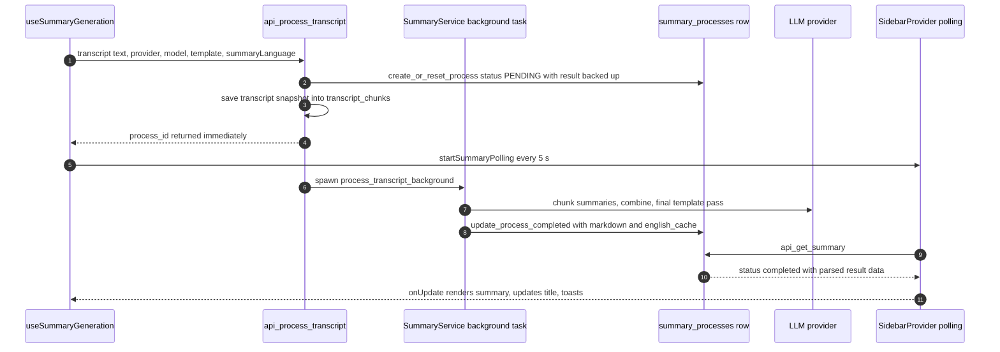
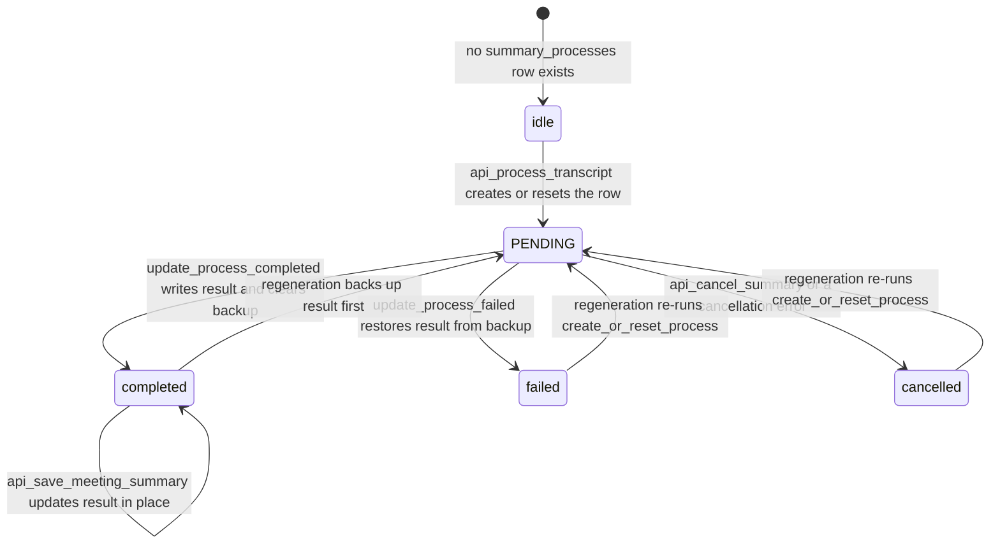

# Summary Generation Workflow

Summary generation turns a meeting's saved transcript into an editable markdown/BlockNote summary. Like the rest of Meetily it is split across two runtimes that cooperate through Tauri commands:

- A **Rust pipeline** (`frontend/src-tauri/src/summary/`) owns the process state. `api_process_transcript` records intent in SQLite, spawns a background task, and returns immediately; the task resolves the LLM provider and model context, runs the prompt passes, and writes the result into the `summary_processes` row. Generation is therefore backend-owned and survives page navigation — the UI only observes it.
- A **React flow** (`frontend/src/`) drives it: the meeting-details page decides whether to auto-generate, `useSummaryGeneration` invokes the command and resolves the summary language, `SidebarProvider` polls for results, and `SummaryPanel`/`BlockNoteSummaryView`/`AISummary` render, edit, and save the output.

<!-- openwiki: broken internal link [/openwiki/concepts/summary-engine.md] file "/openwiki/concepts/summary-engine.md" does not exist. Fix the href or restore the target, then delete this comment. -->
The BuiltInAI engine itself (model manager + llama-helper sidecar) is documented on [Summary Engine](/openwiki/concepts/summary-engine.md), the provider HTTP layer on [LLM Providers](/openwiki/integrations/llm-providers.md), and the `summary_processes`/`transcript_chunks` schema on [Data Model](/openwiki/concepts/data-model.md).

## End-to-end flow



*Figure: the generation loop. The command returns a process id before any LLM work starts; all progress and results are observed by polling `api_get_summary`, never by push events.*

## Persistence: the `summary_processes` row

The row (one per meeting, `meeting_id` primary key) is the single source of truth for pipeline state: `status`, `result` (a JSON string), `result_backup` + `result_backup_timestamp` (added by migration `20251101000000_add_summary_backup`), `error`, `start_time`/`end_time`, `chunk_count`, `processing_time`, `metadata` (see [Data Model](/openwiki/concepts/data-model.md)).

**Save semantics (`api_save_meeting_summary`).** The editor save path expects a JSON object of the shape `{ markdown, summary_json: [...BlockNote blocks...] }` and stores it verbatim. `SummaryProcessesRepository::update_meeting_summary` runs one transaction that (1) verifies the meeting exists — a missing meeting or unserializable payload rolls back and reports "Meeting not found or can't convert the json", (2) overwrites `summary_processes.result`, and (3) touches `meetings.updated_at`. Status is deliberately unchanged: a manual save updates content only.

**Backup-on-regeneration.** `create_or_reset_process` upserts the row with status `PENDING`. On conflict it copies the existing `result` into `result_backup` with `result_backup_timestamp`, keeps `result` in place, and clears `error`. From then on the backup columns guarantee a regeneration never destroys the previous summary:

- `update_process_completed` writes the new result, clears the backup, and records `chunk_count`, `processing_time`, `end_time`.
- `update_process_failed` sets status `failed` with the error and restores `result = COALESCE(result_backup, result)`, then clears the backup.
- `update_process_cancelled` does the same restore but fixes the error text to `Generation was cancelled by user`.

## Status lifecycle

The backend writes exactly four status values: `PENDING` on start, `completed`, `failed`, and `cancelled`. There is **no intermediate processing write** — the row stays `PENDING` for the whole generation, and the frontend's `processing`/`summarizing`/`regenerating` labels are UI-local states derived from `useSummaryGeneration`. `api_get_summary` lowercases the stored status in its response and reports `idle` when no process row exists.



*Figure: `summary_processes.status` transitions. Backup restore on `failed`/`cancelled` is what lets the UI keep showing the previous summary after an aborted regeneration.*

Reading has one subtlety: `api_get_summary` fetches through `get_summary_data_for_meeting`, which **joins `summary_processes` with `transcript_chunks`**. A meeting that has a summary row but no transcript snapshot reads as `idle`. Conversely, the result JSON is parsed and returned *regardless of status*, so `cancelled`/`failed` responses still carry the restored summary data. When no row exists, the response is `idle` with the meeting title attached (when the meeting exists) and no data.

## Starting a generation: `api_process_transcript`

The command (`frontend/src-tauri/src/summary/commands.rs`) is the only way to start the pipeline:

1. Resolves the meeting id (one is generated when omitted), normalizes `summary_language` (empty/whitespace → `None`, so `""` and `null` behave identically), and applies defaults: `custom_prompt` → `""`, `template_id` → `"daily_standup"`.
2. Calls `create_or_reset_process` — this both (re)starts the status lifecycle and creates the backup described above.
3. Persists the transcript snapshot via `TranscriptChunksRepository::save_transcript_data` into the single `transcript_chunks` row (upsert), recording the model, model name, and the `chunk_size` (default 40000) / `overlap` (default 1000) arguments. Note these are **provenance records only** — the actual chunking uses token thresholds (below), not these values.
4. Spawns `SummaryService::process_transcript_background` on the Tauri async runtime and returns `{ message, process_id }` immediately, where `process_id` is the meeting id.

The frontend (`useSummaryGeneration`) fetches **all** transcripts for the meeting first — one `api_get_meeting_transcripts` call sized to `total_count`, not the paginated page state — and builds the payload as `[MM:SS] text` lines joined by newlines, keeping the raw texts separately for language detection.

## The background pipeline

`SummaryService::process_transcript_background` (`summary/service.rs`) runs without further frontend interaction. Every configuration failure marks the row `failed` and returns, so the UI always sees a terminal state:

- **Provider resolution.** `LLMProvider::from_str` parses the raw provider string (`ollama`, `openai`, `claude`, `groq`, `openrouter`, `builtin-ai`, `custom-openai`); an unknown value fails the run.
- **API keys.** Read from `SettingsRepository::get_api_key` for cloud providers; Ollama, BuiltInAI, and CustomOpenAI skip the standard key lookup. CustomOpenAI instead loads its whole configuration (endpoint, key, max tokens, temperature, top_p) from `settings.customOpenAIConfig` — missing configuration fails the run.
- **Token threshold.** Ollama asks the cached model metadata (`ModelMetadataCache`, 5-minute TTL keyed by model + endpoint) for the model's `context_size` minus a 300-token prompt reserve, falling back to 4000. BuiltInAI looks the model up in its registry the same way (fallback 1748). Cloud providers use 100000 — effectively unlimited, so they always summarize in one pass.
- **Language inputs.** The detected transcript language is read from the meeting folder's `metadata.json` and falls back to detecting from the transcript text (see [Language handling](#language-handling)).
- **Template.** Loaded via `templates::get_template`; a failure fails the run. The template's rendered markdown structure and section instructions are hashed into a fingerprint used by the cache.

Generation (`processor::generate_meeting_summary`) returns `(final_markdown, english_markdown, num_chunks)`:

1. **Pass 1 — English summary.** If the total token count fits the threshold (or the provider is cloud-side), the whole transcript is summarized in a single call. Otherwise `chunk_text` splits the text at ~2.85 chars/token into word/sentence-boundary chunks of `token_threshold − 300` tokens with 100-token overlap; each chunk is summarized (the cancellation token is checked before every chunk; individual chunk failures are logged and skipped), multiple chunk summaries are combined in a synthesis pass, and the result feeds the final pass.
2. **Final pass.** The template's markdown structure and section instructions form the system prompt; the transcript (or combined chunk summaries) plus the optional user context form the user prompt. Output is cleaned of `<think>` blocks and stray code fences.
<!-- openwiki: broken internal link [/openwiki/concepts/summary-engine.md] file "/openwiki/concepts/summary-engine.md" does not exist. Fix the href or restore the target, then delete this comment. -->
3. **Final language action.** An explicit non-English `summary_language` triggers a translation pass of the English summary — a translation failure is a hard failure of the whole run. Otherwise, if the detected transcript language is English the English markdown is returned as-is; anything else runs a *soft* English normalization pass whose failure is logged and the pass-1 markdown returned instead (only cancellation propagates). See [Summary Engine](/openwiki/concepts/summary-engine.md) for how this pass behaves under the BuiltInAI engine.

On success the service extracts the first H1 heading from the final markdown as a meeting name and, when non-empty, calls `MeetingsRepository::update_meeting_name`, which updates `meetings.title` and the denormalized `transcript_chunks.meeting_name` in one transaction — summary generation can rename the meeting. It then stores the result JSON:

```json
{
  "markdown": "<final summary, leading H1 stripped>",
  "english_cache": {
    "markdown": "<canonical English summary>",
    "source": { "transcript_fingerprint": "...", "custom_prompt_fingerprint": "...", "template_id": "...", "...": "..." },
    "output_language": "French"
  }
}
```

`strip_title_if_present` removes only a *leading* H1 (a mid-document H1 is preserved) so the stored markdown starts with the template's sections while the title survives in `meetings.title`.

## English-summary caching

Regenerating the same transcript to a *different* language would wastefully rerun pass 1. The service prevents that by fingerprinting every generation input (`SummaryCacheSource`): FNV-1a fingerprints of the transcript text and custom prompt, template id and rendered-template fingerprint, token threshold, provider, model, both endpoint options, and the sampling parameters. Before generating it reads the prior row and `extract_cached_english_markdown` reuses the cached English markdown only when **all** of these hold:

- the requested `summary_language` resolves to a supported non-English language;
- the stored blob has an `english_cache` field (the legacy `english_markdown` field is a cache miss);
- the cache's `source` equals the freshly computed `SummaryCacheSource` exactly;
- the cached `output_language` differs from the requested language — regenerating in the *same* language is deliberately a cache miss so pass 1 reruns.

On a hit, pass 1 is skipped entirely and only the translation pass runs. Unit tests cover the legacy-field miss, the same-language rejection, and each fingerprint field independently invalidating the cache (`summary/service.rs` tests).

## Language handling

Summary language has three layers, resolved top-down at generation time (`resolveSummaryLanguage` in `useSummaryGeneration`):

1. **Per-meeting override** — `api_get_meeting_summary_language` reads the `summary_language` field of the meeting folder's `metadata.json`; `api_save_meeting_summary_language` writes or clears it. Writes are serialized under a global mutex and performed atomically (temp file + rename), and codes are validated against the supported set (BCP-47 tags normalize to base language, `zh-cn` → `zh`, `zh-tw` kept for Traditional Chinese). The picker in `SummaryPanel` saves optimistically with versioned rollback and surfaces a toast when the preference could only be saved on-device.
2. **Cached detection** — `api_get/save_meeting_detected_summary_language` persist the last auto-detected language alongside the override (`detected_summary_language` field).
3. **Fresh detection** — `api_detect_transcript_summary_language` runs `whatlang` over segment texts weighted by alphabetic-character counts (segments under 20 meaningful chars are ignored; confidence below 0.25 is treated as unknown) and returns `{ language, reason }` with reasons `detected`, `tie`, `low_confidence`, `unsupported`, `empty`. A `tie` warns the user about a bilingual transcript.

Meetings **without a `folder_path`** (e.g. some recovered/legacy rows) can't store preferences in `metadata.json`; the backend answers with `storage: "local_fallback"` and the client (`lib/summary-language-preferences.ts`) mirrors the value in localStorage keys (`summaryLanguageFallback:<id>`, `detectedSummaryLanguageFallback:<id>`), transparently falling back and clearing stale fallbacks when metadata storage works again.

The write path is also seeded early: the recording stop flow applies a pinned default (`summaryLanguageDefault` in localStorage) to the fresh meeting or, failing that, detects and caches from the transcript — import and crash-recovery flows do the same — *before* the user ever opens the meeting page.

## Auto-summary on the meeting-details page

The live-recording stop sequence navigates to `/meeting-details?id=<id>&source=recording` (see [Live Recording](/openwiki/workflows/live-recording.md)). The page treats `source=recording` as the only navigation that may trigger auto-generation, and gates it further (`setupAutoGeneration`, run at most once per meeting id):

1. `source` must equal `recording` — direct visits, sidebar clicks, and toast "View Meeting" navigations (which omit the param) never auto-generate.
2. `isAutoSummary` from `ConfigContext` must be enabled — a localStorage-backed toggle (`isAutoSummary`) defaulting to **false**.
3. Model availability: `api_get_model_config` is the source of truth. If the DB already has a model configured, auto-generation proceeds with it (the existing model is never overridden). If the DB has none, the page checks Ollama for `gemma3:1b`; when present it persists a default config (`provider: 'ollama'`, `whisperModel: 'large-v3'`) and proceeds; otherwise it logs and skips.

The actual trigger is an effect that fires only when meeting details are loaded, **no summary exists yet**, and the meeting has transcripts; it calls `handleGenerateSummary('')` (empty custom prompt) and then clears the `shouldAutoGenerate` flag. Because generation lives in the backend, navigating away mid-generation is safe — the unmount handler merely stops polling, and revisiting the page reads the completed row from `api_get_summary`.

## Polling and result pickup

`SidebarProvider.startSummaryPolling(meetingId, processId, onUpdate)` owns polling as an app-level `Map` of interval ids (one 5-second `api_get_summary` poll per meeting; starting a new poll for the same meeting replaces the old interval):

- Polling stops on terminal statuses (`completed`, `error`, `failed`, `cancelled`) or on `idle` after the first poll (the process row vanished), and gives up after 200 polls (~16.5 min, slightly longer than the backend's own timeout) reporting a client-side `status: 'error'` — note `error` is a *frontend-only* status value; the backend writes `failed`.
- The `useSummaryGeneration` callback maps outcomes: `cancelled` re-reads `api_get_summary` to restore the backup-restored data (status back to `completed` if data exists, `idle` otherwise); `error`/`failed` after a **regeneration** reloads the previous summary and toasts "Your previous summary has been restored", while a first generation shows the error with connection hints for `Connection refused`; a "model is required" error auto-opens the model-settings modal.
- On `completed`, markdown-format results render via `{ markdown }`, legacy section JSON is normalized (with `_section_order` preserved and empty sections rejected as an error), the meeting title updates from `MeetingName`/`meetingName`, and success/failure analytics are tracked.

The meeting-details page stops the meeting's poll on unmount or meeting switch, and the page resets summary state whenever `meetingId` changes to avoid cross-meeting races.

## Cancellation

Cancellation is cooperative and keyed by meeting:

- `SummaryService` keeps a global registry (`CANCELLATION_REGISTRY`) mapping meeting id → `tokio_util::CancellationToken`, registered when the background task starts and removed when it ends regardless of outcome.
- `api_cancel_summary` calls `SummaryService::cancel_summary`; if a token existed it is cancelled and the command then marks the row `cancelled` (restoring the backup). With no active run it answers "No active summary generation to cancel" without touching the DB.
- Inside the pipeline the token is honored at every await point: `generate_summary` races each HTTP request against `token.cancelled()` via `tokio::select!` (BuiltInAI sidecar calls receive the token too), the chunk loop checks it before each chunk, and the final/translation/normalization passes check before starting.
- Cancellation surfaces as the error string "Summary generation was cancelled"; the service maps any error containing `cancelled` to `update_process_cancelled` rather than `failed`.
- In the UI, `handleStopGeneration` invokes `api_cancel_summary`, stops polling, resets status to `idle`, and toasts — even if the backend call fails, frontend cleanup proceeds. All user-visible failure and cancellation paths report through `sonner` toasts, not dialogs.

## Editing and saving the result

`BlockNoteSummaryView` detects the stored format and renders accordingly: `summary_json` renders a BlockNote editor directly; `markdown` is parsed into BlockNote blocks; anything else falls back to the legacy section editor (`AISummary`), which provides block selection, undo/redo history, and per-section editing over the `Summary` map shape. Saving emits `{ markdown?, summary_json }` — the BlockNote JSON is always included and markdown is attached when conversion succeeds (guarded by `blocksToMarkdownSafely`); dirty tracking is suppressed until initial content has loaded so parsing doesn't mark the editor dirty.

`useMeetingData.handleSaveSummary` passes BlockNote-format payloads straight through to `api_save_meeting_summary` and wraps legacy section summaries as `{ MeetingName, MeetingNotes: { sections } }`. `saveAllChanges` persists a dirty title via `api_save_meeting_title` plus the summary (through the editor ref when dirty), and reports a single success/error toast.

## Provider pre-checks before generation

`handleGenerateSummary` verifies provider readiness before invoking the backend, aborting with targeted toasts:

- **Ollama** — `get_ollama_models` must return at least one model; a not-installed error shows an "Ollama is not installed" toast with a Download action that calls `open_external_url` to `https://ollama.com/download`.
- **BuiltInAI** — a model must be selected, `builtin_ai_is_model_ready` (with filesystem refresh) must pass, and `builtin_ai_get_model_info` distinguishes `downloading` / `not_downloaded` / `corrupted` / `error` states, each with its own message; not-ready states open the model settings modal.

`handleRegenerateSummary` reuses the same pipeline but skips the provider pre-checks, and both paths report start/completion through Analytics.

## Tests that matter

- `summary/service.rs` — title-stripping edge cases (already-stripped, mid-document H1, `#NoSpace`), template-fingerprint sensitivity, and the full English-cache matrix (legacy field, matching source with changed target, same-language rejection, each changed fingerprint field).
- `summary/metadata.rs` — metadata round-trips preserve unrelated fields, override and detected language are stored separately, clearing removes the field, and unsupported codes are rejected.
- `summary/language_detection.rs` — detection thresholds, ties, unsupported/empty reasons.
- `summary/processor.rs` — chunking boundaries and markdown cleaning; `templates/` — template loading and rendering.

## Related pages

- `/openwiki/concepts/data-model.md` — `summary_processes`/`transcript_chunks` schema, migrations, and the per-meeting `metadata.json` contract.
- `/openwiki/concepts/frontend-state.md` — `ConfigContext` (model config, `isAutoSummary`), `SidebarProvider` (polling ownership), and the provider tree.
- `/openwiki/concepts/summary-engine.md` — the BuiltInAI model manager and sidecar that `generate_summary` dispatches to.
- `/openwiki/integrations/llm-providers.md` — provider parsing, HTTP request shapes, and error mapping.
- `/openwiki/workflows/live-recording.md` — where the `source=recording` navigation and the first language detection originate.
